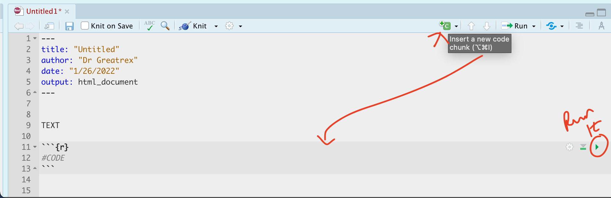
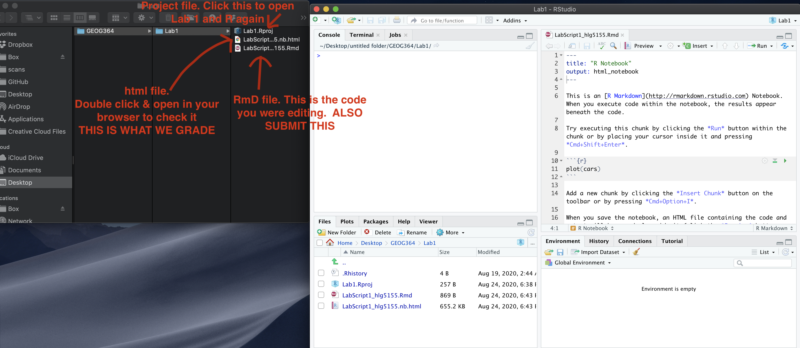

<style>
p.comment {
background-color: #DBDBDB;
padding: 10px;
border: 1px solid black;
margin-left: 0px;
border-radius: 5px;
font-style: normal;
}

h1.title {
  font-weight: bold;
  font-family: Arial;  
}

h2.title {
  font-family: Arial;  
}

</style>


<style type="text/css">
#TOC {
  font-size: 12px;
  font-family: Arial;
}
</style>


\


```{r setup, include=FALSE}
knitr::opts_chunk$set(echo = TRUE, warning=FALSE, message = FALSE)
library(kableExtra)
library(tidyverse)
library(skimr)
library(ggplot2)
library(plotly)
library(ggpubr)
```

# Welcome to Lab 1!

## Overview 

There are 8 labs in this course. Each one will build on the last one, with support provided in a series of tutorials (see the tutorials tab).  You should NOT submit the tutorial work. We will work through the tutorials together and then your job is to submit the requirements on this page.

By the end of this week's lab, you will be able to:

1. Get comfortable with the lab format & how to work through them
2. Know how to get help
2. Get familiar with the RStudio interface
3. Run your first programming commands
4. Put everything together into an interactive markdown website (like this guide)
5. Understand the process for submitting assignments

 **If the labs are causing major problems with your computer or your computer hardware is struggling (or you have any other software issue), Talk to Dr Greatrex**. We can  fix this and there are other options for "online R" that you can use. 
 
THERE IS A TEAMS DISCUSSION FOR ANY LAB HELP (see canvas)

<p class="comment">**Assignment 1 is due by midnight the night before your next lab on Canvas.**  See [here](https://psu.instructure.com/courses/2174925/assignments/13762663) for assignment guidelines & we will cover them in detail here.</p>

<br>  

## Instructions

<br>

### Access R and R-Studio 

These were covered in homework 2 and are here for reference. Your R and R studio should be up to date.

 - Read [Tutorial 1.1](https://psu-spatial.github.io/stat462-2022/T1_R_Basics.html#11_What_are_R_and_R-Studio).<br><br>
 - Install BOTH R and R-Studio, or create an R-Studio Cloud account. This is covered in  [Tutorial 1.2](https://psu-spatial.github.io/stat462-2022/T1_R_Basics.html#12_Accessing_R__R-Studio).
 
<br>

### Getting started in R

 - Work through [Tutorial1.3](https://psu-spatial.github.io/stat462-2022/T1_R_Basics.html#13_Getting_started) to open R-studio and change your settings.<br><br>

 - Use [Tutorial 2.1](https://psu-spatial.github.io/stat462-2022/T1_R_Basics.html#2_R-Projects_and_Packages) to make your first R-project called STAT462-Lab1-Project<br>


 - [OPTIONAL BUT RECOMMENDED] Now work through [Tutorial 3](https://psu-spatial.github.io/stat462-2022/T1_R_Basics.html#3_Basic_commands) to get used to the basics<br>
 
 - Now go back to [Tutorial 2B](https://psu-spatial.github.io/stat462-2022/T1_R_Basics.html#22_R-Packages) to understand what an R-Package is and to install  the code packages/libraries we will need for this course.<br>
 
<br>  
  
### Start Markdown

 - [OPTIONAL BUT HIGHLY ENCOURAGED] Work through [Tutorial 4](https://psu-spatial.github.io/Geog364-2021/pg_Tut4_markdown.html) to make your first Markdown document.  Save and close - this was for your reference!

<br>


### Lab challenge!

Everything above was for your own learning - you do not need to submit any of it.  Now we will start the actual lab you will submit.  Consider printing this out and checking off each step one by one.

<br>

#### 1: Reopen R studio {-} 

First, see if you remember how to close and re-open R studio. <br>

Save everything then close down R studio.To re-open, do not reopen R from the programmes folder or icon!  

**INSTEAD, GO TO THE LAB 1 FOLDER ON YOUR COMPUTER AND DOUBLE CLICK THE .RPROJ FILE CALLED STAT462-Lab1-Project!**.  

This will get you straight back into your lab folder for you to carry on.

<br>

#### 2: Make lab-Markdown {-} 

Create a new **RMarkdown document** called `STAT462-Lab1-PSUID.Rmd`. e.g. for me *STAT462-Lab1-hlg5155.Rmd*.  <br>

Delete all the text/code below line 11 (e.g. everything from "R Markdown onward")

<br>

#### 3: Adding paragraphs {-}

You might find it easier to use the markdown visual text editor.  <br> Click the "A" symbol at the top right to switch (instructions here:[Tutorial 4.6](https://psu-spatial.github.io/stat462-2022/T1_R_Basics.html#46_Formatting_text))


- In the white text area, create a level 1 heading called *"Introduction to STAT-462"*.  For a cheat sheet to help with this, move your mouse to the top of the page, click the help menu, then click Markdown Quick reference, or see [Tutorial 4.6](https://psu-spatial.github.io/stat462-2022/T1_R_Basics.html#46_Formatting_text).  

 - Leave a blank line, then use the STAT-462 syllabus to describe the course late policy in your own words (e.g. you're writing about this in the white space).
 
 -  Press "knit" at the top of the screen.  If you haven't made a mistake a pop up should appear with a html file and your edits.  If you have a made a mistake, stop and fix before continuing.

<br>  


#### 4: Code showcase


```{r, echo=FALSE}

```
<br<

Leave another blank line and add a new Level 1 heading called *"Code Showcase"*.  Add a blank line afterwards too.  Create a code chunk ().  Inside use R code to calculate the following  <br><br>

  - 103^3^  (e.g `103*103*103`, or `103^3`) <br>
  
  _ The co-sine of your age (google is your friend, google R function for cosine) <br>
  
  - Use R code to work out how many characters are in [the longest town name in Wales](https://www.bbcamerica.com/anglophenia/2015/09/how-to-pronounce-the-longest-place-name-in-the-u-k) *Llanfairpwllgwyngyllgogerychwyrndrobwllllantysiliogogogoch*. <br>
     + Hint 1, remember you can copy paste this into your code. <br>
     + Hint 2.. your tutorials and quote marks!<br>
     + Hint 3.. you can google any R command, try gooling R command for number of characters in a word.<br><br>
  
 
Press "knit" at the top of the screen.  If you haven't made a mistake a pop up should appear with a html file and your edits. If you have a made a mistake, stop and fix before continuing.

<br>

#### 5. Packages

If you have run through the tutorials, you should have installed all the packages you need for this course.

**IF NOT GO AND DO THE BULK INSTALL IN [Tutorial 2.2](https://psu-spatial.github.io/stat462-2022/T1_R_Basics.html#22_R-Packages)]**

You only need to _download_ the packages once, but we still need to load them every time we need a command in that package (in the same way you only download your banking app once from the app store but need to press the icon every time you want to use it).

- Always INSTALL/DOWNLOAD packages using a menu or in the console
- Always LOAD packages in a code-chunk in your script (as we need to do tihs every time)


##### DO THIS PART EVEN IF YOU DID TUTORIAL 2!  

Today we will be using commands from the skimr package, the ggplot2 package and the plotly package.

Somewhere near the topc of your script, make a new code chunk and add this code. Remember to run the code chunk! (pressing the green arrow, or go to the run button on the top right and press Run All)

```{r,warnings=FALSE, message=FALSE, eval=FALSE}
library(tidyverse)
library(skimr)
library(ggplot2)
library(plotly)
library(ggpubr)
```


<br>


#### 6: Data analysis

##### 6a Load & summarise the data

Leave a blank line, and create a new level 1 heading called *Car Analysis*.  Leave a blank line afterwards too.   We’re going to work with a table of data that’s already pre-loaded into R inside the ggplot2 package. 

1. Make sure you have run the library code chunk above without error, or it won't work.   <br>
 
2. Load the data using this command

```{r,warnings=FALSE, message=FALSE, eval=FALSE}
data(mpg)
```
 
 <br>
 
3. Type the `?mpg` command in the console. This will bring up the help file.  <br> Read the background of the dataset and briefly summarise it in your script (in the white space). Include the unit of analysis and a reasonable population this dataset could be used to explore. BE SPECIFIC AND READ THE HELP FILE CAREFULLY!


<br>

##### 6b Summary analysis

Now look at the data itself. If you look in the environment tab, you will see a new variable called mpg. Click on it's NAME to see the spreadsheet/table itself and familiarise yourself with the data.  <br> <br>
 
We could have also looked at the raw data by either by typing its name into the console or a code chunk, or by using commands like `head(mpg)` to show the first few lines

Let's look at the summary statistics. Leave a blank line and create a new code chunk containing the following code <br><br>

```{r, eval=FALSE}
# mpg comes from the ggplot2 package
# skim comes from the skimr package
skim(mpg)
```

This command compiles the summary statistics for mpg. You can also use the summary() command to achieve a similar result <br><br>


```{r, eval=FALSE}
summary(mpg)
```


Now below your code, answer the following questions in full sentences.

1. **What is the mean manufacturing year of the car models in the dataset?** <br><br>

2. **What is the maximum value of the number of cylinders of the car models?** <br><br>

3. **What type of data is the manufacturer column of the dataset? (nominal, ordinal, interval, continous) State why you answered that.**

<br><br>

##### 6c Boxplots

Suppose I want to compare the miles per gallon of the car models being driven in cities for different classes of cars.   We can make the comparison by making a side-by-side boxplot. Create a new code chunk. Use the code below to create the plot.  

To see the full plot, press the tiny "show in new window" button at the top right of the plot itself.

```{r, results="hide",fig.keep = 'none' }
# boxplot is the command.  You can have a command on several lines.

boxplot(cty~class,          # the miles per gallon column vs each type
        data=mpg,        #  from the mpg table
        xlab="Class",ylab="mpg in a city", 
        col=c("deepskyblue4","deepskyblue")) # and colours

```

4. *Briefly comment on what you can tell about the population/data from this plot.* 


<br>

##### 6d Selecting columns

As we discussed above, the mpg table is loaded into R.  But what if we want to access a specific column?  This is where the $ symbol is useful. It means, "select the column named.."  

For example if you type `mpg$model` into the console, you will see that it just prints the data from the cyl column (number of cylinders) onto the screen.  We could then apply a command to those numbers.  For example `unique(mpg$model)` will find all the unique values in that column

5. **Create a new code chunk. Use the `median()` and `IQR()` commands to find the actual median and inter quartile range of the column containing highway miles per gallon. Summarise your results in full sentences**


##### 6e Normality testing

I want to see if the hwy variable in our data is normally distributed.  We can do this using the histogram and normal-qq plot.    The code below makes a histogram and QQNorm plot for the car miles per gallon on a highway.  It also runs a Shapiro-Wilks test for the horsepower.  


```{r, results="hide",fig.keep = 'none' }
hist(mpg$hwy,br=10)
```


```{r, results="hide",fig.keep = 'none' }
# Instead we are going to use a nicer format from the `ggpubr` library
ggqqplot(mpg$hwy,col="red")
```

```{r,eval=FALSE}
# Shapiro Wilks test
shapiro.test(mpg$hwy)

```


6. **Use the data above to assess whether the hwy variable in the mpg dataset is normally distributed.  Write out a full hypothesis test in the text, using the R results to inform your conclusions**

If you need help, see this tutorial (https://r4ds.had.co.nz/data-visualisation.html). 


##### 6e Normal distributions


Now we're going to move onto some commands that allow us to calculate normal probabilities using R, rather than slowly by hand. Using the R functions `pnorm()` and `qnorm()`, we can find the cumulative probabilities and normal quantiles for any normal distribution.  

For example, Cat lifespans have a normal distribution with a mean of 15.4 and a standard deviation of 2.3. What's the probability of a cat lifespan less than 14 years?

```{r}
?pnorm # use the help file of ?pnorm to see what lower.tail=TRUE/FALSE does
pnorm(14,mean=15.4,sd=2.4,lower.tail = TRUE)
```

So, it's 0.2798 - or ~28%

What about the probability of a cat being older than 20?
```{r}
pnorm(20,mean=15.4,sd=2.4,lower.tail = FALSE)
```
 
Normal quantiles go the other way around - they tell you the z score for whatever probability you require.   For example, 80% of cats live to be what age?

```{r}
qnorm(.80,mean=15.4,sd=2.4)
```

So the the answer is 17.42 years (remember the units!)

7. **Use R to find the probability below and write your conclusions in the text** <br>

   + **If X ∼ N(5,2), then find P(X ≤ 4)**  <br>

   +  **If X ∼ N(5,2), then find the value a such that P(X < a) = 0.025**  <br>


<br>

#### 7. Above & beyond

Remember that an A is 94%, so you can ignore this section and still easily get an A.

But here is your time to shine. Also, if you are struggling in another part of the lab, you can use this to gain back points.

**To get the final 4 marks in the lab, you need to show me something new, e.g. you need to go above and beyond the lab questions in some way.** 

 - You get 2/4 for doing something new in any way
 - You get 4/4 for something really impressive or multiple small things.
 
Please tell us in your R script what you did!

Here in lab 1, maybe you added in different text formats to make your lab script more clear (bold/italic etc).  Maybe you worked out how to add axis labels to ggplot (note, it's a pain), maybe you used nested headings or sub-headings, or worked out how to add a table of contents.   
 
 OR........
 
Alternatively, you get 4/4 for successfully answering this question fully in your script, using R to help:
 
 **Records maintained by the your admin office indicate that amount of time elapsed between the submission of travel receipts and the final reimbursement of funds has approximately a normal distribution with a mean of 39 days and a standard deviation of 6 days.  If you submitted your travel claim 55 days ago, what is the probability that it should have been returned by now?  What might you conclude?**


<br>
<br>

## Submitting your Lab

Remember to save your work throughout and to spell check your writing (next to the save button). Now, press the knit button again. If you have not made any mistakes in the code then R should create a html file in your lab 1 folder which includes your answers. If you look at your lab 1 folder, you should see this there - complete with a very recent time-stamp.

In that folder, double click on the html file.  This will open it in your browser. CHECK THAT THIS IS WHAT YOU WANT TO SUBMIT.

If you are on R studio cloud, see Tutorial 1 for how to download your files

Now go to Canvas and submit BOTH your html and your .Rmd file in Lab 1.

```{r, echo=FALSE}

```

<br>

## Lab 1 submission check-list

See the table below for what this means - 100% is hard to get!

**HTML FILE SUBMISSION - 8 marks**

**RMD CODE SUBMISSION - 8 marks**

**MARKDOWN/CODE STYLE - 10 MARKS**

Your code and document is neat and easy to read. LOOK AT YOUR HTML FILE IN YOUR WEB-BROWSER BEFORE YOU SUBMIT.  There is also a spell check next to the save button.  You have written your answers below the relevant code chunk in full sentences in a way that is easy to find and grade. For example, you have written in full sentences, it is clear what your answers are referring to. 
    
**Introduction to STAT-462: 10 MARKS** 

You have described the lab late policy clearly in a way I could share with a new student.

**Code Showcase: 20 MARKS** 

You have managed to successfully complete all the code challenges
 
**Car/Normal analysis: 40 MARKS** 

You included all the code and successfully answered the questions, providing reasoning where appropriate

**Above and beyond: 4 MARKS**
 
Here you need to go above and beyond the lab questions in some way.  Here in lab 1, maybe you added in different text formats to make your lab script more clear (bold/italic etc).  Maybe you worked out how to add axis labels to ggplot (note, it's a pain), maybe you used nested headings or sub-headings, or worked out how to add a table of contents.  

You get 2/4 for doing something new in any way and 4/4 for something really impressive or multiple small things.


[100 marks total]


Overall, here is what your lab should correspond to:

```{r, echo=FALSE}
rubric <- readxl::read_excel("STAT462_22_LRubric.xlsx")
knitr::kable(rubric) %>%   
  kable_classic_2() %>%
  kable_styling(bootstrap_options = c("striped", "hover", "responsive"))


```

