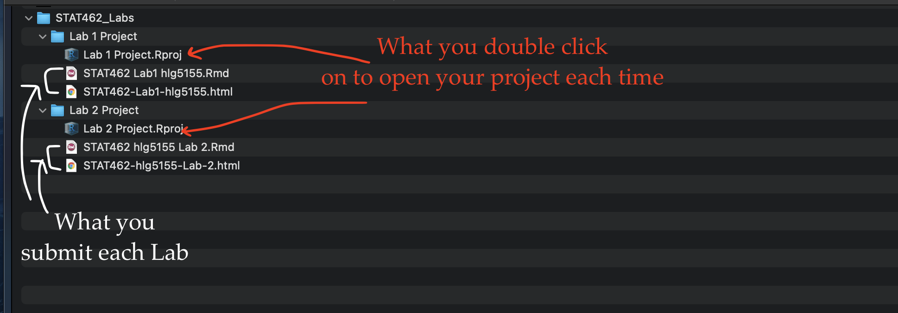

<style>
p.comment {
background-color: #DBDBDB;
padding: 10px;
border: 1px solid black;
margin-left: 0px;
border-radius: 5px;
font-style: normal;
}

h1.title {
  font-weight: bold;
  font-family: Arial;  
}

h2.title {
  font-family: Arial;  
}

</style>


<style type="text/css">
#TOC {
  font-size: 12px;
  font-family: Arial;
}
</style>


\


```{r setup, include=FALSE}
knitr::opts_chunk$set(echo = TRUE, warning=FALSE, message = FALSE)
library(kableExtra)
library(tidyverse)
library(skimr)
library(ggplot2)
library(plotly)
library(ggpubr)

```

# Learning objectives 

By the end of this week's lab, you will be able to:

1. Understand YAML code and set up a lab template
2. Get comfortable de-bugging errors
2. Conduct some exploratory data analysis
3. Make better plots and a more professional report

<br>

<p class="comment">**Assignment 2 is due by midnight Next Wed.**   [See here](https://psu.instructure.com/courses/2174925/assignments/13762677) I PROVIDE HELP UNTIL THE END OF NEXT WEEK'S LAB (final evening is for your own finishing up).</p>

<br>

## I need help

1. There is a TEAMS discussion for lab help [CLICK HERE](https://teams.microsoft.com/l/team/19%3aWabo92vghie-p1jKkmYOGJIOPMUExkoPb0JQMb_9dgw1%40thread.tacv2/conversations?groupId=bbc92dcc-56df-48e6-8da3-5cd766908eeb&tenantId=7cf48d45-3ddb-4389-a9c1-c115526eb52e).  Remember to include a screenshot of the issue and a short desciption of the problem.  Also try googling the error first.

2. Every time you re-open R studio check you are using your project file (does it say Lab 2 at the top?).  

3. EVERY TIME YOU RE-OPEN R-STUDIO YOU NEED TO RE-RUN **ALL** YOUR CODE CHUNKS.  The easiest way to do this is to press the "Run All" button (see the Run menu at the top of your script)

4. **If the labs are causing major problems or your computer hardware is struggling (or you have any other software issue), Talk to Dr Greatrex**. We can  fix this and there are other options for "online R" that you can use. 
 


<br>  

# STEP 1: Lab templates

<br>

## 1a. Get set up

IF YOU ARE DOING THIS ON YOUR COMPUTER:  First, go and look at your STAT-462 folder on your computer.  Make sure that everything looks right (e.g. a single sub-folder for each lab containing your project file, your Rmd and your html, along with any datafiles/pics as needed).  If so, congrats!  If not, chat to Dr G.

1. Open R-studio.  Go to New Project / New Directory / New Project.  Then name your project **Lab2-Project**.  Place the location inside your STAT-462 folder.  If you are stuck, see 
[Tutorial 2.1](https://psu-spatial.github.io/stat462-2022/T1_R_Basics.html#21_Projects).

<br>

2.  Now, go to New File/New R-Markdown to make a new R-Markdown file.  Call it Lab 2 and add your PSU-e-mail e.g. *Lab 2-hlg5155*.  Immediately press knit - as that will auto-save the file (call it the same thing) and create the html.
 
<br>

3.  Your STAT-462 folder & R-Studio should look something like this with maybe minor tweaks in exactly what you called things.  IF NOT, FIX IT! (esp lab 2)

<br>

```{r, Lab2Fig1, echo=FALSE, fig.cap = "*Your Computer Set up*",fig.align='center'}

```

## 1b. Markdown template

As you can see, the friendly text is back for your new lab-script.  This is a pain and we want to make life easy in terms of formatting.  So our first job in this lab is to make a template so future reports are easier.

Work through [Tutorial 5 Report template](https://psu-spatial.github.io/stat462-2022/T1_R_Basics.html#5_Report_template) to create and save a template to your STAT-462 folder and also a version inside your lab 2 folder.  

For the lab 2 folder one, update the title etc to be about Lab 2.


## 1c. Load libraries

In the library section of your lab report, add a new code chunk and use this code to load the following libraries. If some don't exist on your computer or on the cloud, use [Tutorial 2.3] (https://psu-spatial.github.io/stat462-2022/T1_R_Basics.html#23_Adding_a_new_package) to install/download them.

```{r, eval=FALSE}
library(tidyverse)
library(dplyr)
library(ggpubr)
library(skimr)
library(ggplot2)
library(plotly)
library(ISLR)

```

<br>
<br>
<br>

# STEP 2: Code showcase

<br>

## 2a. Markdown 

You should now be able to see how headings work. If you click the A symbol on the top right you can also change the formatting of text (you can also do this in the basic text - see Tutorial 4)

I also want you to be able to embed images or videos into your report.

**Q1:** <br> Follow [Tutorial 4.7 Images](https://psu-spatial.github.io/stat462-2022/T1_R_Basics.html#47_Adding_photos) to add an image of your choice into your report. (note, non english characters in file names or huge photos will break R)

**Q2:** <br> If you wish to add a video from youtube, you will need to install a new package called `vembedr`.  Follow Tutorial 2.3 to install this package and add it to your library code chunk.<br> Now make a code chunk and use the `embed_url` command to embed a video of your choice from youtube/vimeo etc in your report.  If you have issues, see teams.

**Q3:** <br> Below both, use a bullet point list (see tutorial 4 or google) to explain why you chose those photos/images.

<br>
<br>

## 2b. Code/Math 

<br>

TUTORIAL 8 AND LAB 1 MIGHT HELP YOU HERE

**Q4:** 

In your code showcase section, answer these  questions, making sure to use full sentences in your conclusions.  If it helps to make your report easier to read, feel free to include the question text. 
 
*A sample of 36 obese rock-hopper penguins in a zoo were put on a special diet for a year - part of a large nationwide programme.  The average weight loss was 11oz and the standard deviation of the weight loss was 19oz. (note, that a positive weight loss implies reduced weight over time).*

**Q4a:** <br> Given our sample, by hand or in R, calculate a 99% confidence interval for the true mean weight reduction of all zoo penguins in the entire programme (not just our zoo).  Make sure to show your workings or R code. Ideally, but optional, upload a mini diagram of the distribution you are using to calculate your confidence interval & mark any key values.

**Q4b:** <br> Based on the interval you calculate above, do you have sufficient evidence at your 99% level of significance to believe that the weight-loss programme is working and the penguins are losing weight? 

**Q4c:** <br> The average penguin actually weighs about 3Kg. Is this diet something you would recommend for meaningful weight loss?

<br>

**Q5:**

*Tests are being carried out on a new drug designed to relieve the symptoms of the flu, specifically on the number of hours people can sleep.  The new drug is given in tablet form one evening to a random sample of 16 people who have colds. The number of hours they sleep may be assumed to be Normally distributed and is recorded below.*

*There is also a very large control group of people who have colds but are not given the drug.  The mean number of hours they sleep is 6.6 hrs.*

```{r,echo=FALSE,}
print("Hours slept by people given the new drug",quote=FALSE)
for(n in 1:16){print(sort(c(8.1,6.7,2.3,7.2,8.1,9.7,6.0,7.4,6.4,6.9,5.0,7.8,6.7,7.2,7.6,7.9))[n])}
```

<span style="color: navy;">*You can enter the sleep data into R using this code.*</span>

```{r,eval=FALSE}
# The c command sticks things together
sleep <- c(8.1,6.7,2.3,7.2,8.1,9.7,6.0,7.4,6.4,6.9,5.0,7.8,6.7,7.2,7.6,7.9)
```

**Q5a:** <br>By hand, carry out a hypothesis test at the 1% significance level that the drug has any impact on the length of time people sleep. You can use R as a calculator to get things like the mean. Include a screenshot of your [neat] workings in this report. Make sure to include:

 a. *Your H~0~ and H~1~*
 b. *The critical threshold*
 c. *Whether it is one sided or two sided*
 d. *Whether you choose to use the normal or t-distribution*
 e. *A diagram of the distribution split into the acceptance and critical/rejection zones*
 f. *The calculated test statistic*
 g. *and your conclusions*


**Q5b:** <br>  Use R and the t.test command to calculate the t-test for the data above. Comment on whether your two results agree (e.g. did you make a mistake anywhere).  See the Tutorial 7 for code

<br>
<br>
<br>


# STEP 3: Data Analysis

We are now going to work on "real data analysis", filling in the sections in the rest of your report.


## 3a. Choose a dataset 
You have three dataset choices.  Choose ONE of:

 - data("penguins", package = "palmerpenguins")
 - data("starwars", package = "dplyr")
 - data("pirates", package = "yarrr")
 
Choose one column of continuous numeric data that interests you as your response variable. **Choose a DIFFERENT dataset to your friends**.  

Note, putting  the code above into an R code chunk will allow you to load the data, but you *may* have to retype the quote-marks if you get an error.

<br>
<br>

## 3b. Conduct Exploratory Data Analysis

NEW TUTORIALS HAVE APPEARED - Tutorial 6 (summary stats), Tutorial 7 (plots), Tutorial 8 (distributions)

Using the tutorials and [teaching notes on Canvas](https://psu.instructure.com/courses/2174925/files/132549205), fill in the report template to the end of EDA (end of step 2b in the teaching notes), making as professional plots/analyses as you can.

SEE THE PDF FROM CANVAS WITH MORE DETAIL ABOUT WHAT TO DO: https://psu.instructure.com/courses/2174925/files/132549205  

<br>
<br>

## How are we grading this?

As you are choosing your own dataset and your own response variable, we do not have the worked answers.  So here is how we are grading things:

 - 29-30:  Just exceptional.  It's clear from your text and code 
    + What the background of this dataset - why might your topic be interesting to model
    + How it links to your chosen object of analysis/population/response variable
    + We can clearly understand the properties of the sample data (e.g. what type of data, how much is there, what variables, is there missing data)
    + You have made beautiful plots going above and beyond the base R code.  See Tutorial 6 for more details
    + You have thoughtfully answered the questions in the teaching notes step 2b to assess whether your sample is appropriate, referring back to your code/plot/outputs as needed.  
    + You don't have spurious R output e.g. you didn't print out the entire dataset in your final html report.
   
 - 25-28:  You did most of this, but your R plots might have been less professional (say auto column labels), or you didn't do a spell check (IT'S NEXT TO THE KNIT BUTTON), or it wasn't fully clear from your write-up what the study design or sample distribution was.    

- Below 25 gets less for big things missing or say, lots of code but no text explaining the output

Note, this is not a writing class and we are not grading you on your grammar or English literacy, especially knowing that English is not all of your first language.  We *are* grading you on being able to clearly communicate the suitability of your dataset for a model analysis at an undergrad student level - even if you don't use jargon words to do it.   Being able to do regression analysis also means being able to communicate your results to a non-expert, so you do need to do more than just the code/maths.  If you are worried, you are welcome to send me a message on teams/canvas and we can chat.

<br>
<br>

# STEP 4: Show me something new

Remember that an A is 94%, so you can ignore this section and still easily get an A. But here is your time to shine. Also, if you are struggling in another part of the lab, you can use this to gain back points.

**To get the final 4 marks in the lab, you need to show me something new, e.g. you need to go above and beyond the lab questions in some way.** 

 - You get 2/4 for doing something new in any way BEYOND THE LAB INSTRUCTIONS/CODE
 - You get 4/4 for something really impressive or multiple small things.
 - You must tell us in your R script what you did!   

Here are some ideas:

 - You installed a "pretty" theme using a new package (hint, you will need to tweak the YAML code to remove the table of contents)
 - You found a cool new plot from R graph gallery or flowingdata.com and made it work
 - You did something neat in Markdown such as embedding a pdf
 - You worked out how to write your equations in equation format
 - You found a new package/command that did something relevant
 - You found something cool on data camp and applied it here
 - You managed to install tmap (hint, first install raster and sp) and made maps of any spatial data..

<br>
<br>

# Submitting your Lab

Remember to save your work throughout and to spell check your writing (next to the save button). 

Now, press the knit button for the final time. 

If you have not made any mistakes in the code then R should create a html file in your lab 2 folder which includes your answers. If you look at your lab 1 folder, you should see this there - complete with a very recent time-stamp.

In that folder, double click on the html file.  This will open it in your browser. CHECK THAT THIS IS WHAT YOU WANT TO SUBMIT.

If you are on R studio cloud, see Tutorial 1 for how to download your files

Now go to Canvas and submit BOTH your html and your .Rmd file in Lab 2.

```{r, echo=FALSE}
knitr::include_graphics("./Figures/Lab1_Basics_2022_fig1.png")
```

<br>

# Grading Rubric/checklist

See the table below for what this means - 100% is hard to get!

**HTML FILE SUBMISSION - 8 marks**

**RMD CODE SUBMISSION - 8 marks**

**WRITING/CODE STYLE - 10 MARKS**

Your code and document is neat and easy to read. LOOK AT YOUR HTML FILE IN YOUR WEB-BROWSER BEFORE YOU SUBMIT.  There is also a spell check next to the save button.  

You have written your answers below the relevant code chunk in full sentences in a way that is easy to find and grade. For example, you have written in full sentences, it is clear what your answers are referring to. You have used units and explained your workings. 
    
**MARKDOWN SHOWCASE: 10 MARKS** 

You use full sentences and units, You have great Markdown formatting

**R-CODE SHOWCASE: 30 MARKS** 

You have managed to successfully complete all the code challenges
 
**EDA: 30 MARKS** 

See above for ideas on grading.

**Above and beyond: 4 MARKS**
 
See above for ideas on grading

[100 marks total]


Overall, here is what your lab should correspond to:

```{r, echo=FALSE}
rubric <- readxl::read_excel("STAT462_22_LRubric.xlsx")
knitr::kable(rubric) %>%   
  kable_classic_2() %>%
  kable_styling(bootstrap_options = c("striped", "hover", "responsive"))


```

