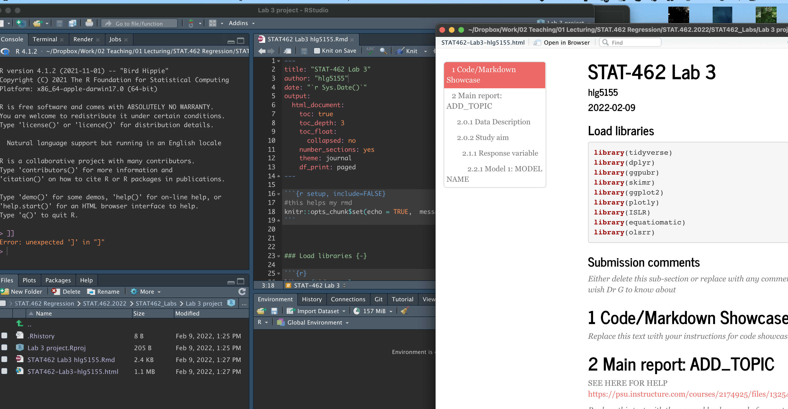

<style>
p.comment {
background-color: #DBDBDB;
padding: 10px;
border: 1px solid black;
margin-left: 0px;
border-radius: 5px;
font-style: normal;
}

h1.title {
  font-weight: bold;
  font-family: Arial;  
}

h2.title {
  font-family: Arial;  
}

</style>


<style type="text/css">
#TOC {
  font-size: 12px;
  font-family: Arial;
}
</style>


\


```{r setup, include=FALSE}
knitr::opts_chunk$set(echo = TRUE, warning=FALSE, message = FALSE)
library(tidyverse)
library(dplyr)
library(ggpubr)
library(skimr)
library(ggplot2)
library(plotly)
library(ISLR)
library(equatiomatic)
library(olsrr)
library(Stat2Data)
library(readxl)
library(corrplot)
data("HousesNY")

```

# Learning objectives 

By the end of this week's lab, you will be able to:

1. Understand YAML code and set up a lab template
2. Get comfortable de-bugging errors
2. Conduct some exploratory data analysis
3. Make better plots and a more professional report

<br>

<p class="comment">**Assignment 2 is due by midnight Next Wed.**   [See here]https://psu.instructure.com/courses/2174925/assignments/13762818) I PROVIDE HELP UNTIL THE END OF NEXT WEEK'S LAB (final evening is for your own finishing up).</p>

<br>

## I need help

1. There is a TEAMS discussion for lab help [CLICK HERE](https://teams.microsoft.com/l/team/19%3aWabo92vghie-p1jKkmYOGJIOPMUExkoPb0JQMb_9dgw1%40thread.tacv2/conversations?groupId=bbc92dcc-56df-48e6-8da3-5cd766908eeb&tenantId=7cf48d45-3ddb-4389-a9c1-c115526eb52e).  Remember to include a screenshot of the issue and a short desciption of the problem.  Also try googling the error first.

2. Every time you re-open R studio check you are using your project file (does it say Lab 3 at the top?).  

3. EVERY TIME YOU RE-OPEN R-STUDIO YOU NEED TO RE-RUN **ALL** YOUR CODE CHUNKS.  The easiest way to do this is to press the "Run All" button (see the Run menu at the top of your script)

4. **If the labs are causing major problems or your computer hardware is struggling (or you have any other software issue), Talk to Dr Greatrex**. We can fix this and there are other free/cheap options for using R online.
 


<br>  

# STEP 1: Lab set up

<br>

## 1a. Get set up

IF YOU ARE DOING THIS ON YOUR COMPUTER:  First, go and look at your STAT-462 folder on your computer.  Make sure that everything looks right (e.g. a single sub-folder for each lab containing your project file, your Rmd and your html, along with any datafiles/pics as needed).  If so, congrats!  If not, chat to Dr G.

1. Open R-studio.  Go to New Project / New Directory / New Project.  Then name your project **Lab3-Project**.  Place the location inside your STAT-462 folder.  If you are stuck, see 
[Tutorial 2.1](https://psu-spatial.github.io/stat462-2022/T1_R_Basics.html#21_Projects).

<br>

2. Set up your template: 
    + IF YOU ARE WORKING ON YOUR OWN COMPUTER: Go onto your computer, find your STAT462 folder and make a copy of your lab template .Rmd file.  Copy it into your lab 3 folder and rename as Lab 3 & your PSU-e-mail e.g. *Lab 3-hlg5155*.  (you can do this within the R files tab if you wish but probably easier on your computer) <br>>br>
    + IF YOU ARE WORKING ON R-STUDIO CLOUD: In the files tab, there is an upload button.  Click that and upload last week's template that you saved onto your computer. Click the checkbox by it and rename to *Lab 3-hlg5155* (with your ID). (If you didn't download a copy of your lab template file, go into your lab 2 project and do so first). <br><br> 
 
3. Go back to R studio, make sure you are running the Lab 3 project, then go to the files quadrant and click on your lab3 script to open.  Update the title etc and make any formatting tweaks you like.

<br><br> 

## 1c. Load libraries and check it all knits

In the library section of your lab report, add a new code chunk and use this code to load the following libraries. If some don't exist on your computer or on the cloud, use [Tutorial 2.3] (https://psu-spatial.github.io/stat462-2022/T1_R_Basics.html#23_Adding_a_new_package) to install/download them first.  To make sure they loaded OK, run the code chunk TWICE.  The second time any welcome text will disappear unless there are errors.

```{r, eval=FALSE}
library(tidyverse)
library(dplyr)
library(ggpubr)
library(skimr)
library(ggplot2)
library(plotly)
library(ISLR)
library(equatiomatic)
library(olsrr)
library(Stat2Data)
library(readxl)
library(tmap)

```

Finally, press knit to check the html works and it looks like this (with your theme)

```{r, echo=FALSE, fig.align='center'}

```

<br>
<br>

# STEP 2: Code showcase

**Note, you might want to make a second .Rmd file to practice the tutorials, so you can save your practice but only write up what is needed in your report**

<br>

## 2a. Markdown - inline code and equations

The best thing about R-Markdown is that you can set up reports to automatically  update even in the text.  For example imagine underneath a code chunk you want to write that the mean of the data is 23.  Instead of typing the number 23, we can add *inline code* to automatically create it 

*Step A:* Work through [Tutorial 4.8, Inline code](https://psu-spatial.github.io/stat462-2022/T1_R_Basics.html#48_Inline_code)

Use the tutorial to do the following.

*Question 1:*  In the markdown/code showcase section of your lab report, create a hidden code chunk where you find the answer to pi to the power 4, to 4 decimal places.  Write a sentence inside your report containing  inline code that shares the answer.

<br>

*Question 2:*  Conduct a t-test to find out whether the true mean of this data is significantly less than 13.  Hide the test itself and simply write out the concluding summary,using inline code and hidden code chunks.

```{r}
testdata <- c(4,6,2,7,8,34,4,65,6,2,3,1,45,5)
```


*Step B:* Equations

It's often good to put professional looking equations into your report.  We can do this using the $ symbol and with some internet support.

Rather than read my tutorial, see this one: https://rmd4sci.njtierney.com/math

I tend to use one of the online LateX maths editors to find the exact commands to make equations and then copy/paste the commands into my markdown  For example:

 - https://latexeditor.lagrida.com/
 - https://www.tutorialspoint.com/latex_equation_editor.htm
 
 
*Question 3:* Explain what the central limit theorem is and why we might use a T distribution instead of a Normal one. Use the tutorials above to make sure your equations are formatted correctly.


<br>
<br>
<br>


# STEP 3: Data Analysis

## 3A. Univariate model

NEW TUTORIALS HAVE APPEARED:
SCATTERPLOTS: [Tutorial 7.8](https://psu-spatial.github.io/stat462-2022/T1_R_Basics.html#78_Scatterplots), CORRELATION PLOTS/CALCULATIONS [Tutorial 6.3](https://psu-spatial.github.io/stat462-2022/T1_R_Basics.html#63_Correlation), 

Next month, your friend is moving to Sindian Dist., in New Taipei City, Taiwan.  They want to buy a house and have asked you to figure out what most impacts house price.  (this course is normally less house price/penguin heavy!  Next week....)

1.  Download the "Lab03_house.xlsx" dataset from the Lab page on canvas and put it into your Lab 3 folder.  Use the read_excel() command to read it in and save it to a variable called house:

```{r}
# This only works if you are running your project
# If it can't find the file, use file.choose() to locate it, as described in homework 3
# Then add in the full location rather than just the file name.
house <- read_excel("Lab03_house.xlsx")

```

2.  Explore the dataset (using summaries etc (lab 1 & 2), and by reading more about the data here: https://archive.ics.uci.edu/ml/datasets/Real+estate+valuation+data+set).  Describe the dataset to your friend. What columns does the dataset contains and how much data there is?  Are there any limitations using this data? 

3. Adjust/fill in the template to end of EDA, focusing only on your response variable for now.

Our first model will be univariate - we think nothing impacts house prices, so all we have is the histogram. Assume that a Normal distribution can fit the data, with mean(sample_mean) and sd(sample_sd).   Adjust the title of your model section to read

### Model 1: Univariate model: Normal Distribution

4. In model fitting, write a sentence to explain the above, but instead of writing out "mean(sample_mean) and sd(sample_sd)", use your new  equation knowledge and inline text to write out the model more formally.  We will talk about this in class.

5. Under check validity, use a Shapiro-Wilk test, a QQplot and a histogram to assess if you think the house price data really is normally distributed.

6. Ignore test skill for now (we will need it later in the course)

7. Under "Assess errors on population parameters:", calculate using R the 99th confidence interval on the population mean and write up the results in your text in full sentences.  E.g. according to the central limit theorem, we can assume.. therefore.. etc.

8. In the same section, my friend has been told that the average price in the city is $35000.  Given your sample, conduct a hypothesis test to assess how likely it is to see your sample result if that statement is likely to be true, with a critical significance of 80%.  
9. In the predict new value, use a 99% prediction interval to assess whether you are 99% likely to see a house over $70,000.


## 3B. Bivariate model

Make a new level 1 section called Bi-variate models.

We do know ways to improve our model, as we know things that might impact house prices contained in our data.  Specifically, our friend has been told that houses might be more expensive in the North.  

10. Scatterplot

- Look at the dataset and see which column gives you information about North/South (hint Latitude/longitude)
- Create a scatterplot to assess this 
- Describe the scatterplot fully as discussed in Lecture 10 (Friday/resources in homework 3)
- Create a Simple Linear Regression model to assess the issue
- Extract the equation and write it below the plot, explaning what the intercept and slope are.
- Plot the abline, line of best fit onto a new scatterplot

11. Comment on why this might be misleading as an analysis?  To help you answer this question, try running this code to further explore the data on a map.

DONT RUN IF TMAP NOT WORKING

```{r,eval=FALSE}
# Command from the sf library
# Make a spatial version of the data using the Longitide and Latitude columns
house.spatial <- st_as_sf(house,coords=c("Longitude","Latitude"),crs = 4326)

# make interactive, for static set as "plot"
tmap_mode("view")

# Command from the tmap library
# and plot
tm_basemap("Esri.WorldTopoMap") + 
     qtm(house.spatial, # data
         symbols.col="House.Price", # which column for the symbols
         symbols.alpha=0.9, # transparency
         symbols.size=.2, # how big
         symbols.palette="Spectral", #colors from https://colorbrewer2.org
         symbols.style="fisher") # color breaks
```

12. Beyond this, what other confounding variables might there be?  Is there a variable that is more important than latitude in predicting house prices in your dataset?  Provide evidence to justify your answer. To help you answer this data and answer this question, some useful code includes:

  + [A] corrplot().  A quick look at the correlation coefficient between all the variables. We will discuss it more next week.  
 
```{r,eval=FALSE}
library(corrplot)
# ADD THAT LIBRARY TO YOUR LIST!
corrplot(cor(house),method="number",type="lower")
```

  + [B] If you then want to look at three variables together, you can use an interactive plot 
  e.g you can use this code and change the response, y (currently house price), the predictor x (currently latitude) and the colour (currently house.age).  

```{r, eval=FALSE}
# Create a plot
p <- house %>%                  
  ggplot( aes(Latitude,House.Price, col= House.Age)) +
  geom_point() +
  theme_classic()+
  scale_color_gradient(low="blue", high="red")

# and actually plot it
ggplotly(p)
```

<br>
<br>

# STEP 4: Show me something new

Remember that an A is 94%, so you can ignore this section and still easily get an A. But here is your time to shine. Also, if you are struggling in another part of the lab, you can use this to gain back points.

**To get the final 4 marks in the lab, you need to show me something new, e.g. you need to go above and beyond the lab questions in some way.** 

 - You get 2/4 for doing something new in any way BEYOND THE LAB INSTRUCTIONS/CODE
 - You get 4/4 for something really impressive or multiple small things.
 - You must tell us in your R script what you did!   

Here are some ideas:

 - You found a cool new plot from R graph gallery or flowingdata.com and made it work
 - You did something neat in Markdown such as embedding a pdf
 - You found a new package/command that did something relevant
 - You found something cool on data camp and applied it here
 - You tweaked your mapping/plotting code to be better

<br>
<br>

# Submitting your Lab

Remember to save your work throughout and to spell check your writing (next to the save button). 

Now, press the knit button for the final time. 

If you have not made any mistakes in the code then R should create a html file in your lab 2 folder which includes your answers. If you look at your lab 1 folder, you should see this there - complete with a very recent time-stamp.

In that folder, double click on the html file.  This will open it in your browser. CHECK THAT THIS IS WHAT YOU WANT TO SUBMIT.

If you are on R studio cloud, see Tutorial 1 for how to download your files

Now go to Canvas and submit BOTH your html and your .Rmd file in Lab 2.

```{r, echo=FALSE}
knitr::include_graphics("./Figures/Lab1_Basics_2022_fig1.png")
```

<br>

# Grading Rubric/checklist

See the table below for what this means - 100% is hard to get!

**HTML FILE SUBMISSION - 8 marks**

**RMD CODE SUBMISSION - 8 marks**

**WRITING/CODE STYLE - 10 MARKS**

Your code and document is neat and easy to read. LOOK AT YOUR HTML FILE IN YOUR WEB-BROWSER BEFORE YOU SUBMIT.  There is also a spell check next to the save button.  

You have written your answers below the relevant code chunk in full sentences in a way that is easy to find and grade. For example, you have written in full sentences, it is clear what your answers are referring to. You have used units and explained your workings. 
    
**MARKDOWN SHOWCASE: 10 MARKS** 

You use full sentences and units, You have great Markdown formatting

**R-CODE SHOWCASE: 20 MARKS** 

**UNIVARIATE: 20 MARKS** 

**BIVARIATE: 20 MARKS** 

You have managed to successfully complete all the code challenges
 
**Above and beyond: 4 MARKS**
 
See above for ideas on grading

[100 marks total]


Overall, here is what your lab should correspond to:

```{r, echo=FALSE}
rubric <- readxl::read_excel("STAT462_22_LRubric.xlsx")
knitr::kable(rubric) %>%   
  kable_classic_2() %>%
  kable_styling(bootstrap_options = c("striped", "hover", "responsive"))


```

