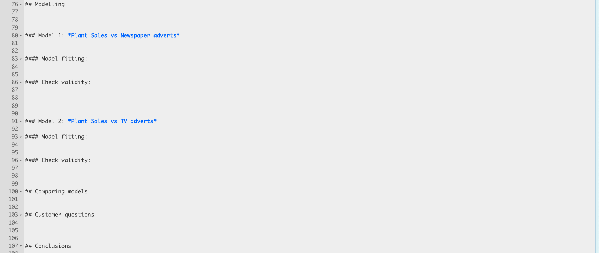

<style>
p.comment {
background-color: #DBDBDB;
padding: 10px;
border: 1px solid black;
margin-left: 0px;
border-radius: 5px;
font-style: normal;
}

h1.title {
  font-weight: bold;
  font-family: Arial;  
}

h2.title {
  font-family: Arial;  
}

</style>


<style type="text/css">
#TOC {
  font-size: 12px;
  font-family: Arial;
}
</style>


\


```{r setup, include=FALSE}
knitr::opts_chunk$set(echo = TRUE, warning=FALSE, message = FALSE)
library(tidyverse)
library(dplyr)
library(ggpubr)
library(skimr)
library(ggplot2)
library(plotly)
library(ISLR)
library(equatiomatic)
library(olsrr)
library(Stat2Data)
library(readxl)
library(corrplot)
library(kableExtra)

```


# Learning objectives 


<p class="comment">**Assignment 5 is due by midnight NEXT WEDNESDAY (1 week lab)**   [See here](https://psu.instructure.com/courses/2174925/assignments/13762850) I PROVIDE HELP UNTIL THE END OF NEXT WEEK'S LAB. After next week's lab (All of Wed evening) is for your own finishing up.</p>


By the end of this week's lab, you will be able to:

1. Feel comfortable working through a simple linear regression analysis
2. Feel comfortable discovering outliers.
3. Feel comfortable assessing LINE assumptions

There is a TEAMS discussion for lab help [CLICK HERE](https://teams.microsoft.com/l/team/19%3aWabo92vghie-p1jKkmYOGJIOPMUExkoPb0JQMb_9dgw1%40thread.tacv2/conversations?groupId=bbc92dcc-56df-48e6-8da3-5cd766908eeb&tenantId=7cf48d45-3ddb-4389-a9c1-c115526eb52e).  Remember to include a screenshot of the issue and a short description of the problem.  Also try googling the error first.

<br>  

# PART 1: Lab set-up. DO NOT SKIP!

<br>  

**Step A:** Create a new project for Lab 5.  If you are stuck, see previous labs or [Tutorial 2.1](https://psu-spatial.github.io/stat462-2022/T1_R_Basics.html#21_Projects).

<br>  

**Step B:** Copy your lab template to your lab 4 folder, rename as `STAT-462_Lab5_EMAILID.Rmd` and open (e.g.STAT-462_Lab5_hlg5155.Rmd). This should have your theme, your table of contents and your headings. 

<br>

**Step C:** In the library section, add a new code chunk and use this code to load the libraries below.

 - If some don't exist on your computer or on the cloud, use [Tutorial 2.3]( https://psu-spatial.github.io/stat462-2022/T1_R_Basics.html#23_Adding_a_new_package) to install/download them first. NEVER put install.packages in your code chunk, run it in the console.

 - To make sure they loaded OK, run the code chunk TWICE.  The second time any welcome text will disappear unless there are errors.
 
 - Sometimes you might need an extra package later in the lab.  Install it using the instructions above and add the library command to your library code chunk.

```{r, eval=FALSE}
# Load libraries
library("tidyverse") # Lots of data processing commands
library("knitr")     # Helps make good output files
library("ggplot2")   # Output plots
library("rmarkdown") # Helps make good output files
library("lattice")   # Makes nice plots
library("RColorBrewer") # Makes nice color-scales
library("skimr")     # Summary statistics
library("Stat2Data") # Regression specific commands
library("corrplot")  # correlation plots
library("GGally")    # correlation plots
library("ggpubr")    # QQplots
library("olsrr")     # Regression specific commands
library("plotly")    # Interactive plots
library("readxl")    # Read from excel files
library("equatiomatic") # extract equations

## you may need additional libraries.  Just add them to this list if you get errors.

```

<br>  

**Step D:** Finally, press knit to check the html works and your theme works.   

<br>  

# PART 2: Code showcase

IF YOU IGNORED THE STEPS ABOVE GO BACK AND DO THEM!  You lose marks for things like no theme, poor headings (remember there is a space between the # and the text), or accidentally printing out package loading text.  

<br>  

**Step 1:** Describe the LINE assumptions for your client in plain language and why each is important.

<br>  

**Step 2:** Go to https://stephenturner.github.io/drawmydata/.  Create and save 3 datasets into your Lab 5 folder. Read all of them into R and assign to testdata1, testdata2 and testdata3.  Consider making a scatterplot...  (hint, if your column names have messed up, think about what we did in Lab 4 to adjust them)  

 - One that meets all the assumptions of simple linear regression
 - One that breaks the assumption of linearity
 - One that breaks the assumption of equal variance/heteroskadisity


<p class="comment">To make life easy for yourself, think about how many data points makes a reasonable regression (e.g. as we are modelling our response, how many would you need for a reasonable histogram..).  Too few points will make your job impossible.</p>

<br>  

**Step 3:** Use NEW TUTORIAL, Tutorial 10, and https://online.stat.psu.edu/stat501/lesson/4 to assess the LINE assumptions for your three datasets. For independence especially, you do not have to run every plot, you can simply talk about if you are concerned about this.

<br>  

# PART 3: House Plant advertising

## Lab report format {-}

Imagine this is a real report you are submitting to an advertising company. You will be graded on the professionality of your final report.   In all of your answers below, I expect good formatting, appropriate units and full sentences to explain your answers.  Please also make sure that you use headings, sub-headings and the spell check to make your lab easier to follow and grade.  

Think about using any/all of the markdown features we have learned so far, for example equations, text formatting, pictures, code-chunk options or anything else that makes your report look more professional.  

<p class="comment">The headings in the template are guidelines. If it helps to use your own or to tweak them, this is OK.</p>

<br>  


## Instructions: {-}

```{r,echo=FALSE,include=FALSE}
adverts <- read.csv("Advertising.csv")
```

Houseplants are now very popular.  You have been hired by an advertising executive who has been collecting data on how well their marketing campaigns have been running.

They have run 200 marketing campaigns over the last few years.  For each one, they recorded:

 - how much they spent (in units of thousands of dollars) on 
     + TV, 
     + radio 
     + and newspaper adverts  
 - How many houseplants were sold (in thousands of plants).  
 - The "X-Factor" of how popular that plant was at the time (percentage popularity), 
 - And typically how tall that type plant was in inches.

The company wish to know which type of advertising campaigns are the most effective.

Follow the instructions below to answer their questions.

<br>

### 1. Describe the study

<p class="comment">IF YOU ARE AN HONORS STUDENT USE YOUR OWN DATA FROM THE FIRST PART OF THE SEMESTER. Choose who you are writing your report for, your dataset and response, then work through</p>

<br>  

**Step 1:**  If you skipped it, go back and read the brief above. Seriously, it will save you time.

<br>  

**Step 2:**  If you skipped making/copying/using the lab report template, go back and do it - or these instructions will not make sense [Tutorial 5](https://psu-spatial.github.io/stat462-2022/T1_R_Basics.html#5_Report_template).

<br>  

**Step 3:**  Read the data into R.  In the `Data Description` and `Study Aim` sections, use the first part of the [teaching notes](https://psu.instructure.com/courses/2174925/files/132549205) to help you write about the following: <br> 

 - The background of the study *(imagine this is a real report to a real customer, google things like _house plant sales increasing_ for ideas, include a picture!)*
 - A short description of the data source.
 - The object of analysis
 - A reasonable population *(what population could your results be extrapolated to)*
 - The response variable *(and units - if they are not provided, state that!)*
 - A bullet point list of your predictor variables *(and units)*
 - The amount of data
 - Statements to answer the questions on page 3 of the teaching notes 
 - A short paragraph to summarise the study *(Example for penguins on page 3 of the teaching notes)*
    
 <p class="comment">There are also guidelines in the template. You do NOT need to repeat yourself, so ignore anything you have already done or refer to it in your answers e.g. "As shown in the histogram above....".</p>

<br>


### 2. Explore the data    

**Step 4:**  Under `Exploratory Analysis | Response Variable` in your report, explore your response variable and describe it in the report, working through page 4-6 of the teaching notes (Step 2) and commenting on all the questions.  E.g. if there are no outliers, SAY there are no outliers (Step 2). <br><br> Again, there are additional hints in the template - you do not need to answer things twice.

 <p class="comment">Hint: For full marks, plots like histograms should have proper x and y axis labels and titles. All the tutorial examples in [Tutorial 7](https://psu-spatial.github.io/stat462-2022/T1_R_Basics.html#7_Making_plots) can be copy/pasted, why not choose a more sophisticated one..</p>


```{r,include=FALSE, echo=FALSE}
library(corrplot)
mat <- cor(adverts)
corrplot(mat)
```

<br>

**Step 5:**  Under `Exploratory analysis`, make a new sub-section called `Correlation`.  Make a correlation plot of the variables against your response [See Tutorial 6.4](https://psu-spatial.github.io/stat462-2022/T1_R_Basics.html#64_Correlation).  Which predictor has the largest _negative_ correlation against your response?

<br>

### 3. Make some models

<p class="comment">IF YOU ARE AN HONORS STUDENT, choose two likely predictor variables for your response and make your two models for those</p>


Your client wishes to know which advertising campaign is the most effective out of.

 - Model1 - Plant Sales vs Newspaper adverts
 - Model2 - Plant Sales vs TV adverts 
 
To do this, we are going to create and compare TWO models.  Adjust your report headings to look like this
 
```{r, echo=FALSE, eval=FALSE}

```


 

<br>

**Step 6:**  FOR BOTH MODELS, under `model fitting` use [Tutorial 8](https://psu-spatial.github.io/stat462-2022/T1_R_Basics.html#78_Scatterplots) and [Tutorial 9](https://psu-spatial.github.io/stat462-2022/T1_R_Basics.html#9_Regression_models) to help you:

 - Make a professional looking scatterplot (this should have proper x,y axis labels etc)
 - Describe the scatterplot (e.g. strength, association etc)
 - Create a linear model
 - Show the model summary
 - Use equatiomatic or any other method to formally write out the equation and coefficients.
 
 
<br>

**Step 7:**  Use the NEW TUTORIAL, [Tutorial 1](https://psu-spatial.github.io/stat462-2022/T1_R_Basics.html#9_Regression_models) to help you assess each LINE assumption for BOTH model 1 and model 2.  For each model, comment if it meets the requirements for simple linear regression, referring back to the diagnostic plots.

<br>

**Step 8:**  Under `Comparing models`, refer to your analysis (or do new analysis as appropriate) to answer the following questions.  

1. Out of model 1 and model 2, where do you see the greatest increase in sales if you increase the advertising budget? <br>  Provide evidence to justify your answer (thinking about uncertainties on your estimate).
 
2. Which model explains the most variability in the sales data? Provide evidence to justify your answer.

<br>

**Step 9:**  Under `Customer questions`, refer to your analysis (or do new analysis as appropriate) to answer the following questions.  

1. _Peace lily dilemma:_ Your customer has a client who needs to sell 8000 "peace lily" plants but hates newspapers. Conduct an hypothesis test to assess whether you typically sell less than 8000 plants in a situation where you spend zero-money on newspaper advertising. You are happy to be wrong one time in 25.  Advise the company whether is OK to stop advertising in newspapers.  
 

2. _TV fears:_  Another client is skeptical of TV.  Use the ANOVA table output to conduct a hypothesis test to examine if there is evidence to suggest a relationship between TV advertising and plant sales, with a critical significance of 1%. (Fridays lecture or see textbook)
 
3. _Best day ever:_ A new client has approached the company with a brand new plant!!! (the rainbow-monstera-fig).  This is *very* popular.  The magazine "Plants Daily" rates its popularity at 70%!  <br> Thinking about the plant popularity independently of advertising type, what is the predicted range of sales for your new campaign? (at a 99% confidence level). Note, you may need to make a section for a new model... (Friday's lecture or see textbook)


<p class="comment">IF YOU ARE AN HONORS STUDENT, for step 9:<br> a) Conduct a hypothesis test on either the intercept or the slope against a value that would be appropriate. <br> b) Conduct an F test using the ANOVA table on either model 1 or model 2.  c) Create a prediction interval for a new data point </p>


<br>

**Step 10:**  Under `Conclusions`, summarise for the customer what you have learned.  Explain how multiple regression might have allowed you to conduct a better analysis.


<br>

# PART 4: Show me something new

Remember that an A is 94%, so you can ignore this section and still easily get an A. But here is your time to shine. Also, if you are struggling in another part of the lab, you can use this to gain back points.

**To get the final 5 marks in the lab, you need to show me something new, e.g. you need to go above and beyond the lab questions in some way.** 

 - You get 2/4 for doing something new in any way BEYOND THE LAB INSTRUCTIONS/CODE
 - You get 4/4 for something really impressive or multiple small things.
 - You must tell us in your R script what you did!   

Here are some ideas:

 - Something cool from data camp or a previous course you did in R.
 - You found a cool new plot from R graph gallery or flowingdata.com and made it work
 - You did something neat in Markdown such as embedding a pdf
 - You found a new package/command that did something relevant
 - You found something cool on data camp and applied it here
 - You tweaked your mapping/plotting code to be better

<br>

# Submitting your Lab

Remember to save your work throughout and to spell check your writing (next to the save button). 

Now, press the knit button for the final time. 

If you have not made any mistakes in the code then R should create a html file in your lab 5 folder which includes your answers. If you look at your lab 5 folder, you should see this there - complete with a very recent time-stamp.

In that folder, double click on the html file.  This will open it in your browser. CHECK THAT THIS IS WHAT YOU WANT TO SUBMIT.

If you are on R studio cloud, see Tutorial 1 for how to download your files

Now go to Canvas and submit BOTH your html and your .Rmd file in Lab 5.

```{r, echo=FALSE, eval=FALSE}
knitr::include_graphics("./Figures/Lab1_Basics_2022_fig1.png")
```


<br>

# Grading Rubric/checklist

See the table below for what this means - 100% is hard to get!

**HTML FILE SUBMISSION - 10 marks**

**RMD CODE SUBMISSION - 10 marks**
    
**CODE SHOWCASE 30 MARKS** 

 - You have successfully created and read in the three datasets.  
 - You have fully explained what each line assumption is 
 - You have fully explained WHY each is important
 - You have assessed the LINE assumptions for your own data

**HOUSEPLANT DATA 1: Professional report 15 MARKS** 

Full marks for a report that _I_ would take into a job interview.  You have done things like fully labeled plots using words, tried more sophisticated plots than just the basics, written full paragraphs/sentences, used equation formats, sub-headings, used spell check, explained results in clear language, included units, used a theme and table of contents..  Lose marks for each thing that makes it look non-professional.

**HOUSEPLANT DATA 2: Exploratory Analysis and Study Aim 10 MARKS** 

You have clearly and neatly explored and written up your study aim and exploratory data analysis

**HOUSEPLANT DATA 3: Making models Aim 10 MARKS** 

You have successfully completed steps 6 - 8

**HOUSEPLANT DATA 4: Answering questions 15 MARKS** 

You have managed to answer each of the questions in step 9 (5 for each)

**SHOW ME SOMETHING NEW: 5 MARKS** 

See above
 
[100 marks total]
 


Overall, here is what your lab should correspond to:

```{r, echo=FALSE, eval=FALSE}
rubric <- readxl::read_excel("STAT462_22_LRubric.xlsx")
knitr::kable(rubric) %>%   
  kable_classic_2() %>%
  kable_styling(bootstrap_options = c("striped", "hover", "responsive"))


```
    