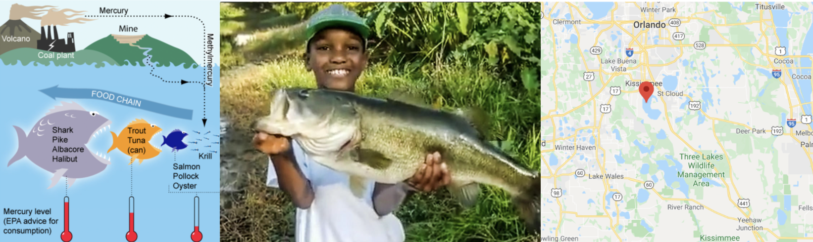

<style>
p.comment {
background-color: #DBDBDB;
padding: 10px;
border: 1px solid black;
margin-left: 0px;
border-radius: 5px;
font-style: normal;
}

h1.title {
  font-weight: bold;
  font-family: Arial;  
}

h2.title {
  font-family: Arial;  
}

</style>


<style type="text/css">
#TOC {
  font-size: 12px;
  font-family: Arial;
}
</style>


\


```{r setup, include=FALSE}
knitr::opts_chunk$set(echo = TRUE, warning=FALSE, message = FALSE)
library(tidyverse)
library(dplyr)
library(ggpubr)
library(skimr)
library(ggplot2)
library(plotly)
library(ISLR)
library(equatiomatic)
library(olsrr)
library(Stat2Data)
library(readxl)
library(corrplot)
library(kableExtra)
library(visreg)
```


# Learning objectives 


<p class="comment">**Assignment 6 is due by midnight NEXT WEDNESDAY (1 week lab)**   [See here](https://psu.instructure.com/courses/2174925/assignments/13762850) I PROVIDE HELP UNTIL THE END OF NEXT WEEK'S LAB. After next week's lab (All of Wed evening) is for your own finishing up.</p>

By the end of this week's lab, you will be able to:

1. Feel comfortable working with outliers
2. Feel comfortable using transformations to fix LINE problems
3. Start running MLR.

There is a TEAMS discussion for lab help [CLICK HERE](https://teams.microsoft.com/l/team/19%3aWabo92vghie-p1jKkmYOGJIOPMUExkoPb0JQMb_9dgw1%40thread.tacv2/conversations?groupId=bbc92dcc-56df-48e6-8da3-5cd766908eeb&tenantId=7cf48d45-3ddb-4389-a9c1-c115526eb52e).  Remember to include a screenshot of the issue and a short description of the problem.  Also try googling the error first.

<br>  

# PART 1: Lab set-up. DO NOT SKIP!

<br>  

**Step A:** Create a new project for Lab 6.  If you are stuck, see previous labs or [Tutorial 2.1](https://psu-spatial.github.io/stat462-2022/T1_R_Basics.html#21_Projects).

<br>  

**Step B:** Copy your lab template to your lab 6 folder, rename as `STAT-462_Lab6_EMAILID.Rmd` and open (e.g.STAT-462_Lab6_hlg5155.Rmd). This should have your theme, your table of contents and your headings. 

<br>

**Step C:** In the library section, add a new code chunk and use this code to load the libraries below.

 - If some don't exist on your computer or on the cloud, use [Tutorial 2.3]( https://psu-spatial.github.io/stat462-2022/T1_R_Basics.html#23_Adding_a_new_package) to install/download them first. NEVER put install.packages in your code chunk, run it in the console.

 - To make sure they loaded OK, run the code chunk TWICE.  The second time any welcome text will disappear unless there are errors.
 
 - Sometimes you might need an extra package later in the lab.  Install it using the instructions above and add the library commands to your library code chunk.

```{r, eval=FALSE}
# Load libraries
library("tidyverse") # Lots of data processing commands
library("knitr")     # Helps make good output files
library("ggplot2")   # Output plots
library("rmarkdown") # Helps make good output files
library("lattice")   # Makes nice plots
library("RColorBrewer") # Makes nice color-scales
library("skimr")     # Summary statistics
library("Stat2Data") # Regression specific commands
library("corrplot")  # correlation plots
library("GGally")    # correlation plots
library("ggpubr")    # QQplots
library("olsrr")     # Regression specific commands
library("plotly")    # Interactive plots
library("readxl")    # Read from excel files
library("equatiomatic") # extract equations
library("ggstatsplot")

## you may need additional libraries.  Just add them to this list if you get errors.

```

<br>  

**Step D:** Finally, press knit to check the html works and your theme works.   

<br>  

# PART 2: Code showcase

Copy any of your old datasets into your lab 6 folder and read it in.  Make a linear model between your response and predictor. Now go to the packages tab and install the `visreg` model.  Add `library(visreg)` to your library code chunk and re-run.

`OLSRR`, `ggstatsplot` and `visreg` are three relatively new packages for regression and they are adding new cool things every day.  Here are tutorials for them:

 - https://pbreheny.github.io/visreg/ and more details (https://journal.r-project.org/archive/2017/RJ-2017-046/RJ-2017-046.pdf)
 - https://cran.r-project.org/web/packages/olsrr/vignettes/intro.html
 - https://indrajeetpatil.github.io/ggstatsplot/ 
 - https://indrajeetpatil.github.io/ggstatsplot_slides/slides/ggstatsplot_presentation.html 
 - https://cran.r-project.org/web/packages/jtools/vignettes/summ.html
 - 
Glance at some tutorials and have a play - see what plots and visualisions are there and try a few on your test data.

Describe at least one thing you think I should add in the tutorials and show me an example.


<br>  

# PART 3: Florida Fish and Mercury poisoning

```{r,echo=FALSE,include=FALSE}
 bass <- read.csv("bass.csv")
```

NEW TUTORIALS: TRANSFORMATIONS : https://psu-spatial.github.io/stat462-2022/T1_R_Basics.html#15_Transformations
and MODEL COMPARISONS : https://psu-spatial.github.io/stat462-2022/T1_R_Basics.html#16_Basic_model_comparisons

## Background

Small amounts of the element mercury are present in many everyday foods.  These do not normally affect your health, but too much mercury can be poisonous. Mercury itself is naturally occurring, but the amounts in the environment have been on the rise from industrialization. The metal can make its way into soil and water, and eventually build up in animals like fish, which are then eaten by people.  More details here:

 - https://www.wearecognitive.com/project/extra-narrative/bbc-mercury
 - https://medium.com/predict/mercury-pollution-reaches-the-deep-sea-f59a4938dc7c

In the late 1980s, there were widespread public safety concerns in Florida about high mercury concentrations in sport fish. In 1989, the State of Florida issued an advisory urging the public to limit consumption of "top level" predatory fish from Lake Tohopekaliga and connected waters: including largemouth bass (Micropterus salmoides), bowfin (Amia calva), and gar (Lepisosteus spp.).  This severely impacted tourism and the economy in the area. Urgent research was required to inform public policy about which lakes needed to be closed.


```{r, out.width = "100%", echo=FALSE,fig.align='center',fig.cap="a. (Left): The mercury food chain in fish.(Wikimedia commons, Bretwood Higman, Ground Truth Trekking) b. (middle) A large bass caught and released in a central Florida lake (https://www.wired2fish.com/news/young-man-catches-releases-huge-bass-from-bank/) c. (right). The location of the lakes in Florida (Google maps)"}

```
## Goal

We are going to reproduce part of one study on the topic conducted by T.R. Lange in 1993. 

Dr Lange and their team took samples from 53 lakes in the Central Florida area. Using water samples collected from each of the lakes, the researchers measured the pH level, as well as the amount of chlorophyll, calcium and alkalinity. The Mercury concentration in the muscle tissue of lake fish was also recorded.

The units of the your dataset are: 

| **Variable** |           **Unit**          |
|:------------:|:---------------------------:|
|  Chlorophyll | micrograms/Litre, $\mu g/L$ |
|  Alkalinity  |   miligrams/Litre, $mg/L$   |
|      pH      |           Unitless          |
|    Calcium   |   miligrams/Litre, $mg/L$   |
|    Mercury   |     Micrograms, $\mu g$     |

The data is stored on Canvas in __bass.csv__.

You can see part of the paper here: https://www.researchgate.net/publication/15388314_Mercury_accumulation_in_largemouth_bass_Micropterus_salmoides_in_a_Florida_Lake 

__You have been asked to assess whether the alkalinity levels of a lake might impact Mercury levels in largemouth bass. You will be presenting your results to the Mayor of Orlando in order to set new fishing regulations.  She has asked for a report to provide your full thinking and workflow in how you decide on your final model.__  


## Lab report format {-}

Imagine this is a formal report you are submitting to the Mayor of Orlando. You will be graded on the professionality of your final report.   In all of your answers below, I expect good formatting, appropriate units and full sentences to explain your answers.  Please also make sure that you use headings, sub-headings and the spell check to make your lab easier to follow and grade.  

Think about using any/all of the markdown features we have learned so far, for example equations, text formatting, pictures, code-chunk options or anything else that makes your report look more professional.  

<p class="comment">The headings in the template are guidelines. If it helps to use your own or to tweak them, this is OK.</p>

<br>  

Follow the instructions below to answer their questions.

<br>

### 1. Describe the study

**Step 1:**  If you skipped it, go back and read the brief above. Seriously, it will save you time.

<br>  

**Step 2:**  If you skipped making/copying/using the lab report template, go back and do it - or these instructions will not make sense [Tutorial 5](https://psu-spatial.github.io/stat462-2022/T1_R_Basics.html#5_Report_template).

<br>  

**Step 3:**  Read the data into R.  In the `Data Description` and `Study Aim` sections, use the first part of the [teaching notes](https://psu.instructure.com/courses/2174925/files/132549205) to help you write about the following: <br> 

 - The background of the study *(imagine this is a real report and the Mayor doesn't know the background)*
 - A short description of the data.
 - The object of analysis
 - A reasonable population *(what population could your results be extrapolated to/  All water in the universe in all time?)*
 - The response variable *(and units - if they are not provided, state that!)*
 - A bullet point list of your predictor variables *(and units)*
 - The amount of data
 - Statements to answer the questions on page 3 of the teaching notes 
 - A short paragraph to summarise the study *(Example for penguins on page 3 of the teaching notes)*
    
 <p class="comment">There are also guidelines in the template. You do NOT need to repeat yourself, so ignore anything you have already done or refer to it in your answers e.g. "As shown in the histogram above....".</p>

<br>


### 2. Explore the data    

**Step 4:**  Under `Exploratory Analysis | Response Variable` in your report, explore your response variable and describe it in the report, working through page 4-6 of the teaching notes (Step 2) and commenting on all the questions.  E.g. if there are no outliers, SAY there are no outliers (Step 2). <br><br> Again, there are additional hints in the template - you do not need to answer things twice.

 <p class="comment">Hint: For full marks, plots like histograms should have proper x and y axis labels and titles. All the tutorial examples in [Tutorial 7](https://psu-spatial.github.io/stat462-2022/T1_R_Basics.html#7_Making_plots) can be copy/pasted, why not choose a more sophisticated one..</p>


```{r,include=FALSE, echo=FALSE}
library(corrplot)
mat <- cor(bass[-2])
corrplot(mat)
ggstatsplot::ggcorrmat(bass)
```

<br>

**Step 5:** Inside `Exploratory analysis`, make a new sub-section called `Correlation`.  Look at the correlation between your predictor variables and your response (e.g. all the variables in the table as well as the 'main' predictor.  Comment on what you find out [See Tutorial 6.4](https://psu-spatial.github.io/stat462-2022/T1_R_Basics.html#64_Correlation).  

<br>

### 3. Initial model

**Step 6:**  Set up the model

Using the study aim I wrote above, identify your response and specific predictor variable for this study.  Under `Model 1:`

 a. Create a linear model 
 
 b. Make a professional looking scatterplot (this should have proper x,y axis labels etc) with the line of best fit plotted from the model 
 
 c. Describe the scatter-plot (e.g. strength, association etc) 
 
 d. Show the model summary
 
 e. Use equatiomatic or any other method to formally write out the equation and coefficients.
 
 f. The Mayor doesn't know regression.  Clearly interpret the estimated model parameters (slope & intercept)/model summary-statistics in the the context of the problem, in a way that would be understandable to a policy maker. <br><br> By this I mean explain what the slope/intercept means in term of the problem, highlighting if this is useful or nonsensical (like knowing weight of someone with zero height is not useful). <br> I also mean talking about the percentage of variation explained by the model and whether from your analysis so far, you think Simple Linear Regression might/might not be appropriate in this case.
 
<br>

**Step 7:**  Under `Model Validity`, use [Tutorial 12](https://psu-spatial.github.io/stat462-2022/T1_R_Basics.html#12_Checking_LINE_Assumptions) to help you formally assess each LINE assumption for model 1.  Comment if it meets the requirements for simple linear regression, referring back to your plots.

<br>

**Step 8:** Use [Tutorial 14 on outliers](https://psu-spatial.github.io/stat462-2022/T1_R_Basics.html#14_Outliers,_leverage_and_influential_points) to show your workings/R-code/thought process and identify:

  a. The name of the lake with highest residual mercury value 
  
  b. The name of the lake with highest leverage 

  c. The name of the lake with highest Cook's distance
  

```{r, include=FALSE}
plot(bass$Mercury~bass$Alkalinity)
model1 <- lm(Mercury~Alkalinity,data=bass)
abline(model1)
olsrr::ols_plot_resid_fit(model1)
olsrr::ols_plot_cooksd_chart(model1)
olsrr::ols_plot_resid_lev(model1)

# Make a new column with the predicted y value
bass$y_predicted <- model1$fitted.values

# Make a new column with the raw residuals
bass$residuals_raw <- model1$residuals

# Make a new column with the standardisd/studentised residuals
library(MASS)
bass$residuals_stud <- studres(model1)

# Make a new column with the leverage
bass$x_leverage <- ols_leverage(model1)

# Make a new column with the Cook's distance. OLSRR package
bass$cooks.distance <- cooks.distance(model1)

# Print out the table
head(bass)

```

HINT!  https://psu-spatial.github.io/stat462-2022/T1_R_Basics.html#145_Making_a_table_of_your_residual_diagnostics 
 

**Step 9:** 
Another analyst looked at your results and suggested that there are four Lakes which appear to be close to Influential Outliers. In your analysis, use Cook's distance to explain why they think this and identify the Lakes they are  worried about. Do you agree with their comment? Explain your reasoning and provide evidence. 

<br>

### 4. Transformations

After examining the data, the results were double-checked and it was decided to keep ALL of the data points - we could find no reason that they were wrong or from another population.  Another team member suggested (and hopefully agreed with you!) that perhaps the observed residual diagnostics are weird because the there is a lack of linearity between the two variables of interest.  They proposed you should apply a transformation and refit the data.  

NEW TUTORIALS: TRANSFORMATIONS : https://psu-spatial.github.io/stat462-2022/T1_R_Basics.html#15_Transformations
and MODEL COMPARISONS : https://psu-spatial.github.io/stat462-2022/T1_R_Basics.html#16_Basic_model_comparisons


<br>

**Step 9:** 
Using the lecture notes/class discussions about possible starting points for transformations, write how you would proceed? (i.e. For a lack of linearity, would you transform the response variable, explanatory variable or both? What transformations could you use?) Clearly explain why you came to this conclusion.  Just write a few sentences, then move to step 10. 

NEW TUTORIALS: TRANSFORMATIONS : https://psu-spatial.github.io/stat462-2022/T1_R_Basics.html#15_Transformations
and MODEL COMPARISONS : https://psu-spatial.github.io/stat462-2022/T1_R_Basics.html#16_Basic_model_comparisons


<br>

**Step 10:** 
After some research, two models were proposed that might fit the data:

  a. A log transformation on the explanatory variable (`log()` command)
  b. The square root of the explanatory variable (`sqrt()` command)

Make a new section after `Model 1` called `Testing Transformations`.  In that section, apply the two transformations to the data and decide which one is the best fit statistically. 

Explain your reasoning referring to any goodness of fit measures that you used. Hint, you do not need to do all the LINE assumptions here. Just a quick plot and the linear model.

NEW TUTORIALS: TRANSFORMATIONS : https://psu-spatial.github.io/stat462-2022/T1_R_Basics.html#15_Transformations
and MODEL COMPARISONS : https://psu-spatial.github.io/stat462-2022/T1_R_Basics.html#16_Basic_model_comparisons


<br>

**Step 11:** 
After talking with some marine biologists, you decide to use the log transformation because it has more physical relevance.

Rename `Model 2`, `Final Model`, and fully summarise your log model e.g. repeat Step 6 and Step 7 for the final log model.

So here I am hoping for a good scatterplot, a description of the model, an assessment of whether the new model meets each of the assumptions needed for linear regression and  if there are any influential outliers. Is this model closer to LINE than the original one?


NEW TUTORIALS: TRANSFORMATIONS : https://psu-spatial.github.io/stat462-2022/T1_R_Basics.html#15_Transformations
and MODEL COMPARISONS : https://psu-spatial.github.io/stat462-2022/T1_R_Basics.html#16_Basic_model_comparisons

<br>

**Step 12:** Model comparisons

Using AIC and R_2_ compare your Log model and the original one.  Explain what AIC and R_2_ show in the text and which model appears to fit the data better.  Google and the textbook will help here (and the lectures..)


and MODEL COMPARISONS : https://psu-spatial.github.io/stat462-2022/T1_R_Basics.html#16_Basic_model_comparisons

<br>

**Step 13:**  New lake

Make a new subsection called `Analysis Questions`

The Governor recently had a question from a member if the public who went fishing in a new lake that was not part of the study.  We know the alkalinity level of that lake was 40mg/L.  The member of the public wants to be 99% sure that they won't exceed the Florida Health Advisory level for Mercury levels in Fish, which is 1 $\mu g$ of Mercury.

Should they eat the fish?  Explain your answer and show your evidence for how you came to your conclusion.

<br>

**Step 14:**  More complex (5 marks, instead of show me something new)

_This question is designed to be more difficult and realistic.  I will answer points of clarification, but I will not help anyone work through it before the labs are submitted. However I will award partial marks for workings and how far you get_

The Florida Health Advisory level for Mercury levels in Fish is 1 $\mu g$ of Mercury. The Governor has accepted your model and is requiring state-wide alkalinity tests.

What is your safety cut-off value of alkalinity for new lakes?  (You would like to be 95% sure that you aren't just seeing this result by chance).  Provide evidence of how you got to your answer

**Step 15:**  Multiple regression

This is leading into Lab 7.. Finally, the mayor thinks that Calcium AND Alkalinity impact Mercury levels on fish. Make an initial Multiple linear regression model and write out the model equation (hint equatiomatric works the same way).  These tutorials might help:

 - http://www.sthda.com/english/articles/40-regression-analysis/168-multiple-linear-regression-in-r/
 - https://www.r-bloggers.com/2021/10/multiple-linear-regression-made-simple/

<br>

**Step 16:**  Under `Conclusions`, summarise for the Mayor what the key points are of your analysis.

<br>

# Submitting your Lab

Remember to save your work throughout and to spell check your writing (next to the save button). 

Now, press the knit button for the final time. 

If you have not made any mistakes in the code then R should create a html file in your lab 5 folder which includes your answers. If you look at your lab 5 folder, you should see this there - complete with a very recent time-stamp.

In that folder, double click on the html file.  This will open it in your browser. CHECK THAT THIS IS WHAT YOU WANT TO SUBMIT.

If you are on R studio cloud, see Tutorial 1 for how to download your files

Now go to Canvas and submit BOTH your html and your .Rmd file in Lab 5.

```{r, echo=FALSE, eval=FALSE}
knitr::include_graphics("./Figures/Lab1_Basics_2022_fig1.png")
```


<br>

# Grading Rubric/checklist


See the table below for what this means - 100% is hard to get!

**HTML FILE SUBMISSION - 10 marks**

**RMD CODE SUBMISSION - 10 marks**

**Professional report 15 MARKS** 

Full marks for a report that _I_ would take into a job interview.  You have done things like fully labeled plots using words, tried more sophisticated plots than just the basics, written full paragraphs/sentences, used equation formats, sub-headings, used spell check, explained results in clear language, included units, used a theme and table of contents..  Lose marks for each thing that makes it look non-professional.

**Code showcase - 10 MARKS** 

You have shown me a plot or some other command that helps with your regression work (might be a new format of scatterplot or something else) and your code to show it off works.

**Study data and EDA - 10 Marks** 

You have explored the data using the guide.  You have created the correlation matrix plot and sensitively described the relationship between your response and your predictors.

**First model and LINE - 10 MARKS** 

You created the model correctly.  In your write up you have summarised the model equation  (including the coefficients as numbers) & summarising units afterwards. 

**Residual Analysis - 10 MARKS** 

You have assessed whether there are outliers and whether they are influential. You have correctly answered the residual questions and shown why.


**Steps 9 and 10- 10 MARKS** 

You have have thoughtfully answered these questions and followed instructions


**Transformed model, making the model - 10 MARKS**

You have correctly refitted and interpreted the transformed models, following steps 11 and 12

**Prediction and Q15 - 10 MARKS**

You have correctly predicted the new lake in step 13 and talked about multiple regression in Q15

**Hard part - 5 MARKS**

You have answered Q.14 correctly and shown your workings..

 - 1/4 you try anything
 - (2-3)/4 Right idea but didn't get far
 - 4/5 nearly there
 - 5/5 perfect


 
[100 marks total]
 


Overall, here is what your lab should correspond to:

```{r, echo=FALSE, eval=FALSE}
rubric <- readxl::read_excel("STAT462_22_LRubric.xlsx")
knitr::kable(rubric) %>%   
  kable_classic_2() %>%
  kable_styling(bootstrap_options = c("striped", "hover", "responsive"))


```
    