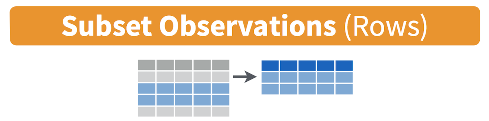

<style>
p.comment {
background-color: #DBDBDB;
padding: 10px;
border: 1px solid black;
margin-left: 25px;
border-radius: 5px;
font-style: italic;
}
</style>


```{r setup, include=FALSE}
knitr::opts_chunk$set(echo = TRUE, warning=FALSE, message = FALSE)
library(vembedr)
library(yarrr)
library(RColorBrewer)
library(GGally) # correlation plots
library(tidyverse)
library(plotly)
library(readxl)
```

# Accessing R & Settings {#Tut1_WhatisR}

*What are R and R-Studio?* <br> *How do I transfer things to and from R-Studio cloud?* <br> *What is a package and how do I install them?* 

<br>


## What are R and R-Studio?

**R** is a free, open source statistical programming language. It is useful for data cleaning, analysis, and visualization. By a "programming language", I mean it is a collection of commands that you can type into the computer in order to analyse and visualise data. The easiest way I find to think about R is that it is literally a language, like Spanish or Hindi, that is spoken by your computer. Learning R means learning vocabulary and grammar in order to communicate. It also means it will get easier with experience and
practice..

When you install R on your computer, you are essentially instantly teaching your computer to "speak in R" with some very basic Notepad-like software where you can enter commands.

<br>

```{r, Tut1Fig1, echo=FALSE, fig.cap = "*The basic R console. You write in blue, the computer replies in black. The > means it is waiting for a command*",fig.align='center',out.width="80%"}

```

<br>

More recently, **R-studio** has been designed as a piece of software to make it easier to programme in R. It's Microsoft Word is compared to notepad with many more options. For example, you can easily see help files, run code, see your output and create outputs like this lab book! R-Studio also allows us to make interactive documents called R-Markdown files.

<br>

```{r, Tut1Fig2, echo=FALSE, fig.cap = "*R-studio is much more sophisticated*",fig.align='center'}
knitr::include_graphics('./Figures/pg_Tut1_about_fig2.png')
```

<br>

To learn more about R studio, see here: <https://www.rstudio.com/products/rstudio/> (1 minute video), or a slightly longer one here:

```{r,echo=FALSE,fig.align='center'}
embed_url("https://www.youtube.com/watch?v=SdMPh5uphO0")

```

<br>
<br>

## Accessing R & R-Studio

For this course you will need TWO pieces of software, one called R and one called R studio. You have four options:

 - Installing on your own computer (free and recommended)
 - R-Studio Cloud - you can access R studio online, but only a certain number of hours are free
 - The Penn State TLT server: (Not recommended as often crashes and loses work)
 - Lab computers (not recommended, they are out of date and R will fill up your U-Drive)

More details here for each of them:


<br>

### On your computer {#Tut1Ba_Desktop}

R is free and having it on your own computer will give you a lot more freedom to complete the labs, especially if there is social distancing later in the semester.

<p class="comment"> "**Your R AND R-Studio MUST be up to date, or things wont' work**. R should be a minimum of 4.1.2 (2021-11-01) -- "Bird Hippie" and R-studio a minimum of Version 2021.09.1" </p>


<p class="comment"> **If you already have R and/or R-Studio, it is very important you update both of them to the most recent version. The easiest way to do this is to first uninstall both programmes, then re-install fresh.** If you are worried this will affect another class, chat with Dr Greatrex before starting out. </p>

#### To install R: {-}
 
1.  On a windows machine, go to: <https://cloud.r-project.org/bin/windows/base/> , download R v 4.1.1 and double click to install (click next through all the options)

2.  On a Mac, go to: <https://cloud.r-project.org/bin/macosx/> ,download the R v 4.1.1 package and double click to install (click next through all the options)

3.  On anything else: <https://cloud.r-project.org/bin>


#### To install R-Studio: {-}

1.  Go to the website here: <https://www.rstudio.com/products/rstudio/download/#download> and download the version for your operating system.

    ***For Windows Users**: Sometimes R asks you to download something called RTools. You can ignore this request as it is not relevant to our course. If you really want the warning to go away, you can download Rtools here <https://cran.r-project.org/bin/windows/Rtools/> Follow the instructions closely and ask if you need support.*


<br>

### R-studio cloud {#Tut1Bb_Cloud}

You can access both R and R-studio online without installing anything through R-studio cloud.

This is a website where you can log into an online version of R. and I believe is free for the first 25hrs each month.  To do this, make an account at <https://rstudio.cloud/plans/free>.

You can also easily move files from the Cloud to your Desktop, so for example, you can work on the cloud during lab hours and on your desktop at home. Here's how

<br>

#### R-Studio Cloud to your computer {-}

 1.  On your computer, go to your STAT462 folder (or make one!)
 2.  Make a subfolder named for that lab e.g. *Lab 1*
 3.  On your browser, open your project in R-studio cloud
 4.  In the files quadrant/tab, select the checkbox of all the files.
 5.  Click Export. This will zip them into a folder. Save that into your lab folder
 6.  Unzip. Double click the project.RProj file to reopen your lab on your computer
 
 <br>

```{r, Tut1Fig3, echo=FALSE,fig.align='center'}

```


#### Your computer to R-Studio Cloud {-}
 
 1.  On your browser, in R studio cloud make a new project and name it something relevant
 2.  Click the upload button
 3.  Navigate to the lab folder on your computer. Choose ONLY the .Rmd file(s) and any input data as appropriate (RStudio-Cloud will make the rest)
 4.  Click on the .Rmd file name in the files in RStudio and you're good to go

<br>

```{r, Tut1Fig4, echo=FALSE,fig.align='center'}
knitr::include_graphics('./Figures/pg_Tut1_about_fig4.png')
```

<br>

```{r, Tut1Fig5, echo=FALSE,out.width="70%",fig.align='centre'}
knitr::include_graphics('./Figures/pg_Tut1_about_fig5.png')
```

<br>

```{r, Tut1Fig6, echo=FALSE,out.width="70%",fig.align='centre'}

```

<br>
<br>


### Lab computers/TLT server {#Tut1Bc_Campus}

There is a free version of R studio cloud hosted by Penn State, that you can access here: https://lat.tlt.psu.edu/home/remoteaccess/oss-web-apps/ .  However, to access off campus you will need a VPN and it can be buggy and crash.  Be warned and talk to Dr G first.

The lab computers should have a recent version of R, but often the code “packages” you will later install fill up your U-drive. Equally, the version of R outside the lab room is going to be out of date and will likely cause issues. Be warned

*If you go down these routes, proceed with care and talk to Dr Greatrex first*

<br>
<br>

## Getting started {#Tut2A_Settings}

Everything in this tutorial is a one-off to get R and R-studio set up.

**IMPORTANT!  In an easy to access place on your computer, make a folder called STAT-462.  This is where ALL your labs are going to live**


#### On your own computer {-}

**Now everything is installed, open R-studio (NOT R!)**.  

<br>

```{r, tut2afig1b, echo=FALSE, out.width="80%",fig.align='center'}
knitr::include_graphics('./Figures/pg_Tut2_startup_fig1.png')
```
<br>

#### On R-studio Cloud {-}

Create a new project (button on the top right).  

<br>

```{r, tut2afig1bbb, echo=FALSE,out.width="80%",fig.align='center'}

```

### Looking around R-studio

You will be greeted by three panels:

 - The interactive R console (entire left)
 - Environment/History (tabbed in upper right)
 - Files/Plots/Packages/Help/Viewer (tabbed in lower right)
 
<br>

```{r, tut2afig2, echo=FALSE, fig.align='center'}
knitr::include_graphics('./Figures/pg_Tut2_startup_fig2.png')
```

<br>

If you wish to learn more about what these windows do, have a look at this resource, from the Pirates Guide to R: https://bookdown.org/ndphillips/YaRrr/the-four-rstudio-windows.html.  
<p class="comment">If you have used R before, you might see that there are variables and plots etc already loaded**.  It is always good to clear these before you start a new analysis.  To do this, click the little broom symbol in your environment tab</p>

<br>

### Moving the 4 quadrants around

You might find you like the different quadrants in a different order. To change this, look at the menu at VERY TOP OF THE SCREEN.  

  - In the`View` menu, there is a `/Panes/Pane Layout` menu item, where you can move the on-screen quadrants around.  I tend to like the console to be top left and scripts to be top right, with the plots and environment on the bottom - but this is  personal choice. 

 -  There should also be a menu called `Help`<br>Useful for R-studio version and Markdown cheatsheets.

<br>

### Changing a few settings (LAB 1 IMPORTANT)

R-studio wants to be helpful and will try to re-load exactly where you were in a project when you log back in.  This can get confusing, so we are going to turn this off.

 - **ON A MAC:** Click on the R-studio menu button on the top left of the screen, then click Preferences. 

 - **ON A PC/R-Studio Cloud:** Click on Tools-> Global Options -> Preferences

Now:

 - UNCLICK "Restore most recently opened project at startup"
 - UNCLICK "Restore .RData into workspace on startup"
 - Set "Save workspace to .RData on" exit to Never
 - UNCLICK "Restore previously open source documents on startup"
 - You can also click the appearances tab to change how the screen looks.


<br>
<br>
<br>


# R-Projects & Packages {#Tut2C_Project}

## Projects

<p class="comment">**You need to make a new project before you start EVERY lab!**</p>


An R-project is a special folder that will store everything to do with each lab in one place on your computer.  This is incredibly useful - it means that if you switch from R-Cloud, to the lab computers, to your laptop, all you have to do is to move the folder and everything will just work. Learn more here. 

[](https://www.linkedin.com/learning/learning-the-r-tidyverse/why-should-you-use-projects-in-rstudio?u=76811570 "Why use R Projects")


<br>
<br>


### Creating an R-project {#Tut2Bb_CreateRproj}

This step is needed for EVERY lab.

##### **On R-Studio Cloud:**

Note, if you are running R-Studio Cloud, you just need to click "Create Project" and name it.

<br>

##### **On your desktop**

```{r, tut2afig1bkaj, echo=FALSE,out.width="60%",fig.align='center'}
knitr::include_graphics('./Figures/pg_Tut2_startup_fig1.png')
```

1. If it's not already open, open **R-Studio** 
2. Go to the file menu at the very top and click `New Project` 
3. Select `New Directory`, then `New Project`
4. Name your project *STAT462-Lab1-PROJECT* 
5. Under "create project as a subdirectory of", hit the browse button and go inside your STAT-462 main folder (you just need to be in the folder, you don't need to have selected anything). Press open
6. Finally, press `Create Project`

```{r, tut2bfig4, echo=FALSE}
knitr::include_graphics('./Figures/pg_Tut2_startup_fig4.png')
```


<br>

### How do I know it has worked? {#Tut2Bc_signsRproj}

R will change slightly.  If you look at the top of the screen in the title bar, it should say *STAT462-Lab1-Project R Studio*.  

The Files tab should have gone to your project folder.  Essentially, R-Studio is now "looking" inside your Lab 1 folder, making it easier to find your data and output your results.  

```{r, tut2afig5, echo=FALSE, fig.cap="Note, in this book you might see a few GEOG-364s instead of STAT-462s"}
knitr::include_graphics('./Figures/pg_Tut2_startup_fig5.png')
```

<br>

Essentially, R-Studio is now "looking" inside your Lab 1 folder, making it easier to find your data and output your results.  

If you want one, final check, try typing this into the console (INCLUDING THE EMPTY PARANTHESES/BRACKETS), press enter and see if it prints out the location of Lab 1 on your computer. If not, talk to an instructor.

```{r, eval=FALSE}
getwd()
```

<br>

### Returning to your lab project

OK, let's imagine that you get halfway through your lab and your computer dies.  How do you get back to your Lab work?  Try this now.  Close down R-Studio.

To reopen a lab:

1. **DO NOT RE-OPEN R-STUDIO!**
2. Instead navigate on your computer to your *STAT-462/STAT462-Lab1-Project* folder.   
3. Double click on the STAT462-Lab1-Project.RProj file.

This will reopen R for that specific lab, so you can continue where you left off.

It means you can also open several versions of R studio for multiple projects, which can be very useful in keeping labs separate and staying sane.


```{r, tut2afig6, echo=FALSE}
knitr::include_graphics('./Figures/pg_Tut2_startup_fig6.png')
```


<br>
<br>


## R-Packages {#Tut2_Packages}

### What are packages? {#Tut2Ba_whatarethey}

As described earlier, we program in R by typing a series of commands.  R is open source meaning anyone can create a new one, so over the last 20 years,tens of millions of new custom commands have been created. 

Commands tend to be grouped together into collections called `Packages` or `Libraries` (two names for the same thing).  For example, one package contains the complete works of Shakespeare; another allows interactive website design; another allows advanced Bayesian statistics.  There is a package for literally everything and there are now about 20,000 packages available. You can see the full list here: https://cran.r-project.org/web/packages/available_packages_by_name.html

This is far too many to store on your computer, so most live on the internet in an online (free) "Package Store". You can download the ones you want, ready to load later.  

So to access the commands in a package we need these two steps:

1. ONCE ONLY: Download the package from the internet
2. EVERY TIME: Load the packages you want

<p class="comment">**A close analogy is your phone:**  There are millions of apps available from banking, to 50 different calendar apps.  You don't have every app in the world installed on your phone - and you don't have every app you *do* download running at the same time.  Instead you download the apps that you think you will need (occasionally downloading a new one on the fly) - and when you need to use an app, you click on it to open.</p>

<br>
<br> 

### LAB 1: Bulk download main packages {#Tut2Bc_fulllist}

Now we are going to download most of the packages you need for these labs so that you do not need to do this each week.

**Copy these command into the R-CONSOLE and press enter to run**.

```{r, warnings=FALSE, message=FALSE, eval=FALSE}
install.packages(c("tidyverse","abind","car","corrplot",
                  "ggpubr","ggstatsplot","ggpubr","IMTest","MASS","nortest",
                  "hrbrthemes", "ISLR","knitr", "kableExtra","lattice","matlab",
                  "olsrr", "plotly","RColorBrewer","readxl","remotes",
                  "rmdformats","skimr", "stargazer",
                  "Stat2Data","units","viridis","yarrr"))

```


When you press enter, a load of text should stream down your console.  Just let it run until the console is back to the > symbol and you can type. It might take several minutes.  Sometimes this will give you an error and not run,  This can be because copy/pasting from the internet messes up the quote marks around each package name.  In that case, you can easily manually download them by clicking the INSTALL button at the top of the packages tab, then choosing each name in turn.


```{r}
# Sometimes you need to install a package from a different place, like github. 
# To do this you use a more complex command, we should not need this
# remotes::install_github("ropensci/USAboundariesData")
```


When all the download text is streaming down your screen, it's hard to know what is an error and what is just "informative".  The easiest way to check is to load all the libraries at once and see whether there are errors. This is the same as clicking every app on your phone to see if they all installed OK.

Copy the code below into the console TWICE.  E.g. 

1. Copy the commands into the console once and press enter to run, wait until it stops running (it will show a load of "welcome" text again that makes it hard to see errors).  
2. The SECOND time you copy it into the console, it should just run without error or messages.

You can select and copy across the whole thing, you don't need to go line by line.  If you have issues, talk to Dr G.

```{r, warnings=FALSE, message=FALSE, eval=FALSE}
library("tidyverse")
library("abind")
library("car")
library("corrplot")
library("ggpubr")
library("ggstatsplot")
library("ggpubr")
library("ISLR")
library("kableExtra")
library("knitr")
library("hrbrthemes")
library("lattice")
library("olsrr")
library("plotly")
library("RColorBrewer")
library("readxl")
library("remotes")
library("rmdformats") 
library("skimr") 
library("stargazer")
library("Stat2Data") 
library("units") 
library("viridis") 
library("yarrr")
```

<br> 
<br> 

## Adding a new package

This is a TWO STEP PROCESS

1. You need to download it from the internet (like buying a phone app)
2. You need to tell the computer you want to use the commands in that package (like clicking on the icon to start the app)

More details here:

<br> 

### How to Download/Install a new package {#Tut2Bb_howtodownload}

Look at the Packages tab next to the plot one, you can see which packages/libraries are already pre-installed onto your computer.

If the package you want isn't listed then you need to download it from the internet (as a one-off), like buying it from the app store

 - Click the INSTALL button in the Packages tab, then start typing the package name and it will show up (check the include dependencies box). 

OR

 - IN THE CONSOLE! Run the `install.packages()` command on the package you want to download **with quotes around the package name** e.g. 
 
   ```{r,eval=FALSE}
   install.packages("bardr")
   ```
   
 OR

 - R will sometime tell you that you are missing a package (sometimes a little yellow ribbon), click yes to install!  

*Note, if you run this command multiple times, or the packages is already loaded, R-Studio might want to restart and sometimes gets confused. If it keeps asking, close R-studio, reopen and try again.  If it really doesn't want to work, open R itself and run in the console there.*

**Try installing the `bardr` package onto your computer**

<br>


#### How to LOAD/USE a package

Installing a package don't make the commands immediately available.  For that you need to load it (like clicking on an app).  This can be done with the `library()` command.  

In the console type this to install the full works of Shakespeare in the bardr package (https://www.rdocumentation.org/packages/bardr/versions/0.0.9)

```{r, eval=FALSE}
library(bardr)
```


If you have managed to install a package successfully, often nothing happens - this is great!  It means it loaded the package without errors. Otherwise, I suggest running this command TWICE!  This is because loading packages will print "friendly messages" or "welcome text" the first time you load them. 

For example, this is what shows up when you install the tidyverse package.  The welcome text is indicating the sub-packages that tidyverse downloaded and also that some commands now have a different meaning.  

```{r, tut3fig4bbb, echo=FALSE, fig.cap = "Tidyverse install messages",fig.align='center',out.width="80%"}

```


**To find out if what you are seeing is a friendly message or an error, run the command again.  If you run it a second time and there is no error then nothing should happen.**

<br>

### How to force the computer to use a specific package
  
Sometimes multiple packages name a command the same thing and you want to specify which package you want to use.  You can do this using the  :: symbol

For example, this command *forces* the computer to use the 'dplyr package' version of filter.

```{r, eval=FALSE}
dplyr::filter(mydata)
```
   

<br>


# Basic commands


<p class="comment">You should now have R-Studio open and be inside an R project. If you're having issues at this point or haven't managed to get to this step, STOP!  Ask an instructor for help.</p>

<br> 

First watch this 5 min video above for some pointers. We will also go through the video more slowly here:


```{r,echo=FALSE,fig.align='center'}
embed_url("https://youtu.be/SWxoJqTqo08?t=41")

```


<br>
<br>

## First steps

Remember that the aim of programming is to provide a language so you can ask your computer to do complex tasks. The console window (see Figure \@ref(fig:tut2afig2)) is like a phone call with your computer, where you "speak" in R.  

 - The computer has a little `>` symbol to say it is listening/waiting for your command
 - You type in a command
 - The computer tries to carry it out and will print the answer directly onto the screen

Let's start by the simplest command possible.  Try typing each of the following commands into your R console and pressing Enter

```{r, eval=FALSE}
1+1
```

When you press enter, it should give you the answer.... 2

```{r}
1+1
```

Note that spacing does not matter: `1+1` will generate the same answer as ` 1      +       1 `. When we get to text, capital letters DO matter.

<br> 
<br> 

## Saving commands in scripts

You might wonder at this point about how to save your work.   

Typing into console is like having a phone call with your computer; you're talking but you're not keeping records of what you say. To see previous commands, you can click the history tab (Environment quadrant) or press the up/down arrows on your keyboard, but when you close R, all record of these commands will be lost. 

We need instead is a way to save the commands for future use - we can do this using scripts.  There are several types of document, or script that you can create and save in R-Studio.

 - A basic script (the filetype is .r).  This is simply just a blank notepad where you can save code commands.  When you "run" the commands in the script, R simply copy/pastes the commands over to the console.
 
 - An R-Notebook or R-Markdown document (the filetype is .Rmd).  These are much more interesting - and are how I wrote this lab book.  We will be getting to these later in the lab
 
<br> 

#### Creating a basic R script {-}

For now, let's just create a basic R script.  Go to the File menu at the very top of the screen, then new file / new script.

This will add a new window - which is simply a notepad file you can save.  If you type your commands in there, you can save them. You run them in the console by highlighting the text on each line and pressing Ctrl-Enter (or command enter on a mac).

```{r, tut3fig4, echo=FALSE, fig.cap = "Running commands in a basic script",fig.align='center'}
knitr::include_graphics('./Figures/pg_Tut3_basics_fig4b.png')
```

You now have a space where you can save the work below if you wish.  YOU DO NOT NEED TO SUBMIT THIS.  You are also welcome to simply enter the commands in the console.

<br> 
<br> 

## R as a calculator {#Tut3B_Calc}

When using R as a calculator, the order of operations is the same as you would have learned back in school, so use brackets to force a different order.  For example, in either the console or a script, try running these two commands

```{r, eval=FALSE}
3 + 5 * 2
```

and

```{r, eval=FALSE}
(3 + 5) * 2
```

<br>


We can also take shortcuts with our numbers.  For example `1:5` means take all the numbers `1 2 3 4 5` (e.g. increment the integers one - to - five). Try typing this command and make sure you understand the result.

```{r}
(1 + 2) * 5:3
```

<br>

We can use this trick to make our first plot!  Try entering this command and see what happens.  It should plot these numbers against each other

```{r, echo=FALSE}
print(data.frame(x=1:5,y=6:10))
```


```{r, eval=FALSE,fig.show=FALSE}
plot(x= 1:5, y= 6:10,xlab="x-axis",ylab="y-axis")
```

<br>
<br>

## Asking questions/comparisons

We can also do comparisons in R - using the special symbols TRUE or FALSE (no quote marks, they are special). 

Here we are asking R whether 1 is equal to 1.

```{r}
# note two equals signs is read as "is equal to"
1 == 1  
```

We could also have used

 - `!=` "Not equal to"
 - `<` "Less than"
 - `<=` "Less than or equal to`
 - `>` "Greater than"
 - `>=` "Greater than or equal to"

Now ask the computer if the number 12 is less than or equal to the number 10.


<br>
<br>


## The + symbol in the console {#Tut3C_plus}

If you type in an incomplete command, R will understand and wait for you to complete it.  For example, if you type `1 +` and press enter, R will know that you are not finished typing.  So it will move onto the next line but the `>` will have changed into a `+`, which means its waiting for you to complete your command.  
  
**If you want to cancel a command you can simply hit the "Esc" key or press the little stop symbol and R studio will reset.**

Pressing escape isn’t only useful for killing incomplete commands: you can also use it to tell R to stop running code (for example if it’s taking much longer than you expect), or to get rid of the code you’re currently writing.

<br>
<br>

## Functions/Commands {#Tut3D_functions}

Watch this short video to learn three important facts about functions:

```{r,echo=FALSE,fig.align='center'}
embed_url("http://vimeo.com/220490105 ")

```


The power of R lies in its many thousands of these built in commands, or *functions*. In fact, we have already come across one - the plot command.  A function, or command is simply an action you can take - like pressing the square root button on a calculator.

**A command is _always_ followed by parentheses ( ), inside which you put your "arguments"**  (e.g. the thing you want to take the square root of)

Try typing these EXACTLY into the console. 

 - `nchar("hello")` 
    + This will count the number of letters in the word "hello" (e.g. 5)
 - `file.choose()`
    + This will open up an interactive window (sometimes behind the studio screen), choose any file and it will print the location in the console.  NOTE WE STILL NEED THE PARENTHESES, but there are no arguments so they are empty.
    
To understand what I mean about parentheses, try typing each of these commands exactly and see what happens. 

```{r, eval=FALSE}
# Typing this into the console will print out the underlying code
file.choose 

# Typing it WITH parentheses will run the command. Note for this command, the parentheses are empty!  
file.choose()

# Typing a ? in front will open the help file for that command in the help quadrant
?file.choose
```

Sometimes we need to give the command some additional information as an argument.  Anything we wish to tell the command should be included inside the inside the parentheses (separated by commas).  The command literally only knows about the stuff inside the parentheses.

```{r, eval=FALSE}
sin(1) # trigonometry functions.  Apply the sine function to the number 1. 

log(10) # natural logarithm.  Take the natural logarithm of the number 10. 

nchar("hello") # Count the letters in the word hello
```

We can also add optional extra arguments.  For example let's improve our plot.   This following command will plot the number 1 to 10 against the numbers 12 to 20, along with some axis labels.  When you run this, the plot will show up in the plots tab.  

```{r}
# plot the numbers 1 to 10 against the numbers 11 to 20
plot(1:10,11:20,col="dark blue", xlab="x values",ylab="STAT-462 is the best") 
```

If you are feeling lost, https://swcarpentry.github.io/r-novice-gapminder/01-rstudio-intro/ is a  good website which goes over a lot of this in more detail.  

<br>
<br>


## Dealing with text {#Tut3E_text}    
    

In R, the computer interprets most words as commands.  But sometimes we need to actually input text, for example for a plot title.   **For the computer to understand text, you need quote marks**. The computer will see anything without quote marks as a command. 

For example, try typing  `print("Hello World")` into the console and the computer should just repeat it back to you.Forget about the quotes and this happens..

```{r, tut3fig3, echo=FALSE, fig.cap = "Your screen after running the project"}
knitr::include_graphics('./Figures/pg_Tut3_basics_fig3.png')
```

Your first error.  The "unexpected symbol" it's talking about is the computer thinking that  "Hello" and "world" must be two different commands, then getting confused by the space between Hello and World..  

<br>
<br>
   
## Variables {#Tut3F_vars} 


So now we can use R as a calculator and even add a few more complex commands.  What we need to be able to do now is to save the results, or load in data so we can run more complex commands.    We do this through assigning our results to a variable. By this I mean we save the results and give them a name, then in the future, instead of retyping the whole command, we simply type that name and R will recall the answer.

The symbol to store data into a variable is using the assignment arrow `<-`, which is made up of the left arrow and a dash.  You can also use the equals sign, but it can cause complications later on.  Try typing this command into the console:

```{r, eval=FALSE}
x <- 1/50
```

Notice that pressing enter did not print a value onto your screen as it did earlier. Instead, look down at the environment tab, you should notice that an x has turned up, with the result next to it. 

So our variable `x` is now associated with the value 0.02, or 1/50.  You can print a variable on screen by typing its name, no quotes, or by using the print command.  Try printing out your variable.  

```{r, eval=FALSE}
x

# or

print(x)

# see what happens when you do this

print("x")

```

This 'x' variable can be used in place of a number in any calculation that expects a number. Try typing

```{r, eval=FALSE}
log(x)

# this is now the same as 
log(1/50)
```

The way R works is that first it looks for the commands on the right of the arrow.  It runs all of them, calculates the result, then saves that result with the name on the left of the arrow.  **It does not save the command itself, just the answer.**  For example, in this case, R has no idea that `x` was created using maths, it just knows that it is equal to the number 0.02.


Notice also that variables can be reassigned. Type this into your console.

```{r, eval=FALSE}
x <- 100
print(x)
```

x used to contain the value 0.025 and and now it has the value 100.

*Note, the letter x isn't special in any way, it's just a variable name. You can replace it with any word you like as long as it contains no spaces and doesn't begin with a number*.  

for example

```{r, eval=FALSE}
vlogbrothers.DFTBA <- "Dont forget to be awesome"
print(vlogbrothers.DFTBA)
```

How you name stuff is up to you, , but be consistent. Different people use different conventions for long variable names, these include

 - periods.between.words.1  (as you can see, I like this)
 - underscores_between_words
 - camelCaseToSeparateWords

Finally, R IS CASE SENSITIVE.  X and x are different variables!  Try these and you will see both appear separately in your environment tab.

```{r, eval=FALSE}
h <- 1
H <- 2

ans <- h+H
print(ans)
```

```{r, eval=FALSE}
print(h)
```

```{r, eval=FALSE}
print(H)
```

To delete a variable, you can use the `rm()` command e.g.

```{r, eval=FALSE}
rm(x)
```

and to clear everything, type

```{r, eval=FALSE}
rm(list=ls())
```


### Combining variables

As I showed above, you can now use multiple variables together in more complex commands. For example, try these commands:

```{r, eval=FALSE}
x <- 2

#Take the variable x, add 1 then save it to a new variable called y
y <- x + 1 

# print the multiple of 2yx onto the screen
print(2*y*x)
```

Now you can see that there are two variables in your environment tab, x and y.  Where y is the sum of the contents of x plus 1. 

You can even use this to change your original variable .  Try typing the code below in a few times into the console and see what happens.

**A short cut to do this is to type the commands the first time, then use the up-arrow on your keyboard to cycle back through previous commands you have typed**

```{r, eval=FALSE}
x <- x + 1 # notice how RStudio updates its description of x in the environment tab
x          # print the contents of "x" onto the screen
```

Our variables don't have to be numbers. They could refer to tables of data, or a spatial map, or any other complex thing.  We will cover this more in future labs.


<br>
<br>


# R-Markdown{#Tut4a_WhatIsIt}


Typing  console is  a phone call to the computer, you're talking but you're not keeping records of what you say (you can always press the up key to see previous commands but that's about it).  When you close R, everything you have done will be lost.  As you might have seen, a basic R script is only one step better!

In this course we are going to focus on the R-Markdown format and you are going to submit your labs as websites/html files along with your code.  

Markdown is cool.

Imagine a normal Microsoft Word document, but halfway through you can press a button and a mini R console appears.  You type your code inside the mini console, it runs and puts the plots/output just below - then you leave the console and continue writing about the results.  Essentially you never have to take another screenshot of results and move it to your output... Rmd files are also flexible.  You can turn them into reports, websites, blogs, presentations or applications with a few short commands.


Read more here: https://rmarkdown.rstudio.com or watch this short video


```{r,echo=FALSE,fig.align='center'}
embed_url("https://vimeo.com/178485416?embedded=true&source=video_title&owner=22717988")
```

 
<br>
<br>

## Creating a markdown document {#Tut4B_MarkCreate}

Save your R-script to your Lab 1 folder and close it. 

Time to make your own. Go to the File menu on the top left, then click New File - **R-Markdown**. If this is your first time ever, it might ask to download some packages to be able to do this. Say yes.

Eventually a window will open up:

```{r, tut4fig1, echo=FALSE,fig.align='center',out.width="50%"}
knitr::include_graphics('./Figures/pg_Tut4_markdown_fig1.png')
```

It will ask you to name and save your file.  Give it a relevant name.  A new file should appear on your screen.  At the top of that window (by the knit button, there is a save button. Save it as something relevant INSIDE YOUR PROJECT FOLDER!  


```{r, tut4fig2, echo=FALSE,fig.align='center',fig.cap="Yours will say STAT-462 not GEOG-364.."}
knitr::include_graphics('./Figures/pg_Tut4_markdown_fig2.png')
```

The new file on your screen is your first markdown script. Essentially, we have some space for text, some space for code, and a space at the top of the file where we can add information about themes/styles etc.  
 
<br>

## Markdown Basics {#Tut4C_Basics}

Your file contains some friendly text to explain what is going on, which I have annotated here. Read the file and see what it says.

```{r, tut4fig3, echo=FALSE,fig.align='center'}
knitr::include_graphics('./Figures/pg_Tut4_markdown_fig3.png')
```

<br>


## Knitting {#Tut4Da_knit}

The file on your screen isn't the finished article.  To see how it will look as a final version, we need to "knit" it. Go to the top of the .Rmd file, find the `knit` button. Press it (you might have to first save your script if you haven't already, then press it again)

You should see that the Markdown tab "builds" your document and you get an output as a website. The html should also be saved into your project folder.   For example, from my other class, here is a file with markdown and knitted output.

```{r, tut4fig4, echo=FALSE,fig.align='center'}
knitr::include_graphics('./Figures/pg_Tut4_markdown_fig4.png')
```


<br>
<br>

## YAML Code {#Tut4E_YAML}

Your YAML code is the code at the top of your file in between the --- lines in the figure above.  Let's zoom in

```{r, tut4fig5, echo=FALSE,fig.align='center',out.width="80%"}
knitr::include_graphics('./Figures/pg_Tut4_markdown_fig5.png')
```

<br>

Your YAML code controls how your final output looks and which type of output it becomes. For example, this could be a website (as for ours), a pdf, a presentation or app.. The basic version is very simple with a title, an author, a self entered date and that we just want a website.

Let's add in more options. 

YAML code is annoying to edit, because here, *spaces really do matter*. Everything has to be perfect or it won't knit.  

**Select everything in my code chunk here and replace your YAML with this (remember the --- on line 1 and at the end).**

```{r,eval=FALSE}

---
title: "STAT-462 TEMPLATE"
author: "hlg5155"
date: "`r Sys.Date()`"
output:
  html_document:
    toc: true 
    toc_depth: 3
    toc_float:
      collapsed: no
    number_sections: yes
    theme: lumen
    df_print: paged
---
      
      
```

Replace the author ID with your user name, change the title if appropriate, then click knit and see if it works.

The elements we just added are:

 - The title
 - The author (note,use your ID not your name)
 - Automatically created today's date
 - A floating table of contents
 - Numbered sections (this won't appear until you start typing section headings)
 - The document is now in the lumen theme. 
 
<br> 
 
### Troubleshooting

 - Note, if you copy/paste this and it doesn't work, sometimes the quote marks copy weirdly from the internet - try deleting and retyping the quotes.  

- If it still doesn't work.. this might be because a space is missing (especially if you typed it out). 
   +  Editing  YAML code can be a pain.  It is very case and space sensitive.<br>For example, the spaces at the start of some lines are important and are created using the TAB KEY, not the space bar.  There is one TAB key before html_notebook (which is now on a new line). There are two TAB KEYS before toc, toc_float, number_sections and theme.

*Don't continue until you can make and view your html when you press knit. If it doesn't work, ask for help before moving on*

<br>

### Changing the theme

You don't need to choose the lumen theme.  There are many other ways you can edit your markdown documents here: https://www.datadreaming.org/post/r-markdown-theme-gallery/

To edit, replace the word lumen with the name of your chosen theme (THIS IS CASE SENSITIVE). Now click knit and see if it works.Some themes are buggy. Try a different one if it doesn't work.  

The themes in "Even More Themes" on the website, require you to install/load some new packages, so they need some extra work. You're welcome to try if you have one you fell in love with!
 
<nr> 
 
### Adding other YAML options
 
There are many more details about different options on these websites:

 - https://bookdown.org/yihui/rmarkdown/html-document.html
 - https://rstudio.com/wp-content/uploads/2015/03/rmarkdown-reference.pdf

If you want to get really fancy, there is an interesting package to help you design YAML code here: https://education.rstudio.com/blog/2019/10/tools-for-teaching-yaml-with-ymlthis/

<br>


## Code chunks {#Tut4F_chunk}

### Code chunk basics {#Tut4Fa_basics}

The grey areas on your screen are called "code chunks" (see \@ref(fig:tut2afig2)).  Think of them as mini consoles.  You put code inside, run them, then the result ends up directly below the chunk in 

**To run the code in a code chunk, Click on the little green triangle arrow at the top-right of the code chunk itself** this will run all of the commands in that code chunk and put the results underneath**.  

Try running the 3 code chunks provided by R in your example markdown document (the top one will do nothing).

Code chunks can be altered.  For example, on line 19, delete `summary(cars)` and type `1+1`.  Now press the green arrow and the new answer should appear directly under your code chunk.  

Click in the white space at the end of the script, press enter a few times (around line 33) and press the green insert button (top right near the Run button).  Insert a new R code chunk.  Inside, type `1+2` and run it. 
 
 
### Editing code chunk options {#Tut4Eb_options}
 
At the top of every code chunk, you should see the line "```{r}".  

Inside the curly brackets, you can add options to the code chunk for when you press knit.  For example you can justify figures, change background colors, or decide if the code even displays/runs at all. 

You can also add options in that first code chunk we have been ignoring. These will apply the options throughout the entire script.  The `echo` option means "show the code as well as the output.  The `include` option means show any sign of this code chunk at all in the final option (e.g. it runs it in the background).

```{r, Lab2fig6, echo=FALSE}

```
<br>

#### Remove all the "welcome" text below the code chunk that loads the libraries when you press knit. 

One useful option is to remove all the "friendly text" when you load libraries and press knit. The two options we need to turn to FALSE are `message` and `warning`.

We could edit the specific code chunk like this

```{r, Lab2fig7, echo=FALSE}
knitr::include_graphics('./Figures/pg_Tut4_markdown_fig7.png')
```
<br>

But..  let's edit the global option itself. Edit the code chunk ~line 8 to look like this:

```{r, Lab2fig8, echo=FALSE}
knitr::include_graphics('./Figures/pg_Tut4_markdown_fig8.png')
```

<br>

Now the loading library text will still appear in your code the first time you run that code chunk, but it should disappear when you press knit.

Press knit and check it works!
 
*Don't continue until this works. If it doesn't work, ask for help before moving on*
 
<br>

#### Other code chunk options

There are loads here along with a nice tutorial: https://rmarkdown.rstudio.com/lesson-3.html

<br>

## Formatting text {#Tut4G_format}

### Markdown visual editor

```{r, Lab2fig8b, echo=FALSE}
knitr::include_graphics('./Figures/pg_Tut4_markdown_fig8b_Visual.png')
```


If you are not familiar with Markdown yet, or do not prefer writing Markdown code, RStudio  has included a new visual editor for Markdown documents, which feels similar to traditional programs like Word. You can find the full documentation at https://rstudio.github.io/visual-markdown-editing/


<br>

#### Writing text and Paragraphs - READ THIS

The text part of your document is anywhere outside your YAML code or a code chunk. 

You can treat this like a Word document, allowing you to write a report around your findings.

Click anywhere in the "text area" (AKA in the white space), and press enter a few times.  Write some text, press knit and your changes should have been incorporated.

IMPORTANT!

R is very sensitive to blank white lines. Put them everywhere. Put a blank line between paragraphs, before/after headings, before lists, before/after code chunks…. If your formatting isn’t working well, chances are there isn’t a blank line before or after it.

<br> 


### Getting formatting help:

There are many ways you can format the text in your markdown document, from adding headings, to bold/italic to complex html text formats.

I will add in a few ideas here, but there are better guides out there!

 - I really like this reference: https://www.markdownguide.org/basic-syntax/
 - Alternatively, go to the help menu AT THE TOP OF YOUR ENTIRE SCREEN.  Scroll down and you will see "Markdown Quick reference". That will open a quick reference guide on your screen.
 
```{r, tut4fig9, echo=FALSE,fig.align='center',out.width="50%"}
knitr::include_graphics('./Figures/pg_Tut4_markdown_fig9.png')
``` 
 

<br> 

### Basic text formats

There are many ways you can format the text in your markdown document, from adding headings, to bold/italic to complex html text formats.

Rather than click a button to turn something bold like in Word, you have to add special characters to your text to change the formatting. For example try putting * on each side of some text you want to make italic. 

The text formatting won't show in the text itself,  you will only see the formats when you press knit.

br> 

#### **Bold** and *italic:*

Putting stars or _ around your text will make it bold or italic (or both). To understand how, take a look at the cheatsheets.   Interestingly (and annoyingly), there is no simple way to underline text. ]

<br> 

### Headings & Sub-headings {Tut_Headings}

You can use the # symbol to make a heading

*Outside* a code chunk, the # symbol makes a heading, AS LONG AS YOU HAVE A WHITE LINE ABOVE AND BELOW AND A SPACE AFTER THE #.  Have a look at Figure \@ref(fig:tut2afig2) for an example.  

You can have nested headings e.g.

 - `# HeadingName` makes a main heading,
 - `## SubHeadingName` makes a subheading,
  - `### SubSubHeadingName` makes a sub-sub-heading...

Including headings this way allows automatic section numbering and will allow the table of contents to automatically be created.  In the script itself the headings won't show up - you will only see them when you press knit.

Now let's make your first heading.  

 - Press enter a few times so you have a blank line above and below.
 - Now make a new heading by typing  `# my new heading`  THE SPACE AFTER THE # IS IMPORTANT.

Below that leave some white space and write some more text. 

<br>

## Adding photos {#Tut4H_photo}

There are many ways to do this, with a FANTASTIC tutorial here if you get stuck:

http://zevross.com/blog/2017/06/19/tips-and-tricks-for-working-with-images-and-figures-in-r-markdown-documents/

<br>

**Step 1:** 

Go find your picture. If it's on the internet the easiest way is to right click on it and press "save as", then save the jpeg or png directly into your project folder with an easy filename.

<br>

**Step 2:** 

Place your picture/photo into your project folder (e.g. your Lab 3 project folder). 

<br>

**Step 3:** 

Make a new code chunk.<br> REMEMER TO ADD BLANK LINES ABOVE AND BELOW THE CODE CHUNK.


<br>

**Step 4** 

Inside the code chunk, use the `knitr::include_graphics()` command from the knitr package. 


```{r, Tut4fig10, echo=FALSE}
knitr::include_graphics('./Figures/pg_Tut4_markdown_fig10.png')
```

You'll see I also added some code chunk options:

 - echo=FALSE : don't show the code
 - fig.align - 'center' : Centre align the photo when you press knit
 - out.width - '60%' : Make your photo smaller or larger on the page
 - fig.cap - "your caption" : Add a caption (IN QUOTES). I used * to make mine italic.

If you run the code chunk by pressing the green arrow, you will see the picture, but not things like the caption. 

Now press knit and you should see the picture, caption and options, but not the code (if echo=FALSE is included)

<br>

**Example**

For example, here's an example on chipmunks. The `chipmunk.webp` file is inside my project folder. (note, the file type doesn't matter but you have to type it)

Here's how it looks in my .Rmd file.

```{r, Tut4fig11, echo=FALSE}
knitr::include_graphics('./Figures/pg_Tut4_markdown_fig11.png')
```

and in the actual report:

```{r, echo=FALSE, fig.align='center' , out.width="70%" , fig.cap="*Chipmunks are cool, image from: https://mymodernmet.com/chris-mcveigh-chipmunk-adventures*"}
knitr::include_graphics("chipmunk.webp")
```

**For more options see the tutorial: http://zevross.com/blog/2017/06/19/tips-and-tricks-for-working-with-images-and-figures-in-r-markdown-documents/ **


## Inline code

"Inline code" is where you also include snippets of R code in your report text itself.  This makes it easy to update your report if your data changes and removes the chance of typos.

The way to set up inline code is to contain it within SINGLE little back-apostrophes (the same symbol that you see at the start/end of a code chunk).  Inside the back-apostrophes you put an r to say you want the code to be run in the R language.   For example:

```{r, echo=FALSE, fig.align='center'}
knitr::include_graphics("./Figures/pg_Tut4_markdown_fig21.png")
```
Beware!  R likes to add in extra symbols to be helpful. 
 
When you are in the text/code editing window, it will not do the calculation; there is no way to "run" this code chunk.  But when I press knit, it will automatically calculate the result from the code e.g. 

E.g.  here is some text and I also want to include the answer to the sum 3 plus 3, which is equal to `r  3+3`

### Best practice

You can do all the workings inside an inline code chunk, but this is a pain and it's easy to make a mistake.  Instead, I normally do the following:

1. Do all the calculations I want in a normal code chunk (either visible or hidden from the reader depending on the report)

2. Make a hidden code chunk where I assign my answer to a variable and do things like round the number of digits etc.  To hide the code chunk, I use the include=FALSE code chunk option. 

3. Simply use the inline code chunk to print the result. 

For example
```{r, include=FALSE}
mydata <- rnorm(4,5,3)

# you can do all of this in one command, 
#i'm just splitting it up so you understand my steps
mean_height <- mean(mydata)

# round to 3 d.p.
mean_height_to_print <- round(mean_height,3)

```

```{r, echo=FALSE, fig.align='center'}
knitr::include_graphics("./Figures/pg_Tut4_markdown_fig22.png")
```

will print as :

The mean height of my houseplants is `r mean_height_to_print` cm.  Without rounding, it will look a mess! e.g. `r mean_height` cm.


I highly recommend you use this technique instead of typing ANY numbers from your report. 


If you need something like a p-value from a t-test, you can often get it by saving the entire test to a variable, then using the $ sign. 


```{r, include=FALSE}
library(Stat2Data)
data(HousesNY)

```


For example in your final report you might have.

```{r, echo=FALSE, fig.align='center'}
knitr::include_graphics("./Figures/pg_Tut4_markdown_fig23.png")
```

which prints as:

```{r}
t.test(HousesNY$Beds,mu=3)
```
```{r, include=FALSE}
answer <- t.test(HousesNY$Beds)

test.statistic <- round(answer$statistic,3)
pvalue         <- round(answer$p.value,3)
```

The T-test statistic of my house bedroom data is `r test.statistic`, which corresponds to a p-value of  `r pvalue`.   E.g. there is a `r pvalue*100`% chance of seeing this result from a random sample if our H~0~ was true and the average house had 3 beds.


### More support 

Follow these tutorial to see more about to add inline code and to practice.

 - https://bookdown.org/yihui/rmarkdown-cookbook/r-code.html
 - https://www.njtierney.com/post/2019/07/10/jq-verbatim-inline-r/
 - https://rmarkdown.rstudio.com/lesson-4.html


# Report template

It is often useful to have a "template" markdown file so you don't have to re-do all your custom formatting each time.  Here we will set up a specific one for your STAT462 Labs.  For this section, I advise doing everything in the standard view (E.g. don't press the little A symbol for the pretty view)


**PART 1.** When you make a new markdown file, it makes a load of friendly text explaining how to use R.  We don't need this in your report.  

In your .Rmd, delete all the text/code below line 11.  Your lab report should look like this.

```{r, tut3fig5, echo=FALSE,fig.align='center'}
knitr::include_graphics('./Figures/pg_Tut3_basics_fig5.png')
```

<br>

**PART 2.** Now we want to update the YAML code at the top (between the ---).  

Follow Tutorial 4.4 to understand what YAML code is and to update yours [CLICK HERE FOR TUTORIAL 4.4](https://psu-spatial.github.io/stat462-2022/T1_R_Basics.html#44_YAML_Code){target="_blank"}

Press knit.  EVERYTHING SHOULD STILL WORK.  Your html output should now look like this.

```{r, tut3fig6, echo=FALSE,fig.align='center'}
knitr::include_graphics('./Figures/pg_Tut3_basics_fig6.png')
```
<br>

**PART 3.** Customise.  Now customise! You can change the theme to something you like or add in other options.  Press knit to check it still works before you move on. Lots of themes in [Tutorial 4.4](https://psu-spatial.github.io/stat462-2022/T1_R_Basics.html#44_YAML_Code){target="_blank"}
 
<br> 

**PART 4.** Now we want to update some *code chunk options*.  For each little grey code chunk there are a load of things we can do. For example we can make it hide the code and show the output (or vica-versa), change colour, or add captions. See [Tutorial 4.5 Code Chunks for more details:]( https://psu-spatial.github.io/stat462-2022/T1_R_Basics.html#45_Code_chunks){target="_blank"} 

This first code chunk shows the options we want as default for ALL code chunks. We want to add in a few additional things. Specifically we want to make it remove all the library loading messages in your final reports <br><br>  Change the top code chunk so that it says this:

```{r, eval=FALSE, fig.cap="*Hint, remember R is case sensitive.  It should be FALSE, not false*"}
knitr::opts_chunk$set(echo = TRUE, message=FALSE, warning = FALSE)
```

<br>

When you press knit, nothing will happen but later on in your labs when you knit, R will still show error messages, but hide friendly warnings. <br> See [Tutorial 4.5 Code Chunks for more details:]( https://psu-spatial.github.io/stat462-2022/T1_R_Basics.html#45_Code_chunks){target="_blank"}


```{r, tut3fig7, echo=FALSE,fig.align='center'}

```

<br>

*PART 5** Now we want to create a standard report structure.  To do this we can use formal headings and sub-headings which will link into your table of contents. Read [Tutorial 4.6.4](https://psu-spatial.github.io/stat462-2022/T1_R_Basics.html#46_Formatting_text){target="_blank"} to remind yourself, or see here: https://www.rstudio.com/wp-content/uploads/2015/02/rmarkdown-cheatsheet.pdf 

To make life quick and easy, I have created the structure for you.  Go to the Lab 2 Canvas page and download the file [LAB SCRIPT TEXT.txt](https://psu.instructure.com/courses/2174925/assignments/13762677)

Download this, then open in notepad and copy/paste everything into the TEXT AREA below your code chunk.  Press knit and you should see something like this.

```{r, tut3fig8, echo=FALSE,fig.align='center'}
knitr::include_graphics('./Figures/pg_Tut3_basics_fig8.png')
```

*PART 6**  Save a new copy of your .Rmd file directly into your stat 462 folder.  Now for future labs we can simply copy/paste this across.


<br>
<br>
<br>

# Summarising data

Here I will show a few examples for the houses dataset we were using in lectures

```{r,warning=FALSE,message=FALSE,echo=FALSE}
# Conduct a Shapiro-Wilk test for normality on the Price of houses
data("HousesNY", package = "Stat2Data")
```

## Looking at the data itself {#Tut8a1_basics}


To have a look at the data there are many options. You can:

 - click on its name in the environment tab
 - Type its name into the console or into a code chunk (e.g. for our table, type `piratedataset` into the console or a code chunk)
 - Run the command `View(variable_name)` (View is a command from the tidyverse package).<br> This will open the data in a new tab.
 - Run the command `head(variable_name)` to see the first 6 lines or so (good for quick checks)
 - Run the command `glimpse(variable_name)` to get a nice summary.
 - Run the command `names(variable_name)` to get the column names.
 - 
 
<br>
 
For example
 
```{r}
# Note, there are sometimes more columns to the right, use the arrow to see
head(HousesNY)
```

To see what the column names are, you can use the `names(dataset)` command

```{r}
names(HousesNY)
```

Or the glimpse command:

```{r}
glimpse(HousesNY)
```

To see how many columns and rows there are, you can use the `nrow()` and `ncol()` commands

```{r}
nrow(HousesNY)
ncol(HousesNY)
```

<br>
<br>

## Summary statistics

To look at the summaries there are a load of options. Choose your favourites:

 - `summary(dataset)`
 - `skim(dataset)` in the skimr package
 - `summarize(dataset)` in the papeR package. This looks pretty powerful, I'm just learning it

None are better or worse than others - simply choose what works for you in the moment.

```{r}
summary(HousesNY)
```

```{r}
library(skimr) # you would need to install this
skim(HousesNY)
```

```{r}
library(pillar) # you would need to install this
glimpse(HousesNY)
```

or 

```{r}
str(HousesNY)
```


To see what the column names are, you can use the names(dataset) command

```{r}
names(HousesNY)

```

To print the first few rows

```{r}
head(HousesNY)
```

To find the number of rows and columns

```{r}
nrow(HousesNY)

ncol(HousesNY)

#or both dimensions
dim(HousesNY)
```

Or you can do things manually, using the $ symbol to choose a column.  All of this is for the price column

```{r}
mean(HousesNY$Price)
median(HousesNY$Price)
mode(HousesNY$Price)
sd(HousesNY$Price)
var(HousesNY$Price)
IQR(HousesNY$Price)
range(HousesNY$Price)
```
### Missing: What if they say NA?

 
There are missing values in  some datasets - and by default, R will set the answer to statistics to also be missing. 
```{r}
example <- c(1,4,5,2,3,NA,2,4)
mean(example)
```


To ignore them in a given command, try adding ,na.rm=TRUE to the command e.g.
```{r}
mean(example, na.rm=TRUE)
```

To simply remove all rows with missing data, try the `na.omit()` command e g.

```{r}
test <- data.frame(A=c(1,3,4),B=c(NA,3,1))
test
```
```{r}
test2 <- na.omit(test)
test2
```

## Making tables

Sometimes we want to see how many rows there are in different categories.  The easiest way to do this is using the table command.  For example, in our New York data, we can see how many houses there are with each number of beds using 

```{r}
table(HousesNY$Beds)
```

So there are 19 rows in our dataset where the Beds column says 4 (AKA 19 houses in our sample with 4 beds).  Or we can look at a 2 dimensional table

```{r}
table(HousesNY$Beds, HousesNY$Baths)
```
So there are 10 houses with 4 beds and 2 baths


To make these look more professional there are a number of packages you can install and use. For example, ztable will take the output of table and format it in a pretty way.  This will look TERRIBLE when you run R as it's making html code. But when you press knit it will look beautiful

```{r, results='asis'}
# don't include the install line in your code, run it in the console
# install.package("ztable")

library(ztable)
library(magrittr)
options(ztable.type="html")

mytable <- table(HousesNY$Beds, HousesNY$Baths)

my_ztable =ztable(mytable) 
print(my_ztable,caption="Table 1. Basic Table")
```


## Correlation

To find the correlation between two variables, you can simply use the cor function e.g.

```{r}
cor(HousesNY$Price,HousesNY$Beds)
```

To see the correlation between ALL columns we can make a "correlation matrix"


### Covariance/correlation matrix {-}

Looking at correlations is a quick (but often misleading) way to assess what is happening.  Essentially we can look at the correlation between each column of data.


```{r,message=FALSE,warning=FALSE}

# Choose column names - let's say I don't care about location
colnames(HousesNY)

# Create plot - note I have message=TRUE and warning=TRUE turned on at the top of my code chunk
ggpairs(HousesNY[,c("Price","Beds" ,"Baths","Size" , "Lot"   )])

```

You can simply look at the correlations of any NUMERIC columns using the corrplot code.

```{r}
library(corrplot)
house.numeric.columns <- HousesNY[ , sapply(HousesNY,is.numeric)]

corrplot(cor(house.numeric.columns),method="ellipse",type="lower")
```

There are LOADS of other ways to run correlation plots here: https://www.r-graph-gallery.com/correlogram.html
Feel free to choose a favourite.

Importantly, remember back to this website - https://www.tylervigen.com/spurious-correlations.  Just because another variable is correlated with our response does not mean it HAS to be in the model.  It simply means that you might want to consider whether there is a reason for that correlation.


<br>
<br>

#  Making plots


## Where to get plot code and examples

There are three places I visit constantly:

- https://r-charts.com/distribution/ 
- https://www.r-graph-gallery.com/ 
- https://flowingdata.com/ 

For plots, we have *many* choices.  We can use what is built into R, or.. use the ggplot system where you add on layers to your plot using the + symbol, or use specialist packages such as ggstatplot or beeswarm.

If you are new to data visualisation, read these two articles

 - https://flowingdata.com/2014/10/23/moving-past-default-charts/
 - https://flowingdata.com/2012/05/15/how-to-visualize-and-compare-distributions/


## How to decide what to do

Plots are designed to do two things, allow you to see something in the data that you couldn't see in the numbers, plus communicate output in a compelling way.  Going beyond the basics or knowing the limitations of a plot will help you do this, so in these examples I have provided a range of complexity.

So far, I have focused on plots that slow you to visualise the distribution of your response variable.  You do not need to use them all!  Choose ones that work for you and your data.

1. Boxplots
2. Histograms
3. Violin plots (half boxplot half histogram)
3. Beeswarm


## Boxplots

Boxplots have been around over 40 years!  See their history and evolution here: http://vita.had.co.nz/papers/boxplots.pdf
  
```{r, Tut6fig1, echo=FALSE,fig.cap="*Image source: https://www.leansigmacorporation.com/box-plot-with-minitab/*"}
knitr::include_graphics('./Figures/Tut6_fig1_boxplot.png')
```

In terms of your reports, you need to think of 3 things:
 - Why you are making the plot (quick look vs publication worthy final graphic)
 - What aspects of the data do you want to highlight (lots of data, comparing groups, weird distributions..)
 - What are your final requirements and personal style (colorblind friendly, you're drawn to a certain type of plot..)
 
So for boxplots.. they are especially good at allowing you to compare different groups of things or to look for multiple groups in a single response variable.  Here is a beautiful example made by Marcus Beckman on dissertation lengths (description here: https://beckmw.wordpress.com/2014/07/15/average-dissertation-and-thesis-length-take-two/ and code here: https://github.com/fawda123/diss_proc )

If there are only one or two variables, I often jump to the violin or histogram plots as they show more detail.

```{r, Tut6ExampleBeckman, echo=FALSE,fig.cap="*See how important the caption is in describing the plot - and how even the colors have meaning*"}
knitr::include_graphics('./Figures/beckman_thes_plo.png')
```

So.. how to make these yourselves.  You have a range of options!

### Basics (single boxplot)

Here is the most basic boxplot you can make.  I often start with this for my own use when exploring the data, then later decide which plots to "make pretty".

```{r}
boxplot(HousesNY$Price)
```

We can make better boxplots in base R (e.g. using no special packages/libraries).   See this tutorial for all the details: https://www.datamentor.io/r-programming/box-plot/  which goes through exactly what each line means.

```{r}

# one big command on separate lines
boxplot(HousesNY$Price,
        main = "House prices of Canton NY sample",
        xlab = "Price (Thousand USD)",
        col = "light blue",
        border = "dark blue",
        horizontal = TRUE,
        notch = TRUE)
```


There are specific plotting packages, the most famous being ggplot2 (there are data camp courses on it).  The absolute basics.  Here x is blank because we just want to look at the price column alone.

```{r}
library(ggplot2)

ggplot(HousesNY, aes(x ="", y = Price)) +    ## this loads the data
   geom_boxplot()                            ## and we choose a boxplot
```


Note for now, think of the %>% symbol and + symbol also as "one command on multiple lines..".  They allow you to build up layers of the plot. Data camp has more on this.

But with these we can easily do more sophisticated things.  For example, here's how to see the underlying data, which allows us to see something of the background distribution

https://r-charts.com/distribution/box-plot-jitter-ggplot2/

```{r}
# Basic box plot
ggplot(HousesNY, aes(x = "", y = Price)) + 
  geom_boxplot() +
  geom_jitter()
```


### Comparing groups

The basic code to see a boxplot split by group, in this case the price per number of beds:

```{r}
boxplot(HousesNY$Price ~ HousesNY$Beds)
```

The advantage of this is that you can be sure that you really did plot your columns of choice (e.g. you didn't mistakenly label anything).  Note, if you use a comma, rather than the "~" symbol, you will make one for each column - which is normally not useful!

```{r}
boxplot(HousesNY$Price,  HousesNY$Beds)
```
<br>


In GGplot comparing different groups:

```{r}
# Libraries
library(tidyverse)
library(hrbrthemes)
library(viridis)

# tell R that the beds column is categorical
HousesNY$Beds <- factor(HousesNY$Beds,
                     levels=c(min(HousesNY$Beds):max(HousesNY$Beds)))

# Plot
  ggplot(HousesNY, aes(x=Beds, y=Price)) +
    geom_boxplot() 

```

Or getting more complex 

```{r}
# Libraries
library(tidyverse)
library(hrbrthemes)
library(viridis)

# tell R that the beds column is categorical
# I already did this in the table section
#HousesNY$Beds <- as.factor(HousesNY$Beds)

# Plot
HousesNY %>%
  ggplot( aes(x=Beds, y=Price, fill=Beds) )+
    geom_boxplot() +
    scale_fill_viridis(discrete = TRUE, alpha=0.6) +
    geom_jitter(color="black", size=0.5, alpha=0.8) +
    ggtitle("") +
    xlab("Beds")

```

or dotplots..

```{r}
ggplot(HousesNY,  aes(x=Beds, y=Price, fill=Beds)) +
  geom_boxplot() +
  geom_dotplot(binaxis = "y", stackdir = "center", dotsize = 0.5,binwidth=7)
```

There are MANY more options, plus code here:
https://www.r-graph-gallery.com/boxplot.html

```{r, Tut6fig2b, echo=FALSE,fig.cap="*R graph gallery*"}
knitr::include_graphics('./Figures/Tut6_fig2_boxplot.png')
```

and a delightful tutorial here: https://www.r-bloggers.com/2021/11/how-to-make-stunning-boxplots-in-r-a-complete-guide-with-ggplot2/


### Sophisticated 

Finally, we *can* get super fancy in base R - it's often a good way to learn how to code. I like this example because it shows many different aspects/useful commands in R programming. http://www.opiniomics.org/beautiful-boxplots-in-base-r/

```{r, tidy=FALSE}
library(RColorBrewer)

# create colours and colour matrix (for points)
m     <- as.matrix(HousesNY$Price)

col_main   <- colorRampPalette(brewer.pal(12, "Set3"), alpha=TRUE)(ncol(m))
col_transp <- colorspace::adjust_transparency(col_main, alpha = .3)

colsm   <-matrix(rep(col_main, each=nrow(m)), ncol=ncol(m))
colsm_tr <-matrix(rep(col_transp, each=nrow(m)), ncol=ncol(m))


# create some random data for jitter
r <-  (matrix(runif(nrow(m)*ncol(m)), nrow=nrow(m), ncol=ncol(m)) / 2) - 0.25

# get the greys (stolen from https://github.com/zonination/perceptions/blob/master/percept.R)
palette <- brewer.pal("Greys", n=9)
color.background = palette[2]
color.grid.major = palette[5]

# set graphical area
par(bty="n", bg=palette[2], mar=c(5,8,3,1))

# plot initial boxplot
boxplot(m~col(m), horizontal=TRUE, outline=FALSE, lty=1, 
        staplewex=0, boxwex=0.8, boxlwd=1, medlwd=1, 
        col=colsm_tr, xaxt="n", yaxt="n",xlab="",ylab="")

# plot gridlines
for (i in pretty(m,10)) {
	lines(c(i,i), c(0,20), col=palette[4])
}

# plot points
points(m, col(m)+r, col=colsm, pch=16)

# overlay boxplot
boxplot(m~col(m), horizontal=TRUE, outline=FALSE, lty=1, 
        staplewex=0, boxwex=0.8, boxlwd=1, medlwd=1, col=colsm_tr, 
        add=TRUE, xaxt="n", yaxt="n")

# add axes and title
axis(side=1, at=pretty(m,10), col.axis=palette[7], 
     cex.axis=0.8, lty=0, tick=NA, line=-1)
axis(side=1, at=50, labels="Price (Thousand USD)", 
     lty=0, tick=NA, col.axis=palette[7])
axis(side=2, at=1, col.axis=palette[7], cex.axis=0.8, 
     lty=0, tick=NA, labels="Sample 1", las=2)
axis(side=2, at=17/2, labels="Phrase", col.axis=palette[7], 
     lty=0, tick=NA, las=3, line=6)
title("House Prices in Canton NY")
```

Or if you wish to do the rainbow many group boxplot at the beginning, the code is here : https://github.com/fawda123/diss_proc/blob/master/diss_plot.R


<br>
<br>


## Violin plots

Violin plots combine the simplicity of a boxplot with a sense of the underlying distribution.  This is useful when you want a sense of both the symmetry of the data and the underlying distribution.  Highly recommended!  For a single variable, consider a box-plot-with-histogram (see below).

There are MANY on R graph gallery with code:
https://www.r-graph-gallery.com/violin.html

```{r, Tut6fig2, echo=FALSE,fig.cap="*R graph gallery - https://www.r-graph-gallery.com/violin.html*"}
knitr::include_graphics('./Figures/Tut6_fig4_violin.png')
```

For example, for our data:

```{r}
# fill=name allow to automatically dedicate a color for each group
ggplot(HousesNY, aes(x=Beds, y=Price, fill=Beds)) + 
   geom_violin()
```


There's also a *beautiful* package  called `ggstatsplot` which allows a lot of detail (https://indrajeetpatil.github.io/ggstatsplot/)

For example, I love the plot below because it shows how much data in each group.

```{r}
# you might need to first install this.
library(ggstatsplot)

# i'm changing the middle mean point to be dark blue

ggbetweenstats(data = HousesNY,x = Beds,y = Price, 
               centrality.point.args=list(color = "darkblue"))
```

Or we can customise it even more using this tutorial to get results like this (https://www.r-graph-gallery.com/web-violinplot-with-ggstatsplot.html)


```{r, Tut6fig77, echo=FALSE,fig.cap="*GGStatsplot*"}
knitr::include_graphics('./Figures/Tut6_fig3_boxplot.png')
```


<br>
<br>


## Histograms

Especially just looking at a single response variable, it's useful to look immediately at the distribution itself.  Histograms are great for this, although you must be careful that the bin size doesn't impact your perception of results.  Adding in a boxplot is often useful

Here is the absolute basic histogram

```{r}
hist(HousesNY$Price)
```

Or changing the bin size

```{r}
hist(HousesNY$Price,br=40)
```

In GGPlot 2, it's also easy

```{r}

ggplot(data=HousesNY, aes(x=Price)) + 
  geom_histogram(bins=20) 

```


Often, a boxplot AND a histogram is useful as it allows you to see a sense of the data shape and its underlying symmetry.  For example, in base R

```{r,tidy=FALSE}
# Layout to split the screen
graphics::layout(matrix(c(1,2),2,1, byrow=TRUE),  
       height = c(2,7))
 
# Draw the boxplot and the histogram 
par(mar=c(0, 3.1, .5, 2.1))

data_to_plot <- HousesNY$Price

rangeplot <- pretty(data_to_plot,10)

boxplot(data_to_plot,col = "light blue",
        border = "dark blue",xaxt="n",frame=FALSE,xlim=c(0.75,1.25),
        horizontal = TRUE,notch = TRUE,ylim=c(min(rangeplot),max(rangeplot)))

par(mar=c(3, 3.1, .5, 2.1))
hist(data_to_plot , breaks=20 , 
     col=grey(0.3) , border=F , 
     tcl=-.25,mgp=c(1.75,.5,0),
     main="" , xlab="Price of houses in Canton NY", 
     xlim=c(min(rangeplot),max(rangeplot)))
box();grid();
hist(data_to_plot , breaks=20 , add=TRUE,
     col=grey(0.3) , border=F , axis=FALSE,
     xlim=c(min(rangeplot),max(rangeplot)))
```


And the same with ggplot2:

```{r}
library(ggExtra)

p <- ggplot(data=HousesNY, aes(x=Price)) + 
  geom_point(aes(y = 0.01), alpha = 0) +
  geom_histogram(bins=20) +
  geom_density(na.rm=T)

ggMarginal(p, type="boxplot", margins = "x")

```


I also love the ggstatplot version 

```{r}

library(ggstatsplot)
## plot
gghistostats(
  data       = HousesNY, ## dataframe from which variable is to be taken
  x          = Price, ## numeric variable whose distribution is of interest
  title      = "Price of sampled houses in Canton NY", ## title for the plot
  caption    = "Source: Zillow",
  type = "parametric",
  xlab = NULL,subtitle=FALSE,
  ggthemes::theme_tufte(),
  binwidth   = 8) ## binwidth value (experiment)
```

Or their version that includes a lot of associated statistics.  You can turn many of these on and off

```{r}
library(ggstatsplot)

## plot
gghistostats(
  data       = HousesNY, ## dataframe from which variable is to be taken
  x          = Price, ## numeric variable whose distribution is of interest
  title      = "Price of sampled houses in Canton NY", ## title for the plot
  caption    = "Source: Zillow",
  type = "parametric",
  xlab = NULL,
  ggthemes::theme_tufte(),
  binwidth   = 8) ## binwidth value (experiment)
```
### Adding a density function

Sometimes seeing a smoothed line helps draw the eye to distributions

```{r}
hist(HousesNY$Price, prob = TRUE,
     main = "Canton Prices with density curve")
lines(density(HousesNY$Price), col = 4, lwd = 2)
box()
```


### Adding a distribution

Let's say you want to make plots similar to the ones in the lectures where there is your chosen distribution on top.

If you know the distribution, you can simply add it on top as a line

```{r}
mysample <- HousesNY$Price

plotmin <- mean(mysample) - sd(mysample)*3
plotmax <-  mean(mysample) + sd(mysample)*3

# Points for the normal equation line
NormCurve_x <- seq(plotmin,plotmax, length = 40)

# Normal curve calculation for each point
NormCurve_y <- dnorm(NormCurve_x, mean = mean(mysample), sd = sd(mysample))

# make sure this is density not raw frequency
hist(mysample , breaks=20 , freq=FALSE,
     col=grey(0.5) , border=F , 
     xlim=c(plotmin,plotmax),
     tcl=-.25,mgp=c(1.75,.5,0),
     main="" , xlab="Price of houses in Canton NY")
# add the normal curve (THIS NEEDS TO BE IN THE SAME CODE CHUNK)
lines(NormCurve_x, NormCurve_y, col = 2, lwd = 2)
box()

```

We could plot any old curve this way, it doesn't have to be "fit" to our data.  For example here is a random gamma function

```{r}
mysample <- HousesNY$Price

# Points for the normal equation line
GammaCurve_x <- seq(plotmin,plotmax, length = 60)
GammaCurve_y <- dgamma(GammaCurve_x,shape = 2)

# make sure this is density not raw frequency
hist(mysample , breaks=20 , freq=FALSE,
     col=grey(0.5) , border=F , 
     xlim=c(plotmin,plotmax),
     tcl=-.25,mgp=c(1.75,.5,0),
     main="" , xlab="Price of houses in Canton NY")
# add the normal curve (THIS NEEDS TO BE IN THE SAME CODE CHUNK)
lines(GammaCurve_x, GammaCurve_y, col = 2, lwd = 2)
box()

```


### Comparing groups

Or you can easily compare two datasets, tutorial for this plot here:
https://www.r-graph-gallery.com/histogram_several_group.html

```{r, Tut6fig3b, echo=FALSE,fig.cap="*GGStatsplot*"}
knitr::include_graphics('./Figures/Tut6_fig5_box.png')
```

<br>
<br>

## Ridgeline plots

These are another way of looking at histograms for different groups.  They work especially when your grouping data is ORDINAL (has some inherent order).  So bedrooms would be a good example

Two great pages here:
 - https://www.data-to-viz.com/graph/ridgeline.html
 - https://r-charts.com/distribution/ggridges/


We can use histograms or smoothed density lines
https://www.data-to-viz.com/graph/ridgeline.html

```{r}

library(ggridges)
library(ggplot2)

HousesNY %>%
  ggplot( aes(y=Beds, x=Price,  fill=Beds)) +
    geom_density_ridges(alpha=0.6, stat="binline") +
    scale_fill_viridis(discrete=TRUE) +
    scale_color_viridis(discrete=TRUE) +
    theme_ipsum() +
    theme(
      legend.position="none",
      panel.spacing = unit(0.1, "lines"),
      strip.text.x = element_text(size = 8)
    ) +
    xlab("") +
    ylab("Number of Bedrooms")

```

But the

All of these are from
https://r-charts.com/distribution/ggridges/


```{r,message=FALSE}
library(ggridges)
library(ggplot2)

ggplot(HousesNY, aes(x = Price, y = Beds, fill = stat(x))) +
  geom_density_ridges_gradient() +
  scale_fill_viridis_c(name = "Depth", option = "C") +
  coord_cartesian(clip = "off") + # To avoid cut off
  theme_minimal()
```


We can also make the colours more meaningful, for example adding quantiles to show the median and interquartile range

```{r}
ggplot(HousesNY, aes(x = Price, y = Beds, fill = stat(quantile))) +
  stat_density_ridges(quantile_lines = FALSE,
                      calc_ecdf = TRUE,
                      geom = "density_ridges_gradient") +
  scale_fill_brewer(name = "")
```

or highlighting tails

```{r}
ggplot(HousesNY, aes(x = Price, y = Beds, fill = stat(quantile))) +
  stat_density_ridges(quantile_lines = TRUE,
                      calc_ecdf = TRUE,
                      geom = "density_ridges_gradient",
                      quantiles = c(0.05, 0.95)) +
  scale_fill_manual(name = "Proportion", 
                    values = c("#E2FFF2", "white", "#B0E0E6"),
                    labels = c("(0, 5%]", "(5%, 95%]", "(95%, 1]"))
```


## Beeswarm plots

These are cool.  As described here:

https://www.rhoworld.com/i-swarm-you-swarm-we-all-swarm-for-beeswarm-plots-0/#:~:text=What%20is%20a%20beeswarm%20plot%3F&text=A%20beeswarm%20plot%20improves%20upon,bees%20buzzing%20about%20their%20hive.

"But what is a beeswarm plot? ... A beeswarm plot improves upon the random jittering approach to move data points the minimum distance away from one another to avoid overlays. The result is a plot where you can see each distinct data point, like so: It looks a bit like a friendly swarm of bees buzzing about their hive."

It's often used for professional visualisation, see here for many examples: https://flowingdata.com/charttype/beeswarm

```{r, Tut6fig6, echo=FALSE,fig.cap="*Both found at https://flowingdata.com/charttype/beeswarm*"}

```

Especially for the first, you can see the distribution clearly, also with the amount of data.  With the second, you can see the mitigating impact of a second variable.

To make easy ones you can install a new packages "beeswarm"


```{r}
library("beeswarm")

beeswarm(HousesNY$Price,
         vertical = FALSE, method = "hex")
```

This is a little boring for my 58 data points!  (although perhaps it does show that 58 points is barely a big enough sample to know an underlying model..)


<br>
<br>

## Scatterplots


Here is the absolute basic scatterplot

```{r}
# you can either do plot(x, y)
# OR (recommended), use the ~ to say plot(y~x) 
# e.g. y depends on x
HousesNY$Beds <- as.numeric(HousesNY$Beds)

plot(HousesNY$Price ~ HousesNY$Beds)
```

There are many things we can change, see the help file for the `par` command for more.

For example, here is an ugly plot showing as many as I can think!

```{r}

plot(HousesNY$Price ~ HousesNY$Beds,
     xlim=c(0,7), #xlimits
     ylim=c(40,220), #ylimits
     xlab=list("Beds",cex=.8,col="red",font=2), # play with x-label
     ylab=list("Price",cex=1.2,col="blue",font=3), # play with x-label
     main="Ugly feature plot",
     cex=1.2, #point size
     pch=16, # symbol shape (try plot(1:24,1:24,pch=1:24 to see them all))
     tcl=-.25, # smaller tick marks
     mgp=c(1.75,.5,0)) # move the x/y labels around

grid() #  add a grid

# lines means "add points on top"
lines(HousesNY$Price ~ HousesNY$Beds, 
     type="p", # p for points, "l" for lines, "o" for both, "h for bars
     xlim=c(0,7), #xlimits
     ylim=c(40,220), #ylimits
     col="yellow",
     cex=.5, #point size
     pch=4) # move the x/y labels around


```

To add a line, you can use the abline command IN THE SAME CODE CHUNK.  For example


```{r}

plot(HousesNY$Price ~ HousesNY$Beds,
     xlim=c(0,7), #xlimits
     ylim=c(40,220), #ylimits
     xlab=list("Beds",cex=.8,col="red",font=2), # play with x-label
     ylab=list("Price",cex=1.2,col="blue",font=3), # play with x-label
     main="", # no title
     cex=1.2, #point size
     pch=16, # symbol shape (try plot(1:24,1:24,pch=1:24 to see them all))
     tcl=-.25, # smaller tick marks
     mgp=c(1.75,.5,0)) # move the x/y labels around

# add vertical line at 3.5
abline(v=5.5,col="red")
# add horizontal line at the mean of price
abline(h=mean(HousesNY$Price)) 
# add line of best fit
abline(lm(HousesNY$Price ~ HousesNY$Beds),col="blue",lty="dotted",lwd=3) 


```


GGPlot also has basic and advanced options.  From the basics:

```{r}
library(ggplot2)
#
ggplot(HousesNY, aes(x=Beds, y=Price)) + 
    geom_point()

```

To more advanced:
```{r}
library(ggplot2)
library(hrbrthemes)

# use options!
ggplot(HousesNY, aes(x=Beds, y=Price)) + 
    geom_point(
        color="black",
        fill="#69b3a2",
        shape=22,
        alpha=0.5,
        size=6,
        stroke = 1
        ) +
    theme_ipsum()
```

Adding a line of best fit is also easy, but fits less easily with R's modelling commands:

```{r}
# Library
library(ggplot2)
library(hrbrthemes)

# Create dummy data
data <- data.frame(
  cond = rep(c("condition_1", "condition_2"), each=10), 
  my_x = 1:100 + rnorm(100,sd=9), 
  my_y = 1:100 + rnorm(100,sd=16) 
)

# Basic scatter plot.
p1 <- ggplot(data, aes(x=my_x, y=my_y)) + 
  geom_point( color="#69b3a2") +
  theme_ipsum()
 
# with linear trend
p2 <- ggplot(data, aes(x=my_x, y=my_y)) +
  geom_point() +
  geom_smooth(method=lm , color="red", se=FALSE) +
  theme_ipsum()

# linear trend + confidence interval
p3 <- ggplot(data, aes(x=my_x, y=my_y)) +
  geom_point() +
  geom_smooth(method=lm , color="red", fill="#69b3a2", se=TRUE) +
  theme_ipsum()

p1
p2
p3
```

Or using the plotly library to make your plots interactive (really useful, try zooming in or clicking on a few points)

```{r}
# create the plot, save it as "p" rather than print immediately
myplot <-   ggplot(HousesNY, aes(x=Beds, y=Price, label=Baths)) + 
            geom_point(alpha=.5) +
            theme_classic()
            
# and plot interactively
ggplotly(myplot)
```


It's also very easy to add in color to see another variable.  For example

```{r}
# create the plot, save it as "p" rather than print immediately
myplot <-   ggplot(HousesNY, aes(x=Beds, y=Price,color=Baths)) + 
            geom_point(alpha=.5) +
            theme_classic()+
            scale_color_gradient(low="blue", high="red")

# and plot interactively
ggplotly(myplot)
```

Many more interactive options in this tutorial: https://plotly.com/r/line-and-scatter/ 


#  Distributions and tests {#S.Tutorial.2D}

We have talked about several distributions and tests so far in the lab.  To see the help files for most of them, see `?Distributions`

## Normal distribution {#S.Tutorial.2D.1}

Remember as we discussed in lectures, we normally state that a variable is ~N(mean, VARIANCE).  But in these commands you need the standard deviation instead. (you can google how to get the sd from the variance if you have forgotten)

To see the help file for all these:
```{r,eval=FALSE}
?Normal
```

To generate a random sample from a normal distribution: 
```{r}
sample.normal <- rnorm(n=100,mean=4,sd=2)
```

To calculate a z score from your sample/population, you can use R as a calculator. 

To calculate the probability of greater/lesser than a value in a given normal distribution (e.g. you can use this as an interactive table)

```{r}
# probability of less than 1.7 in a normal distribution of N(4,2^2)
pnorm(1.7,mean=4,sd=2,lower.tail = TRUE)

# probability of greater than 1.8 in a normal distribution of N(4,2^2)
1 - pnorm(1,mean=4,sd=2,lower.tail = TRUE)
# or
pnorm(1,mean=4,sd=2,lower.tail = FALSE)
```

To calculate the value for a given probability

```{r}
# what value is less than 60% of the data?
qnorm(0.6,mean=4,sd=2,lower.tail = TRUE)

# what value is greater than 80% of the data?
qnorm(0.8,mean=4,sd=2,lower.tail = FALSE)
```


### Wilks Shapiro test for normality {#S.Tutorial.2D.3}

To test for normality: 

First, have a look at the histogram!  Here is the code for the Shapiro-Wilk test.

```{r}
shapiro.test(HousesNY$Price)
```

You can also make a QQ-Norm plot

We discussed the basic qqnorm command last week: `qqplot(variable)`.  For example *qqplot(malepirates$age)* makes a qq-norm plot of the age column in the data.frame we created earlier on male pirates.  There is a nicer version inside the ggpubr package.

```{r, eval=FALSE}
library(ggpubr)
ggqqplot(HousesNY$Price,col="blue")
```

YOU CAN INTERPRET IT HERE: https://www.learnbyexample.org/r-quantile-quantile-qq-plot-base-graph/


## Student's t-distribution  {#S.Tutorial.2D.2}

What even is this?  See this nice resource: https://365datascience.com/tutorials/statistics-tutorials/students-t-distribution/


To see the help file for all these:

```{r,eval=FALSE}
?TDist
```

To calculate a t-statistic from your sample/population, you can use R as a calculator.  To calculate the probability of greater/lesser than a value in a given t-distribution (e.f. you can use this as an interactive t-table)

```{r}
# probability of seeing less than 1.7 in a  t-distribution 
# with 20 degrees of freedom
pt(1.55,df=20,lower.tail = TRUE)

```

To calculate the value for a given probability

```{r}
# what value is greater than 90% of the data in a t-distribution with df=25
qt(0.9,df=25,lower.tail = TRUE)
```

To conduct a full t-test on some data:

```{r}

# Conduct a two-sided t-test where we think that the data comes from a T-distribution with mean 100.
t.test(HousesNY$Price,mu=100,alternative="two.sided")
```

or see the detailed tutorial here: http://www.sthda.com/english/wiki/one-sample-t-test-in-r for one-sample

and here for comparing two samples: http://www.sthda.com/english/wiki/unpaired-two-samples-t-test-in-r


<br>
<br>

# Regression models

Now we will fit our first regression model.  

## "Standard" regression output {#S.Tutorial.3B.1}

The command to do this is `lm()` e.g. linear model.

```{r,eval=FALSE}
output <- lm(y_column ~ x_column,data=tablename)
output
```

NOTE, THE WEIRD ~ SYMBOL. This means "depends on" and it's how we tell R what the response variable is.  E.g. y depends on x, or y=mx+c.  

For example for the NYHouses data, it would be

```{r}
# response = Price, predictor = Lot size
Model1.lm <- lm(Price ~ Lot,data=HousesNY)
Model1.lm
```

So we are saying here that the equation is

Expected_Average_Price  =  -0.5749*Lot_Size  + 114.0911

E.g. the average expected price house with no Lot/Garden is 114.09

You can also directly get the code for the model equation by the equatiomatic package

```{r,eval=FALSE}
# YOU MIGHT NEED TO INSTALL THIS PACKAGE (SEE THE TUTORIAL)
library(equatiomatic)
extract_eq(Model1.lm,use_coefs=FALSE)
```

To make it print out directly, put "asis=TRUE" as a code chunk option e.g. this code


```{r, eqn, echo=FALSE,fig.cap="See the asis in the top, this prints the output directly when you knit"}

```

Turns into this:


```{r,asis=TRUE}
library(equatiomatic)
extract_eq(Model1.lm,use_coefs=FALSE)
```

You can also look at the summary by looking at the summary command:

```{r}
summary(Model1.lm)
```

In both cases, we have an estimate of the intercept (0.6386) and of the gradient (-13.8103).  We will discuss the other values in later labs/lectures.

Now let's see how to add the regression line to our scatterplot.  We can do this using `abline(REGRESSION_VARIABLE)`, where regression_variable is the name of the variable you saved the output of lm to.  For example.

```{r}
plot(HousesNY$Price ~ HousesNY$Lot)
abline(lm(Price ~ Lot,data=HousesNY),col="blue",lwd=1) 

```

For more professional plots, see the scatterplots tutorial

## "Fancy" OLSRR regression output {#S.Tutorial.3B.2}

If you want a different way of seeing the same output, you can use the `ols_regress()` command inside the `olsrr` package.  

```{r}
library(olsrr)
Model1.lm.ols <- ols_regress(Price ~ Lot,data=HousesNY)
Model1.lm.ols
```

The ols_regress command produces beautiful output, but sometimes it doesn't work well with other commands.  So I tend to run a lm command at the same time to have both available.

Sometimes, this command can produce a weird error:

```{r, olsrr.error, echo=FALSE,fig.cap="This is probably because you loaded the moderndive package"}
knitr::include_graphics('./Figures/Tut7_OLSRR.png')
```

This is probably because you loaded the moderndive package. They do not play nicely together. Save your work, restart R and **do not run any line that says library(moderndive)!**.


## ANOVA 

There are two quick and easy ways to make an ANOVA table. Lecture 13 describes it in a lot more detail.

### Base R {#S.Tutorial.5A.1}

Simply use the ANOVA command.  For example

```{r}
data(starwars)
mymodel <- lm(mass~height,data=starwars)
summary(mymodel)
```

```{r}
anova(mymodel)
```


### Using OLSRR 

In OLSRR, it's even easier.  Our standard `ols_regress()` command includes ANOVA.

```{r}
data(starwars)
mymodel <- lm(mass~height,data=starwars)
ols_regress(mymodel)

# or 
#ols_regress(mass~height,data=starwars)

```


# Reading in and loading data

## In-built datasets

There are many datasets built into R, and even more that come with packages.  To load them you simply use the `data` command.  Typing data() will bring up a load of the possible datasets.  

For example, this loads the iris dataset:

```{r}
data("iris")

glimpse(iris)
```

If you want to specify data from a specific package, we can also tell R that:

```{r}
data("pirates", package = "yarrr")
mean(pirates$parrots)
```


All the datasets in R have a help file by using the help menu or putting a ? in front of its name.  DO THIS IN THE CONSOLE NOT A CODE CHUNK.

```{r,eval=FALSE}
?pirates
```


<br>

## Loading data from Excel files

R can easily read in Microsoft Excel spreadsheets using the `readxl` package:


1. **Make sure the readxl package is loaded.**<br>E.g. is `library(readxl)` in your library code chunk?<br>Have you run the code chunk?

2. **Place your excel file in your project folder**.<br>E.g. here I placed *Data_frostday.xlsx* into my project folder. MAKE SURE YOU **OPEN** R-STUDIO USING YOUR LAB PROJECT!! If you are not sure what I mean see [Projects: How do I know if I am running one?](https://psu-spatial.github.io/stat462-2022/T1_R_Basics.html#212_How_do_I_know_it_has_worked) and [returning to your project](https://psu-spatial.github.io/stat462-2022/T1_R_Basics.html#213_Returning_to_your_lab_project)
  
3. **Make a new code chunk and add the read_excel() command e.g.**<br>
   ```{r,eval=FALSE}
   frost <- read_excel("Data_frostday.xlsx")
   ```
   Here the command is `read_excel()`, you are applying this to "frostdays.xlsx" (e.g. reading in an excel file with that name), then assigning the result to a variable called frost. Because you are using your project, R knows to look inside your project folder to find the file.

If this works, there should be no errors and nothing prints on the screen when you run the code chunk.  

When I ran it, in the environment tab, frost appeared with a description as a table with 76 rows (observations/obs), and 7 columns (variables).  In R, this type of table/spreadsheet is called a `data.frame`.

```{r}
# Read in the frost.xlsx file in my project folder and assign it to a variable called frost
library(readxl)
frost    <- read_excel("Data_frostdata.xlsx")
names(frost)
```

Or you can put the full file path in the read_excel command

```{r}
# Read in the frost.xlsx file in my project folder and assign it to a variable called frost
library(readxl)
frost    <- read_excel("/Users/hlg5155/Dropbox/My Mac (E2-GEO-WKML011)/Documents/GitHub/Teaching/stat462-2022/Data_frostdata.xlsx")
names(frost)
```

<br>

### Troubleshooting

**It says it can't find the file:**
 - **Are you running the right project? e.g. does it say Lab 3 at the top of the screen?**
 - Did you put the file into your Lab folder?
 - Did you spell it right and include the full .xslx extension?
 - Did you use quote marks?
 
**It says read_excel doesn't exist**
 - Did you install the readxl package?
 - Did you load the readxl package? Go click the code chunk with the library command again!
 - Did you spell the command right? (case sensitive)
 - Did you use () afterwards so R understands that it's a command?

<br>

**Using the wizard:** Sometimes you just can't get it working.  In those cases, try the import wizard:<br>

 - Go to the file menu at the very top of the screen. Click import dataset, then From Excel. Use the wizard to find your file and get it looking correct. It will show you the code you need in the code preview.
 - Because we want to include this file in the markdown, rather than pressing OK, copy the code preview text and put it in your code chunk. DO NOT PUT THE VIEW LINE IN THERE, or every time you run it will open a new tab with the data.

<br>

## Reading in csv Files {#Tut6b_csv}

```{r, include=FALSE}
ozone   <- read.csv("Data_Ozone.csv")
```

.csv files are comma separated text files, you can read them into microsoft excel.  In R, you don't need any special package to read in a csv file 

1. Place the csv file into your project folder 

2. Use the `read_csv()` command to read it into R. Assign it to a variable or it will just print onto the screen 

3. Run the code chunk, then click on the variable name in the Environment quadrant to check that it read in correctly (especially make sure that column names have read in correctly) 

For example, for to read in a csv file on PA fossils, convert it to spatial and make a map:

```{r}
# Read in the some data on ozone
ozone    <- read.csv("Data_Ozone.csv")

# Check the column names, or click on its name in the Environment quadrant
summary(ozone)

```

<br>

### Troubleshooting

**It says it can't find the file:**
 - Are you running the right project? e.g. does it say Lab 2 at the top of the screen?
 - Did you put the file into your Lab 2 folder?
 - Did you spell it right and include the full .csv extension?
 - Did you use quote marks?


<br>

**Using the wizard:** Sometimes you just can't get it working.  In those cases, try the import wizard:<br>

 - Go to the file menu at the very top of the screen. Click import dataset, then From Excel. Use the wizard to find your file and get it looking correct. It will show you the code you need in the code preview.
 - Because we want to include this file in the markdown, rather than pressing OK, copy the code preview text and put it in your code chunk. DO NOT PUT THE VIEW LINE IN THERE, or every time you run it will open a new tab with the data.

## Reading in txt Files {#Tut6c_csv}

Same as above but you use the read.txt command.  You get a lot of options here, from telling R if it has headers/column names to changing the 'delimiter'.  See the help file and http://www.sthda.com/english/wiki/reading-data-from-txt-csv-files-r-base-functions for more.


# Filtering and selecting data


```{r,include=FALSE,echo=FALSE}
# invisible data read
library(tidyverse)
library(sp)
library(sf)
library(readxl)
library(skimr)
library(tmap)
library(USAboundaries)
library(viridis)
```


## Selecting a specific column 

Here I am using the NYHouses data as an example.   Sometimes we want to deal with only one specific column in our spreadsheet/dataframe, for example applying the mean/standard deviation/inter-quartile range command to say just the Price column.

To do this, we use the $ symbol. For example, here I'm simply selecting the data in the elevation column only and saving it to a new variable called elevationdata.

```{r, eval=FALSE}
data("HousesNY")
price <- HousesNY$Price

price
```

Try it yourself.  You should have seen that as you typed the $, it gave you all the available column names to choose from.

This means we can now easily summarise specific columns. For example: 

 - `summary(HousesNY)` will create a summary of the whole spreadsheet, 
 - `summary(HousesNY$Price)` will only summarise the Price column.  
 - `mean(HousesNY$Price)` will take the mean of the Price column in the HousesNY dataframe.  
 
<br>


## Table command: counts per group {#Tut7b_table}

Sometimes we want to count the occurrences of some category in our dataset.  For example, if you look at the HousesNY, it might be interesting to know how many Houses had each number of bedrooms

To do this, we use the table command: 

```{r, eval=FALSE}
table(HousesNY$Beds)
```

or to see the number with each combination of bedrooms and bathrooms:

```{r, eval=FALSE}
table(HousesNY$Beds, HousesNY$Baths)
```

For more, this tutorial is excellent: https://www.cyclismo.org/tutorial/R/tables.html.

<br>


## "Group_by" command: statistics per group

What if we want to do more than just count the number of rows?  

Well, we can use the `group_by()` and `summarise()` commands and save our answers to a new variable.  

Here we are making use of the pipe symbol, %>%,  which takes the answer from group_by and sends it directly to the summarise command.

Here is some data on frost dates at weather stations.

```{r}

frost    <- readxl::read_excel("Data_frostdata.xlsx")
head(frost)
```

To summarise results by the type of weather station:

```{r}
frost.summary.type <- group_by(frost, by=Type_Fake) %>%
                          summarise(mean(Latitude),
                                    max(Latitude),
                                    min(Dist_to_Coast))
frost.summary.type
```

Here, my code is:

 - Splitting up the frost data by the Type_Fake column<br>(e.g. one group for City, one for Airport and one for Agricultural Research) 
 - For the data rows in *each group*, calculating the mean latitude, the maximum latitude and the minimum distance to the coast 
 - Saving the result to a new variable called frost.summary.type.
 - Printing the results on the screen e.g. the furthest North/maximum latitude of rows tagged Agricultural_Research_Station is 36.32 degrees.
 

## Filtering rows and columns 

Sometimes, we do not want to analyse at the entire data.frame.  Instead, we would like to only look at one (or more) columns or rows. 

There are several ways we can select data. 

 - To choose a specific column, we can use the `$` symbol to select its name (as described above)

 - If you know which number rows or columns you want, you can use **square brackets** to numerically select data.
 
Essentially our data follows the format: tablename[ROWS,COLUMNS]


```{r}
# This will select the data in the 5th row and 7th column
frost[5,7]

# This will select the 2nd row and ALL the columns 
frost[2,]

# This will select the 3rd column and ALL the rows
frost[,3]
# similar to using its name
frost$Type_Fake

# We can combine our commands, this will print the 13th row of the Longitude column 
# (no comma as we're only looking at one column)
frost$Longitude[13]

# The : symbol lets you choose a sequence of numbers e.g. 1:5 is 1 2 3 4 5
# So this prints out rows 11 to 15 and all the columns
frost[11:15,]

# The "c" command allows you to enter whatever numbers you like.  
# So this will print out rows 4,3,7 and the "Elevation" and "Dist_to_Coast" columns
frost[c(4,3,7), c("Elevation","Dist_to_Coast")]
```


You can also add questions and commands inside the square brackets.  For example here is the weather station with the lowest elevation.  You can see my command chose BOTH rows where elevation = 10.

```{r}

# which row has the lowest elevation
# note the double == (more below)
row_number <- which(frost$Elevation == min(frost$Elevation))

# choose that row
loweststtation <- frost[row_number ,  ]
loweststtation
```

```{r}
seaside <- frost[which(frost$Dist_to_Coast < 10) ,  ]
seaside
```


## which command

The which command essentially says "which numbers" meet a certain threshold

e,g,

```{r}
a <- 100:110
which(a > 107)
```

Or which rows:

```{r}
outlier_rows <- which(frost$Dist_to_Coast < 1.5)
```


### Deleting rows


Or if you know the row number you can use the minus - sign to remove.  Or just filter below.


```{r}
# remove row 6 and and overwrite
frost <- frost[-6 ,]

# remove columns 4 and 2 and save result to newdata and overwrite
newdata <- frost[, - c(2,4) ]

```


### The dplyr filter command (tidyverse)

Filtering means selecting rows/observations based on their values.  To filter in R, use the command `filter()` from the dplyr package. I tend to write it as `dplyr:filter()` to force it to be correct.

Visually, filtering rows looks like this.

```{r, Tut7Fig2, echo=FALSE, fig.align='center',out.width="80%"}

```

Here we can apply the filter command to choose specific rows that meet certain criteria

```{r, results="hide"}
filter(frost, State == "FL")
```

The double equal operator `==` means equal to.  The command is telling R to keep the rows in *frost* where the *State* column equals "FL". 

If you want a few categories, choose the %in% operator, using the `c()` command to stick together the categories you want.  For example, here are states in Florida and Virginia.

```{r, results="hide"}
filter(frost, State %in% c("FL","VA"))
```

We can also explicitly exclude cases and keep everything else by using the not equal operator `!=`.  The following code *excludes* airport stations.

```{r, results="hide"}
filter(frost, Type_Fake != "Airport")
```

What about filtering if a row has a value greater than a specified value?  For example, Stations with an elevation greater than 500 feet?

```{r, results="hide"}
filter(frost, Elevation > 500)
```

Or less-than-or-equal-to 200 feet.

```{r, results="hide"}

# or save the result to a new variable
lowland_stations <- filter(frost, Elevation < 200)
summary(lowland_stations)
```

<br>

In addition to comparison operators, filtering may also utilize logical operators that make multiple selections.  There are three basic logical operators: `&` (and), `|` (or), and `!` (not).  We can keep Stations with an *Elevation* greater than 300 **and** *State* in Alabama `&`.

```{r, results="hide"}
filter(frost, Elevation > 300 & State == "AL")
```

Use `|` to keep Stations with a *Type_Fake* of "Airport" **or** a last spring frost date after April (~ day 90 of the year).

```{r, results="hide"}
filter(frost, Type_Fake == "Airport" | Avg_DOY_SpringFrost > 90 )

```


### The dplyr arrange command (tidyverse)
\

We use the `arrange()` function to sort a data frame by one or more variables. You might want to do this to get a sense of which cases have the highest or lowest values in your data set or sort counties by their name. For example, let's sort in ascending order by elevation.

```{r}
arrange(frost, Latitude)
```

By default, `arrange()` sorts in ascending order. We can sort by a variable in descending order by using the `desc()` function on the variable we want to sort by. For example, to sort the dataframe by *Avg_DOY_SpringFrost* in descending order we use

```{r}
arrange(frost, desc(Avg_DOY_SpringFrost))
```

<br>
<br>


# Checking LINE Assumptions


We know from the lectures that there are multiple assumptions underpinning whether a regression is a good model or not.These are described in detail in:

 - Online STAT-462 - Lesson 4 (https://online.stat.psu.edu/stat462/node/116/)
 
Regression diagnostics are a set of tools we can use to assess these assumptions.  Many regression diagnostics include plots of standardized residuals, which we will focus on today.

Let's use the example from the online textbook. Some researchers (Urbano-Marquez, et al., 1989) were interested in determining whether or not alcohol consumption was linearly related to muscle strength. The researchers measured the total lifetime consumption of alcohol (x) on a random sample of n = 50 alcoholic men. They also measured the strength (y) of the deltoid muscle in each person's nondominant arm. 

```{r}
testdata <- read.csv("alcoholstrength.csv")
mymodel <- lm(strength~alcohol,data=testdata)
plot(testdata$alcohol,testdata$strength,xlab="Alcohol",ylab="Strength",pch=16)
abline(mymodel)
```

## Residual plots  {#S.Tutorial.5B.1}

It can be difficult looking at the raw data to assess whether many of the assumptions are true or not.  So in this case we can look at the residuals

We can access the residuals and many other model elements directly from the model.  First, remind yourself what a residual is (see here for a good example, or Lesson 2 in the textbook.  https://www.khanacademy.org/math/ap-statistics/bivariate-data-ap/xfb5d8e68:residuals/v/regression-residual-intro)

### Residuals vs fitted values

First, we could look at the residual vs the predicted value (otherwise called the "fitted value") e.g.

```{r, Tut10Fig1, echo=FALSE, fig.cap = "*Plot from here, which also as an interactive demonstration, http://www.shodor.org/interactivate/discussions/FindingResiduals/*",fig.align='center'}

```

First, here is how to find/see the residuals


```{r}
# Here are the things we can look at from the model summary
names(mymodel)
# see ?lm for more explanation
```

```{r}
testdata$strength_predicted <- mymodel$fitted.values
testdata$residuals          <- mymodel$residuals
head(testdata)
```


#### Residuals vs fitted values {-}

The most common residual plot you will see is residuals vs predicted values for each point.  You can see how to interpret it here: https://online.stat.psu.edu/stat462/node/117/

Manually this is:

```{r}
plot(testdata$strength_predicted,testdata$residuals, pch=16)
abline(h=0) #plot a horizontal line
```

```{r, include=FALSE,message=FALSE, warning=FALSE}
library(olsrr)
```


However R has many built in functions for this one:

```{r,resplot,fig.cap="A residual plot for data that likely passes all the tests for linear regression"}
# using the olsrr package
ols_plot_resid_fit(mymodel)
```

We want our residuals to be normally distributed, random (e.g. independent) and showing no pattern or unequal variance.  IF YOU SEE ANY PATTERN AT ALL THAT IS NOT RANDOM IT SUGGESTS THAT ONE OF THE LINE ASSUMPTIONS IS BROKEN.

#### Residuals vs predictor {-}

Alternatively, we can use this to manually make a plot of the residuals against the x-values (the predictor) - see here for how to interpret this and compare it to the fitted value plot https://online.stat.psu.edu/stat462/node/118/

```{r}
plot(testdata$alcohol,testdata$residuals, pch=16)
abline(h=0) #plot a horizontal line
```

Let's use these to see how we can test the four assumptions underpinning linear regression (LINE).

Further residual interpretation can be seen here: https://online.stat.psu.edu/stat462/node/124/

## Checking Linearity {#S.Tutorial.5B.2}

**THE AIM HERE IS TO SEE IF A CURVE (or pattern) WOULD FIT THE DATA BETTER THAN A LINE.  JUST RANDOM POINTS IS OK, A CURVE/DINOSAUR IS BAD.**

If you are applying a linear model to data which is non-linear, you are in all sorts of trouble.  Your model is simply a bad model and you will need some sort of transformation, or simply a better model altogether.

```{r,echo=FALSE,fig.cap="Don't be the person who makes this linear model!"}
mystery <- read.csv("MysteryData.csv")
mystmodel <- lm(mystery)
plot(mystery,pch=16,asp=1)
abline(mystmodel)
```

ALWAYS PLOT YOUR DATA AND LOOK AT IT (even if I don't tell you to explicitly).  For more examples of why this is useful to do, see here: https://online.stat.psu.edu/stat462/node/123/

However, in real life, it can often be difficult to assess whether the fit is linear by looking at the scatterplot alone.  So instead, we look at the residuals, which often show a pattern much more clearly.  For example

```{r, fig.cap="This looks relatively linear, but...."}
treadwear <- read.csv("treadwear.csv")
tread_model <- lm(mileage~groove,data=treadwear)
plot(treadwear$groove,treadwear$mileage,xlab="groove",ylab="mileage",pch=16)
abline(tread_model)
```

```{r,fig.cap="A parabola would clearly fit the data better than a straight line"}
# using the olsrr package
ols_plot_resid_fit(tread_model)
```


Compare this residual plot to the strength/alcohol example above in Figure \@ref(fig:resplot).  You can see in the treadwear data, the residuals depart from 0 in a very systematic manner. They are clearly positive for small x values, negative for medium x values, and positive again for large x values. Clearly, a non-linear model would better describe the relationship between the two variables. In future classes we will touch upon polynomial models that you might use to deal with this.

## Checking Independence {#S.Tutorial.5B.3}

This is a tough one.  Essentially we are asking if each row in our table is independent and representative of the population. So essentially we are looking for confounding variables.  Or to put it another way, is there another variable that we need to include in our model.  

A classic example is that the order in which the sample was taken influences the result.  For example, imagine I was plotting exam score against class attendance, but really the time it took for the student to finish was a better predictor, I might make the wrong assumptions.

Let's say our data is not independent but we notice.  What happens? First off, this isn't so terrible compared to if linearity is broken. The linear relationship likely still stands between our predictor and our response variable.  So for example, there really is a relationship between height and weight that's relatively linear.  Or house prices in our State College pre-regression example might really be taken from a normal distribution.

BUT, it we had taken into account this new variable ALSO, we might have done an even better job.  So for example, the relationship between height and weight is definitely affected by someone's gender.  Or in the example from Lab 3, knowing how close a house is to "downtown" is a better predictor of price than knowing how far East/West it is.  

Equally, the non independence of our data makes it hard for us to be sure how good our model is or for us to make predictions. For example, if we were looking at height and weight and our sample was made up only of people who identified as women, then there might be clear limitations in predicting the weight of the men's basketball team.

Because every case is different, there is no "set method" for checking independence, but there are a few common ways to check things that you are suspicious of.  So the first item is to think about the problem.  What might impact your response variable that you have not taken into account.

USE COMMON SENSE TO THINK THROUGH WHAT NON INDEPENDENCE YOUR DATA MIGHT HAVE.  FOR LAB 5, MAYBE THE ORDER IN WHICH YOU CLICKED....

#### Independence check 1: Covariance matrix {-}

Looking at correlations is a quick (but often misleading) way to assess what is happening.  Essentially we can look at the correlation between each column of data.

The basic way to do this is very quick and easy.  For example, let's look at our Star Wars height/data.  

The GGally function allows us to see the histogram of each column we choose to plot - along with the correlation of any numeric pairs.  Let's look at this for a new dataset looking at how much people are tipped in New York restaurants.

```{r,message=FALSE,warning=FALSE}
# Quick display of two capabilities of GGally, to assess the distribution and correlation of variables 
house <- read_excel("Lab03_house.xlsx")

# Choose column names - let's say I don't care about location
colnames(house)

# Create plot - note I have message=TRUE and warning=TRUE turned on at the top of my code chunk
ggpairs(house[,c("House.Price" ,"House.Age","Distance.Station","Number.Shops" )])

```

You can simply look at the correlations of any NUMERIC columns using the corrplot code, as we did in Lab 3.

```{r}
library(corrplot)
house.subset <- house[ , sapply(house,is.numeric)]
corrplot(cor(house.subset),method="ellipse",type="lower")
```

There are LOADS of other ways to run correlation plots here: https://www.r-graph-gallery.com/correlogram.html
Feel free to choose a favourite.

Importantly, remember back to this website - https://www.tylervigen.com/spurious-correlations.  Just because another variable is correlated with our response does not mean it HAS to be in the model.  It simply means that you might want to consider whether there is a reason for that correlation.


#### Scatterplots and residual plots with a suspected confounding variable {-}

A second way we looked at in a previous lab was to add colour to our scatterplot and see if we can see any influence from a suspected confounding variable.  

```{r}
# Create a plot
p <- house %>%                  
  ggplot( aes(Latitude,House.Price, col= Distance.Station)) +
  geom_point() +
  theme_classic()+
  scale_color_gradient(low="blue", high="red")

# and actually plot it
ggplotly(p)
```

However, this can be hard to see - so instead we can plot the residuals, but have the x-axis as the the variable we think is affecting independence.  For example

```{r, fig.cap="These residuals do not look randomly distributed on the page.."}
housemodel            <- lm(House.Price~Latitude,data=house)
house$price_predicted <- housemodel$fitted.values
house$residuals       <- housemodel$residuals

plot(house$Distance.Station, house$residuals)
```

This definitely doesn't look like a random cloud!  It looks like distance to the station is really impacting the linear model between house price and latitude.

In this case we will use MULITPLE REGRESSION. (later in the course)

#### If your data includes a date or time-stamp {-}

Then you have time-series data and there is an ENTIRE COURSE on modelling it (https://online.stat.psu.edu/stat510/).  For now, if your data contains any time stamp or date, be very cautious.  Changes are that your data contains auto-correlation e.g. the response tomorrow is likely to be affected by the response today.  

In the short term, if you know the order in which your data was collected, you could plot a residuals/order plot as described here: https://online.stat.psu.edu/stat462/node/121/. 


#### If your data includes a location {-}

Spatial data is often not independent due to Tobler's Law (close together things are more similar than those further apart).  For example, imagine you were looking at the correlation between money spent on alcohol and undergraduate degree score  Your relationship might be different in areas with lower drinking age-limits, or in countries where drinking is outlawed.  

So knowing the location of your sample is important.  The easiest thing we can do here to check for independence is to make a literal map of the residuals.  For example, remember in lab 3 - let's do something similar

```{r,eval=FALSE}
# Command from the sf library
# Make a spatial version of the data using the Longitide and Latitude columns
library(sp)
library(sf)
house.spatial <- st_as_sf(house,coords=c("Longitude","Latitude"),crs = 4326)

library(tmap)
# make interactive, for static set as "plot", for interactive set as "view"
tmap_mode("plot")

# Command from the tmap library
# and plot
qtm("Esri.WorldTopoMap") + 
     qtm(house.spatial, # data
         symbols.col="residuals", # which column for the symbols
         symbols.size=.4, # how big
         symbols.palette="RdBu",
         midpoint=0) # color breaks
```

There definitely looks like the residuals are not randomly distributed in space, which makes me suspicious that there is spatial autocorrelation (e.g. correlation with itself - the location of a point impacts the residual).  

We can test this through a statistic called Moran's I - which compares the residual at each point against its residuals for surrounding points.  In my spatial statistics course, we spend about 3 weeks on Moran's I, so there is a lot of nuance we are skipping over here.  For more, see https://mgimond.github.io/Spatial/spatial-autocorrelation.html 
### Checking Normality {#S.Tutorial.5B.4}

There are three things we might want to check around normality and regression - but essentially we are testing whether the RESIDUALS are normal around the regression line.  To get the best estimates of parameters such as B0 and B1, the residuals must be normally distributed around the regression line.  but this has a much smaller effect typically than non-linearity or breaking assumptions of independence.

Breaking normality is only important in the calculation of p values for significance testing and confidence intervals, but this is only a problem when the sample size is  small.  When the sample size is  larger (>200), the Central Limit Theorem ensures that the distribution of residuals will approximate normality when calculating parameters.
 
So never throw away your data if it breaks normality. But it's good to take a look.

Let's go back to our original test data:

```{r}
mymodel <- lm(strength~alcohol,data=testdata)
plot(testdata$alcohol,testdata$strength,xlab="Alcohol",ylab="Strength",pch=16)
abline(mymodel)
```

To test normality, we can use OLSRR to:

```{r}
#Create a QQ plot of the residuals
ols_plot_resid_qq(mymodel)
#Create a histogram of the residuals
ols_plot_resid_hist(mymodel)
#Run a Wilks-Shapiro test for normality
ols_test_normality(mymodel)
```

In this case, our residuals look very normal.

Compare that to our house dataset, which suggests that the data is mildly non normal.

```{r}
housemodel <- lm(House.Price~Latitude,data=house)
plot(house$House.Price~house$Latitude,xlab="Latitude",ylab="House Price",pch=16)
abline(housemodel)
#Create a QQ plot of the residuals
ols_plot_resid_qq(housemodel)
#Create a histogram of the residuals
ols_plot_resid_hist(housemodel)
#Run a Wilks-Shapiro test for normality
ols_test_normality(housemodel)
```

The answer to non-normal data is to use a GLM (Generalised Linear Model), which again we will get to later in the semester.

Alternatively you can use your linear model, but make the significance level more rigorous (say 1% rather than 5%) to take into account the fact that the assumptions underpinning the calculations might be flawed.

In terms of detailed interpretation, read this page: https://online.stat.psu.edu/stat462/node/122/ 
 
### Checking Equal Variance/homoskadisity {#S.Tutorial.5B.5}

The easiest thing to do here is to plot the residuals, then see if you see any variations in variance.  For example in our house regression, the residuals look like this - you are looking for some areas where there are small residuals and some areas with large residuals (e.g. a cone shape, a bow-tie) vs just random dots.

```{r}
ols_plot_resid_fit(housemodel)
```

You can clearly see here that for low values of the fitted data, there is not much variance - but there is a lot of variance between 30-50

You can also run statistical tests, explained in more detail here: https://rpubs.com/tskam/Session06

```{r}
# F test - assumes residuals are  independent and identically distributed (i.i.d.)
ols_test_f(housemodel)
```

In this case, we can see that perhaps we need to worry less about unequal variance,  

There is also another test available, the Breusch Pagan Test - but this relies on the residuals being normally distributed.


# Confidence and Prediction Intervals 

## What are they?

Essentially these are two different things:

**Confidence interval:** “Error bar” on the location of the regression line at any specific value of x, or "what is the uncertainty on the population mean of $y$, for a specific value of $x$?”

**Prediction interval:** Predicting the range of likely y-values for a new data-point, or “if you had to put a new dot on the scatterplot, what range of y values would it likely be found in

These are described in detail here:

 - https://online.stat.psu.edu/stat462/node/125/
 - https://online.stat.psu.edu/stat462/node/126/
 - https://online.stat.psu.edu/stat462/node/127/
 - https://online.stat.psu.edu/stat462/node/128/ 
 
In R, lets look at the pirate dataset

```{r}
#For our pirate weight/height dataset
lm.pirate <- lm(weight~height,data=pirates)
summary(lm.pirate)
```

## Calculating a confidence interval

**What are the AVERAGE WEIGHTS (and uncertainty on our estimate) of pirates whose heights are 150cm and 170cm?**


```{r}
# So we have the MODEL
lm.pirate <- lm(weight~height,data=pirates)


# a mini table of our new X-Values - you need the column name to be identical to your predictor
new.pirates <- data.frame(height=c(150,170))


# and the command
# predict (MODEL_NAME ,  NAME_OF_NEW_DATA,  TYPE_OF_INTERVAL, SIG LEVEL)
predict(lm.pirate,newdata=new.pirates,interval="confidence",level=0.95)

```

We are 95% certain that on average, the AVERAGE weight of pirates who are 150cm tall falls between 52.8 Kg and 53.74 Kg.

We are 95% certain that on average, the AVERAGE weight of pirates who are 170cm tall falls between 69.32 Kg and 69.80 Kg.


## Calculating a prediction interval

**A new pirate joins and her height is 160cm.  What range of weights is she likely to have? with a significance level of 99%**

```{r}
# So we have the MODEL
lm.pirate <- lm(weight~height,data=pirates)


# a mini table of our new X-Values - you need the column name to be identical to your predictor
new.pirates <- data.frame(height=c(160))


# and the command
# predict (MODEL_NAME ,  NAME_OF_NEW_DATA,  TYPE_OF_INTERVAL, SIG LEVEL)
predict(lm.pirate,newdata=new.pirates,interval="predict",level=0.99)

```

Given our model, her weight is likely to be somewhere between  51.27 Kg and 71.56 Kg with 99% certainty.

# Outliers, leverage and influential points

There are three key things to know when it comes to outliers:

1. We use the word __outlier__ to describe an observation (point on the scatterplot) that has a very different response from the predicted response from the model e.g. it does not follow the trend determined by the rest of the dataset.  We consider it an outlier _only_ if it is an extreme "y" value e.g. an extreme response.

2. If a data point has an x-value that is extremely different (either too high or too low) from the rest of the data points, we call this a __high leverage__ point.  It might, or might not be an outlier.

3. We call a data point an __influential point__ if that data point has a considerable impact on the regression model. For instance, if the model fit changes considerably by removing a point, such data point is called an influential point.  Influential points tend to be further from the mean.  We know the regression lines goes through the mean of x and the mean of y, they tent to tilt like a see-saw.

Both outliers and the leverage points can be influential depending on where they located in a scatterplot. We can easily see them using a fits vs residuals plot (we'll get to this below)

For more details here, see  https://online.stat.psu.edu/stat501/lesson/11/11.1

## Visual inspection 

The first way we can check for simple linear regression is to plot the data and take a look. Here are some examples that we can assess by eye which show the different effects.

#### No outliers, influential or high leverage points {-}

```{r,echo=FALSE,message=FALSE,fig.cap="No outliers, influential values or high leverage points"}
data <- read.csv("neither.csv")
layout(matrix(c(1,2), 1, 2, byrow = TRUE))
plot(data$x,data$y,pch=16,xlab="x",ylab="y",main="Dataset A")
plot(data$x,data$y,pch=16,xlab="x",ylab="y",main="Dataset A"); abline(lm(y~x,data=data))

```

In the figure above, all of the data points follow the general trend of the rest of the data, so there are no outliers (in the y direction). And, none of the data points are extreme with respect to x, so there are no high leverage points. Overall, none of the data points would appear to be influential with respect to the location of the best fitting line. e.g. if we removed any one point, the line would probably be the same.

#### An outlier with no leverage {-}

```{r,echo=FALSE,message=FALSE,fig.cap="One outlier. The red-dashed line is the model including all the points. The black-solid line is the model with the red point removed "}
data1 <- read.csv("outlier.csv")
data1b <- data1[-21,]

layout(matrix(c(1,2), 1, 2, byrow = TRUE))
plot(data1$x,data1$y,pch=16,xlab="x",ylab="y",main="Dataset B",col="red")
lines(data1b$x,data1b$y,pch=16,xlab="x" ,ylab="y",main="Dataset B",type="p")
plot(data1$x,data1$y,pch=16,xlab="x",ylab="y",main="Dataset B",col="red")
lines(data1b$x,data1b$y,pch=16,xlab="x",ylab="y",main="DatasetB",type="p")
abline(lm(y~x,data=data1b))
abline(lm(y~x,data=data1),col="red",lty="dashed")

```

In the figure above, most of the data points follow the general trend of the rest of the data, but there is one clear outlier (one point that is unusual in the y direction). However, no point has an extreme x value, so there are no high leverage points. Overall, none of the data points would appear to be influential with respect to the location of the best fitting line. e.g.when we removed the red point,the line of best fit remains relatively stable.

#### A high leverage point that isn't an outlier {-}

```{r,echo=FALSE,message=FALSE,fig.cap="No outliers,but one high leverage point. The red-dashed line is the model including all the points. The black-solid line is the model with the red point removed"}
data2 <- read.csv("leverage.csv")
data2b <- data2[-25,]

layout(matrix(c(1,2), 1, 2, byrow = TRUE))
plot(data2$x,data2$y,pch=16,xlab="x",ylab="y",main="Dataset C",col="red",ylim=c(0,120))
lines(data2b$x,data2b$y,pch=16,xlab="x" ,ylab="y",main="Dataset C",type="p")
plot(data2$x,data2$y,pch=16,xlab="x",ylab="y",main="Dataset C",col="red",ylim=c(0,120))
lines(data2b$x,data2b$y,pch=16,xlab="x",ylab="y",main="DatasetC",type="p")
abline(lm(y~x,data=data2b))
abline(lm(y~x,data=data2),col="red",lty="dashed")

```
In the figure above, most of the data points follow the general trend of the rest of the data, so there are no outliers (in the y direction). But one data points is extreme with respect to x. Overall, none of the data points would appear to be influential with respect to the location of the best fitting line. e.g.when we removed the red point,the line of best fit remained relatively stable.


#### An influential high leverage outlier {-}

```{r,echo=FALSE,message=FALSE,fig.cap="One influential high leverage outlier. The red-dashed line is the model including all the points. The black-solid line is the model with the red point removed" }
data2 <- read.csv("influential.csv")
data2b <- data2[-25,]

layout(matrix(c(1,2), 1, 2, byrow = TRUE))
plot(data2$x,data2$y,pch=16,xlab="x",ylab="y",main="Dataset D",col="red",ylim=c(0,120))
lines(data2b$x,data2b$y,pch=16,xlab="x" ,ylab="y",main="Dataset D",type="p")
plot(data2$x,data2$y,pch=16,xlab="x",ylab="y",main="Dataset D",col="red",ylim=c(0,120))
lines(data2b$x,data2b$y,pch=16,xlab="x",ylab="y",main="Dataset D",type="p")
abline(lm(y~x,data=data2b))
abline(lm(y~x,data=data2),col="red",lty="dashed")

```
In the figure above, most of the data points follow the general trend of the rest of the data, with one clear outlier. This point also has high leverage abd appears to be very influential. e.g.when we removed the red point,the line of best fit changes hugely,

Here with a simple regression, we can easily see outliers.  This is much harder when we have many predictors.  So as well as examining the data by eye, we can use diagnostic plots.

## Detecting leverage

Leverage ($h_{ii}$): is used for for measuring unusual observations in x-direction (high leverage point).   Essentially, the leverage quantifies the influence that the observed response  has on its predicted value. That is, if the leverage is small, then the observed response plays only a small role in the value of the predicted/modelled response. On the other hand, if the leverage is large, then the observed response plays a large role in the value of the predicted response. 

This quantity is based on

 - The distance of $x_{i}$ from the bulk of the x’s.
 - The extent tjat the fitted regression line is attracted by the given point.
 
The Leverage, $h_{ii}$ associated with the ith datapoint is:

$$h_{ii}=\frac{1}{n}+\frac{\left(x_i-\overline{\left(x\right)}\right)^2}{\ \left\{\sum_{i=1}^n\left(x_j-\overline{\left\{x\right\}}\right)^2\right\}}$$

and is described further in https://online.stat.psu.edu/stat501/lesson/11/11.2

You don't need to remember the equation as R does the calculation for you, but here are some important properties of the leverages:

1. The leverage  is a measure of the distance between the x value for the  data point and the mean of the x values for all n data points.
2. The leverage  is a number between 0 and 1, inclusive.
3. The sum of the  equals p, the number of parameters (regression coefficients including the intercept).

A rule of thumb would be to classify classify $x_{i}$ as a high leverage point if 

$$h_{ii}>\frac{2p}{n}$$
where p = number of regression coefficients (2 for SLR) and n = number of observations

We can calculate and plot the leverage easily for each point in either the base package (`hatvalues`), or using OLSRR (`ols_leverage`).  

Let's see how this works for our scenarios above. If you are coding this, you don't necessarily need the left hand plot - but it's helpful for me showing you what is going on.

```{r,message=FALSE,fig.cap="No outliers, influential values or high leverage points.  Thr highest x point is around the threshold for high leverage, but nothing special here"}
# read the data
data <- read.csv("neither.csv")

#calculate the model
model <- lm(y~x,data=data)
leverage <- ols_leverage(model) 

# Set up 2 sub-plots one next to each other
layout(matrix(c(1,2), 1, 2, byrow = TRUE))

# plot 1 (left hand side)
plot(data$x,data$y,pch=16,xlab="x",ylab="y",main="Dataset A"); 
abline(model)

# plot 2 (right hand side). Remember to choose your own ylim
plot(data$x,leverage,pch=16,ylim=c(0,.6),
     xlab="x",ylab="y",type="h",
     main="Dataset A leverage"); 

# Calculate the critical value of leverage and add to plot
n=nrow(data)
p=length(coefficients(model))
cutLev=2*p/n
abline(h=cutLev,col="blue",lty=2)

```

```{r,echo=FALSE,message=FALSE,fig.cap="No outliers,but one high leverage point. The red-dashed line is the model including all the points. The black-solid line is the model with the red point removed"}
data1           <- read.csv("leverage.csv")
data1minuspoint <- data2[-25,]

#calculate the model
model1 <- lm(y~x,data=data1)
leverage1 <- ols_leverage(model1) 

# Set up 2 sub-plots one next to each other
layout(matrix(c(1,2), 1, 2, byrow = TRUE))

# plot 1 (left hand side)
plot(data1$x,data1$y,pch=16,xlab="x",ylab="y",main="Dataset B",col="red") 
lines(data1minuspoint$x,data1minuspoint$y,pch=16,type="p")
abline(model1)

# plot 2 (right hand side). Remember to choose your own ylim
plot(data1$x,leverage1,pch=16,ylim=c(0,.6),
     xlab="x",ylab="y",type="h",
     main="Dataset B leverage"); 

# Calculate the critical value of leverage and add to plot
n=nrow(data1)
p=length(coefficients(model1))
cutLev=2*p/n
abline(h=cutLev,col="blue",lty=2)

```

#### An important distinction! {-}

There is such an important distinction between a data point that has high leverage and one that has high influence that it is worth saying it one more time:

 - The leverage merely quantifies the potential for a data point to exert strong influence on the regression analysis.
 - The leverage depends only on the predictor values.
 - Whether the data point is influential or not also depends on the observed value of the reponse.

## Detecting outliers 

In lab 5, we mentioned two measures that we use to help identify outliers. They are:

 - Residuals
 - Studentized residuals (or internally studentized residuals) (often called standardized residuals)

First, briefly review these measures using this page: https://online.stat.psu.edu/stat501/lesson/11/11.3
 
OLSRR also offers several more plots and tests including :

 - Cook’s D Bar Plot
 - Cook’s D Chart
 - DFBETAs Panel
 - DFFITs Plot
 - Studentized Residual Plot
 - Standardized Residual Chart
 - Studentized Residuals vs Leverage Plot
 - Deleted Studentized Residual vs Fitted Values Plot
 - Hadi Plot
 - Potential Residual Plot

For now, we will focus on one of the most effective ways to assess residuals, the studentized residual/fits plot.


For example for our test data:

```{r,message=FALSE}
# read the data
data <- read.csv("neither.csv")

#calculate the model
model <- lm(y~x,data=data)
leverage <- ols_leverage(model) 

# plot 1 (left hand side)
plot(data$x,data$y,pch=16,xlab="x",ylab="y",main="Dataset C"); 
abline(model)

# plot 2 (right hand side). Remember to choose your own ylim
ols_plot_resid_stud(model)

```

There should be no absolute cut-off here (around 2-3 is a warning sign).  Instead, take these as an opportunity to explore those points further.  For example here is our plot with the residual:


```{r,message=FALSE}
# read the data
data1 <- read.csv("outlier.csv")

#calculate the model
model1 <- lm(y~x,data=data1)

# plot 1 (left hand side)
plot(data1$x,data1$y,pch=16,xlab="x",ylab="y",main="Dataset B"); 
abline(model1)

# plot 2 (right hand side). Remember to choose your own ylim
ols_plot_resid_stand(model1)

```

Here the plot is telling me that it thinks row 21 of the dataset might be an outlier

```{r}
data1[21,]
```


## Detecting influential points {#Tutorial.6AC}


If a point is both an outlier AND has leverage, chances are it will be influential over the fit.  

OLSRR has a nice way of summarising both statistics.  For example here are our four plots together:


```{r,message=FALSE,fig.cap="Our four examples"}
# read the data
data <- read.csv("neither.csv")
data2 <- read.csv("outlier.csv")
data2b <- data2[-21,]
data3 <- read.csv("leverage.csv")
data3b <- data3[-25,]
data4 <- read.csv("influential.csv")
data4b <- data4[-25,]

#calculate the model
model <- lm(y~x,data=data)
model2 <- lm(y~x,data=data2)
model3 <- lm(y~x,data=data3)
model4 <- lm(y~x,data=data4)

# Set up 4 sub-plots one next to each other
layout(matrix(c(1,2,3,4), 2, 2, byrow = TRUE))

plot(data$x,data$y,pch=16,xlab="x",ylab="y",main="Dataset A",col="black") 
abline(model)

plot(data2$x,data2$y,pch=16,xlab="x",ylab="y",main="Dataset B",col="red") 
lines(data2b$x,data2b$y,pch=16,type="p")
abline(model2)

plot(data3$x,data3$y,pch=16,xlab="x",ylab="y",main="Dataset C",col="red") 
lines(data3b$x,data3b$y,pch=16,type="p")
abline(model3)

plot(data4$x,data4$y,pch=16,xlab="x",ylab="y",main="Dataset D",col="red",ylim=c(0,100)) 
lines(data4b$x,data4b$y,pch=16,type="p")
abline(model4)

```

```{r}
# model A
ols_plot_resid_lev(model)
# model B
ols_plot_resid_lev(model2)
# model C
ols_plot_resid_lev(model3)
# model D
ols_plot_resid_lev(model4)
```

Cook’s Distance is another method for identifying influential points

Cook’s distance, $D_i$,  is measured by deleting one observation at a time and each time re-fitting the regression line on the remaining observations. By comparing the results from the n observations to the results with ith observation deleted, we can get an idea about the influence from the ith observation on the fitted model.

While there is no set cut-off for flagging a datapoint as an influential point, an observation with $D_i$ would most likely be an influential point.

Again for our four examples:

```{r}
# model A
ols_plot_cooksd_bar(model)
# model B
ols_plot_cooksd_bar(model2)
# model C
ols_plot_cooksd_bar(model3)
# model D
ols_plot_cooksd_bar(model4)

```

## Making a table of your residual diagnostics 

If your data is not huge, making a table of your residual diagnostics often makes it much easier to work out which points you are looking at.

In fact we can do this very easily simply by making new columns in our table of data.  Let's try it with our influential dataset.

```{r}
testdata <- read.csv("influential.csv")
mymodel <- lm(y~x,data=testdata)

# Make a new column with the predicted y value
testdata$y_predicted <- mymodel$fitted.values

# Make a new column with the raw residuals
testdata$residuals_raw <- mymodel$residuals

# Make a new column with the standardisd/studentised residuals
library(MASS)
testdata$residuals_stud <- studres(mymodel)

# Make a new column with the leverage
testdata$x_leverage <- ols_leverage(mymodel)

# Make a new column with the Cook's distance. OLSRR package
testdata$cooks.distance <- cooks.distance(mymodel)

# Print out the table
head(testdata)
```

If you click on the NAME of the table (e.g. testdata in the environment tab) then it will open the table in a new tab which makes it easier to view things. 

```{r,tablelookup, echo=FALSE, fig.cap = "How to sort the table in R-Studio. click the tiny arrows"}

```

If you're sick of looking at things in R, you can save the table to a csv file and open it in excel.  If you are running your project, this should save into the folder where your project file is (you can add a different directory if required)

```{r}
write.csv(testdata,"Output.csv",quote=FALSE)
```

Finally, there might be too much data to look at things manually.  You can now use commands like filter on your new table to find which rows are of interest

```{r}
# Filter rows with high cooks distance
dplyr::filter(testdata,  cooks.distance>1)
```


If you decide to remove an outlier, you can do it in excel! (save the file as something new first, then read that back in).  

Or you can remove a specific row with the - symbol

```{r}
row_highcooks <- which(testdata$cooks.distance > 1)
print(paste("Row number: ", row_highcooks))

newdata <- testdata[-row_highcooks]

## BE CAREFUL.  AS YOU REMOVE A DATA POINT ALL THE ROW NUMBERS WILL SHIFT AROUND, SO RUN THE WHICH COMMAND EACH TIME
```


Or you can simply use filter the other way around, but again be careful that you only remove the data you mean to

```{r}
# Filter rows with high cooks distance
newdata <- dplyr::filter(testdata,  cooks.distance <= 1)
```

<br>

# Transformations 

We will talk in the class (or read here! https://online.stat.psu.edu/stat501/lesson/9 ) about *why* to apply transformations.  Here I will simply show you how.

This is very similar to the method in 6a.  We simply make a new column and use maths to fill in the value.

For example:

```{r,message=FALSE}
# read the data
data <- read.csv("neither.csv")
head(data)
```

To make a column with $\frac{1}{x}$ as the predictor, we do

```{r,message=FALSE}
# Note I am trying to avoid spaces  or special characters in my data
data$transform_1overx <- 1/data$x
```


To make a column with $x^2$ as the predictor, we do

```{r,message=FALSE}
# Note I am trying to avoid spaces  or special characters in my data
data$transform_xsquare <- data$x^2
```

To make a column with $\log(x)$ as the predictor, we do (this is the NATURAL LOG)

```{r,message=FALSE}
# Note I am trying to avoid spaces  or special characters in my data
data$transform_lnx <- log(data$x)
```

To make a column with $\log_{10}(x)$ as the predictor, we do 

```{r,message=FALSE}
# Note I am trying to avoid spaces  or special characters in my data
data$transform_logx <- log(data$x,base=10)
```

To make a column with $\sqrt{x}$ as the predictor, we do 

```{r,message=FALSE}
# Note I am trying to avoid spaces  or special characters in my data
data$transform_sqrtx <- sqrt(data$x)
```

And let's see the output

```{r}
head(data)
```
We could now perform our linear regression with any of these as our predictor.  For example


```{r}
newmodel <- lm(y~transform_sqrtx,data=data)
plot(data$y~data$transform_sqrtx,xlab="Sqrt(x) UNITS",ylab="y UNITS")
```

You don't *have* to make a new column in advance, you can do the maths within the regression itself:

```{r}
newmodel2 <- lm(y~sqrt(x),data=data)

# For Polynomial regression you can use the poly command e.g. X+X^2 

newmodel3 <- lm(y ~ poly(x,2),data=data)

```

```{r}
summary(newmodel3)
```

```{r}
equatiomatic::extract_eq(newmodel3)
```


# Basic model comparisons 

You are now being asked to assess two (or more) models and decide "which is best".

We will talk about this in more detail later in the semester, but for now, there are two easy ways we can compare different models.

##### Coefficient of Determination $R^2$ {-}

We could look first at the coefficient of variation for each model in the model summary.  e.g. which model explains more variation in your response variable.

##### AIC {-}

There is another measure called AIC (read more here: https://online.stat.psu.edu/stat501/lesson/10/10.5).  For now, know that the lower the AIC, the "better" the model.  This is a non parametric test that takes into account the number of predictors and the amount of data, so is often more robust to bad linear fits than $R^2$ (which needs LINE to be true)

Let's compare two models now, using our transformed data:

```{r}
model1 <- lm(y~x,data=data)
model2 <- lm(y~sqrt(x),data=data)

model1summary <- summary(model1)
model2summary <- summary(model2)

# Adjusted R2
paste("Model 1:",round(model1summary$adj.r.squared,2) )
paste("Model 2:",round(model2summary$adj.r.squared,2) )

# AIC
AIC(model1,model2)

```

We can see here that although $adj-R^2$ is higher for model 2, the AIC suggests that model 1 does a better job.

YOU SHOULD NEVER USE THESE NUMBERS IN ISOLATION.  Also look at the data and use your common sense.  Use them as guidelines.

